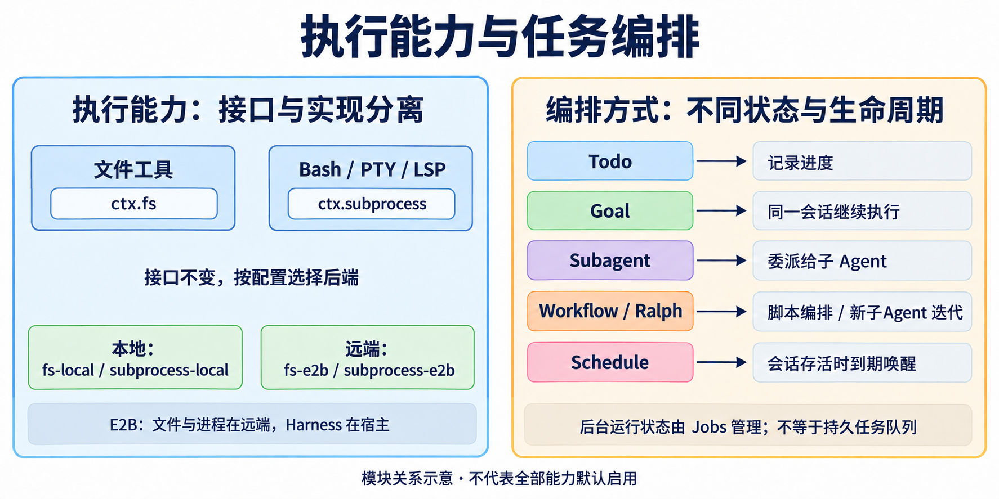

在[第二篇](/posts/projects/deepseek-harness/runtime-and-state)中，Agent 已经能调用一个抽象的“工具”。本篇继续追问：**工具实际怎样接触代码、进程、网络和其他 Agent？这些执行又怎样受策略约束？** 版本仍为本地 `47f9438`；模块总图见[第一篇](/posts/projects/deepseek-harness/project-overview)。

## 1. 执行能力与编排能力的全景



图 4：左侧比较同一接口的不同执行环境，右侧比较任务组织方式。它们解决不同层次的问题；能记录目标，不表示一定要创建子 Agent，能后台执行也不表示具备持久任务队列。

## 2. fs：读取、修改与搜索代码

`packages/fs` 有七个包。

| 包                        | 主要职责                                               | 直接消费方或后端                 |
| ------------------------- | ------------------------------------------------------ | -------------------------------- |
| `fs`                      | 路径、文件 URI、文本 I/O、原子修改与 `fs/*` 策略事件   | 提供 `ctx.fs`                    |
| `fs-local`                | 本地文件系统实现                                       | Node.js 文件能力                 |
| `fs-sandbox`              | 在本地实现上约束写入与编辑范围                         | 共享 Sandbox 策略                |
| `fs-observation-policy`   | 记录已观察状态，要求编辑前读取并校验版本               | 监听 `fs/*`                      |
| `tool-fs`                 | 模型的 `read`、`write`、`edit`，包含读取窗口和展示规则 | `ctx.fs`                         |
| `tool-fs-search`          | 模型的 `glob`、`grep`                                  | 经 `ctx.subprocess` 启动 ripgrep |
| `tool-str-replace-editor` | `view/create/str_replace/insert` 形式的文本编辑工具    | `ctx.fs` 与同一策略体系          |

一次编辑不只是字符串替换。工具先解析目标路径，策略判断模型是否看过相关文件以及文件是否变化，提供方负责在允许范围内执行原子修改，结果再转换成模型文本和 UI diff 卡片。

这里有两道独立约束：**观察策略**回答“依据是否仍然有效”，**沙箱策略**回答“这个位置是否允许修改”。删除其中一个插件，并不会自动让另一个承担它的职责。

`glob/grep` 不属于通用文件提供方的方法，而是进程驱动的搜索流程。这是一个值得记住的实现细节：把文件后端搬到远端时，搜索进程也必须和文件读取处于一致的执行环境。

`str_replace_editor` 面向 UTF-8 文本，要求替换目标恰好匹配一次，没有 `replace_all`。`tool-fs` 的文件 I/O 不设置普通工具式超时，取消只在系统调用边界尽力传递，避免宣称已超时但操作系统稍后仍完成写入的模糊状态。

源码入口：[文件模块](https://github.com/deepseek-ai/deepseek-harness/blob/47f943859bef60e4160492346772ded9b24f765a/packages/fs/README.md)、[文本编辑器](https://github.com/deepseek-ai/deepseek-harness/blob/47f943859bef60e4160492346772ded9b24f765a/packages/fs/tool-str-replace-editor/README.md)。

## 3. subprocess、shell、terminal：三个执行层次

### 3.1 Subprocess 管进程机制

`subprocess` 定义可执行文件定位、进程启动、stdio、进程树与终端进程原语。`subprocess-local` 提供本地实现，包括 `node-pty`、输出收集、进程组信号和等待清理。

它知道“一个进程怎样开始和结束”，但不应该决定“这条 Bash 命令的默认超时是什么”或“这个 LSP 响应是什么意思”。这些业务语义留在上层。

### 3.2 Shell 管一次命令执行

`shell` 定义请求、解析后的执行规格、结果和错误；`bash-local`、`bash-sandbox`、`pwsh-local`、`pwsh-sandbox` 提供后端；`tool-bash` 和 `tool-pwsh` 提供模型接口。`shell-env` 管插件贡献的受控 `DSH_*` 运行环境信息。

典型链路是：

```text
模型 bash 调用
  → tool-bash：参数、输出格式、后台执行选项
  → ctx.shell：Shell 请求与明确的执行规格
  → bash-sandbox：按当前策略包装命令
  → ctx.subprocess：实际启动、收集输出、停止进程树
```

### 3.3 Terminal 管跨调用的终端状态

`terminal` 提供按精确 Agent 所有权划分的持久 PTY 会话；`terminal-bash` 管 shell 就绪检测、终端状态与策略；`tool-terminal` 暴露会话操作并可接 Jobs。

`shell/tool-bash-persistent` 又在它们之上提供一个简化的 `bash(command)` 工具：每个 Agent 复用一个 Shell，因此 `cd`、导出变量、环境激活与函数可以跨调用保留。超时、取消或 Shell 退出可能关闭并重建该 Shell，状态不会永远存在。

| 方式                 | 适合场景                             | 状态特点                        |
| -------------------- | ------------------------------------ | ------------------------------- |
| 单次 Bash/PowerShell | 跑测试、编译、短命令                 | 不承诺跨工具调用保留 Shell 状态 |
| 显式 PTY             | 交互程序、持续终端会话               | Agent 拥有会话，显式操作与清理  |
| Persistent Bash      | 希望以简单命令接口持续使用同一 Shell | 自动复用，但异常/超时会重置     |

依据：[子进程](https://github.com/deepseek-ai/deepseek-harness/blob/47f943859bef60e4160492346772ded9b24f765a/packages/subprocess/README.md)、[持久 Bash](https://github.com/deepseek-ai/deepseek-harness/blob/47f943859bef60e4160492346772ded9b24f765a/packages/shell/tool-bash-persistent/README.md)。

## 4. sandbox 与 e2b：限制本地执行，或替换执行环境

### 4.1 本地沙箱的四个包

`sandbox` 是能力接口，`sandbox-policy` 保存并解析会话的限制模式和工作区根目录，`sandbox-local` 选择平台机制，`sandbox-windows-acl` 实现 Windows 的写限制部分。

本地后端的选择为：Linux 优先可工作的 Bubblewrap，再尝试 Landlock；macOS 使用 Seatbelt；Windows 使用 ACL 与受限令牌机制。无法使用合适机制时按规则报错，不悄悄降为不受限制执行。

模式和落实程度是两件事。例如某些平台后端报告 `enforcement: partial`，不能把它们统一宣传为完整隔离。沙箱也不是一个通用网络安全产品；应按具体后端实际约束的文件/进程行为理解它。

文件写入和 Shell 执行共享 `sandbox-policy`，避免同一个会话在文件工具里不能写、换一条 Shell 却无意绕开相同根目录策略。

### 4.2 E2B 迁移的是文件和进程执行

`e2b` 持有一个 E2B 沙箱及其生命周期；`fs-e2b` 实现文件接口；`subprocess-e2b` 实现进程、stdio 和 PTY 接口。二者共享一个远端 Linux 环境。

上层 Bash、Terminal 和 LSP 因为消费通用 `ctx.fs`/`ctx.subprocess`，可以复用已有实现，无需各写一套 E2B 版本。Harness 主进程、Cordis 对象、模型请求和 Session 持久化并不会因此全部搬到 E2B。当前这组能力仍被项目标为 POC。

来源：[沙箱后端及限制](https://github.com/deepseek-ai/deepseek-harness/blob/47f943859bef60e4160492346772ded9b24f765a/packages/sandbox/sandbox-local/README.md)、[E2B 范围](https://github.com/deepseek-ai/deepseek-harness/blob/47f943859bef60e4160492346772ded9b24f765a/packages/e2b/README.md)。

## 5. LSP：语义导航，而非文本匹配

`lsp` 定义统一语义查询接口，`lsp-stdio` 启动并管理具体语言服务器，`tool-lsp` 将它暴露给模型。

当前工具只提供四种只读操作：`goToDefinition`、`findReferences`、`goToImplementation`、`hover`。它不等于实现了 LSP 的所有能力，也不提供任意协议调用入口。

模型参数使用一基的行、字符位置，字符按 UTF-16 计算；工具负责转换成协议中的零基坐标。语言服务器、启动命令、工作区和超时由部署配置决定，避免模型为每次查询自行发明环境参数。

当 `grep` 找到多个同名函数时，LSP 可以帮助确定真正的定义或引用。若坐标没有落在符号上，返回空结果也可能是正常成功。

依据：[LSP 工具](https://github.com/deepseek-ai/deepseek-harness/blob/47f943859bef60e4160492346772ded9b24f765a/packages/lsp/tool-lsp/README.md)。

## 6. Web、Skill、MCP：三种不同的知识与能力入口

### Web：检索和获取外部信息

`web` 提供搜索/抓取的共同接口；`web-search-deepseek`、`web-search-exa`、`web-search-perplexity` 是搜索实现；`web-fetch-http` 负责 HTTP/HTTPS 资源获取；`tool-web` 统一模型侧入口。

接口存在不代表默认组合同时具备所有后端。当前 standard preset 的 `tool-web` 配置为 `fetch: false`，主要启用所装配的搜索能力。具体可用工具应根据配置树判断。

### Skill：按需加载可复用指令

`skill` 合并各提供方目录，`skill-filesystem` 发现本地技能，`skill-badge` 提供可选内置技能，`tool-skill` 把目录和正文加载能力呈现给模型。

技能首先是指令与资源组织方式；Skill 文本不自动创建一个可执行后端。模型仍需使用已经注册的工具落实其中步骤。目录摘要与按需加载能避免把所有技能全文塞进每次请求。

### MCP：把外部服务器工具接入同一工具注册表

`mcp/mcp-client` 连接 stdio 或 Streamable HTTP MCP 服务器，调用 `listTools()` 后以 `mcp__服务器名__工具名` 形式注册工具；因此外部工具也进入统一执行管线。

它处理工具列表变化、调用取消、超时、断线重连、名称规范化和卸载。过长或不合规范的名字会采用确定性归一化，避免连接顺序影响模型看到的工具身份。

当前包说明区分完整程序化结果与模型文本呈现：结构化内容可保留在规范结果中，Native 的图像、音频、资源等块可能投影为占位描述。不能仅因 MCP 支持某类块，就推断当前聊天界面原生完整呈现了它。

来源：[Web](https://github.com/deepseek-ai/deepseek-harness/blob/47f943859bef60e4160492346772ded9b24f765a/packages/web/README.md)、[Skill](https://github.com/deepseek-ai/deepseek-harness/blob/47f943859bef60e4160492346772ded9b24f765a/packages/skill/README.md)、[MCP 桥接](https://github.com/deepseek-ai/deepseek-harness/blob/47f943859bef60e4160492346772ded9b24f765a/packages/mcp/mcp-client/README.md)。

## 7. interaction、plan、guard、hooks：谁来约束执行

| 组            | 包与职责                                                                                                                      | 边界                                           |
| ------------- | ----------------------------------------------------------------------------------------------------------------------------- | ---------------------------------------------- |
| `interaction` | `commands` 分派人的命令；`user-questions`/`tool-ask-user` 提问；`user-approval` 一次性审批；`permission-presets` 组合权限选项 | 人的命令可以直接执行，不必经模型猜测           |
| `plan`        | `plan-mode` 保存计划协作状态、指导语、`/plan` 和评审退出                                                                      | 计划模式是软指导；硬限制由沙箱和审批落实       |
| `guard`       | `repeat-tool-reminder` 提醒重复调用；`timeout-policy` 在执行外层处理截止时间                                                  | 重复提醒不会自动升级为强制阻断                 |
| `hooks`       | `hook-protocol` 定义协议；`hooks-claude-code`、`hooks-codex` 映射外部钩子习惯                                                 | 桥接钩子格式，不意味着运行对应产品的整个 Agent |

提问和审批也要区分：询问用户偏好是收集信息，一次性审批是决定某项操作是否允许。两者消费方、返回值和失败语义不同。

计划模式的 schema 保持稳定，不通过反复增删工具表达模式切换。`exit_plan_mode` 通过用户问题服务进行明确评审；失败或关闭评审不代表已批准实施。`plan/mode` 记录在日志中，恢复时可重建。

工具超时包会挂到 `tools/execute` 环绕层，并遵守具体工具的超时契约。重复工具提醒按准确的参数规范化匹配，因此“略微改变参数但实质相同”的行为不一定命中。

依据：[计划模式](https://github.com/deepseek-ai/deepseek-harness/blob/47f943859bef60e4160492346772ded9b24f765a/packages/plan/plan-mode/README.md)、[重复提醒](https://github.com/deepseek-ai/deepseek-harness/blob/47f943859bef60e4160492346772ded9b24f765a/packages/guard/repeat-tool-reminder/README.md)。

## 8. Subagent：把子任务交给另一个 Agent

`subagent` 是注册、委派和续跑接口，允许多个具名 provider 同时存在。其余包分为提供方与模型工具。

| 提供方                       | 实现方式                                      | 上下文特点               |
| ---------------------------- | --------------------------------------------- | ------------------------ |
| `subagent-spawn-in-process`  | 进程内创建新子 Agent                          | 新会话                   |
| `subagent-fork-in-process`   | 进程内从父会话历史建立子 Agent                | 继承允许的已完成历史前缀 |
| `subagent-in-process-driver` | 上述进程内方案共用的驱动逻辑                  | 不单独代表一种用户工具   |
| `subagent-acp`               | 经 ACP 驱动外部 Agent 进程                    | 外部协议与生命周期       |
| `subagent-codex`             | 启动真实 Codex app-server 子 Agent            | 对应产品后端             |
| `subagent-claude-code`       | 通过 Claude Agent SDK 启动子 Agent            | 对应产品后端             |
| `subagent-dsh-sdk`           | 通过 TypeScript SDK 启动另一个 Harness 运行时 | 进程外 Harness           |

`tool-subagent` 提供委派工具；不同实例可选择不同 provider 与名字。`tool-subagent-control` 提供后续发送、中断与列举；`tool-subagent-report` 为符合条件的子 Agent 提供向父 Agent 报告的通道。

这里有两个很具体的语义：

- `send_message` 为子 Agent 排入**下一轮 FIFO 输入**，不会直接重写它正在进行的轮次；返回接受入队不等于返回子 Agent 的答案。
- `interrupt_agent` 只请求停止目标当前活动，保留相应队列；它不会自动停止目标已经发布的全部后代。权限由真实父子血缘验证。

一次性子任务和可续跑子 Agent 的消费方式也不同。后台模式由配置选择；当前 base 与 standard preset 对 fork 的设置还存在差异，不能写成所有 fork 一律是某一种模式。

来源：[子 Agent 组](https://github.com/deepseek-ai/deepseek-harness/blob/47f943859bef60e4160492346772ded9b24f765a/packages/subagent/README.md)、[控制工具语义](https://github.com/deepseek-ai/deepseek-harness/blob/47f943859bef60e4160492346772ded9b24f765a/packages/subagent/tool-subagent-control/README.md)。

## 9. Jobs、Workflow 与 Ralph

### Jobs：后台工作的控制面

`jobs` 定义通用后台工作接口，`jobs-local` 管进程内运行登记，`tool-jobs` 提供查询、读取和停止能力。后台 Shell、PTY 发送及部分子 Agent 委派可以登记为 Job。

Job 负责“这个后台工作现在怎样”，Session 负责“过去发生过什么”。`jobs-local` 不承诺跨进程重启重建仍在执行的操作，不能把它当作持久消息队列。

### Workflow：代码化编排子 Agent

`workflow` 定义请求、结果和生命周期，`workflow-worker-thread` 执行脚本，`tool-workflow` 给模型一个通用编排入口。脚本中的 `agent()` 经 `ctx.subagents` 创建工作者，因此模型后端和委派传输仍由已有接口负责。

这适合把多个子任务的依赖和结果合并写成程序。Worker 将脚本运行和宿主事件循环分开，并支持终止控制，但并不构成对恶意代码的安全边界。

### Ralph：固定的全新子 Agent 迭代策略

`tool-ralph` 是 Workflow 上的特殊消费方。每轮创建一个不继承父对话的新子 Agent，输入包括固定目标、轮数、共享工作区说明与上轮结构化交接。

它将跨轮长期信息放在工作区，交接只携带有界报告。报告可以是 continue、complete 或 blocked；父工具最终可能返回 complete、blocked、budget-limited。这里的完成与阻塞是工作者报告，不是独立验证器结论。

当前 Ralph 是前台等待、按轮数限额的策略，不具备通用持久恢复、独立评估、费用预算或每轮自动重试承诺。项目的模型指导也要求用户明确请求这种方式时才使用。

依据：[Workflow](https://github.com/deepseek-ai/deepseek-harness/blob/47f943859bef60e4160492346772ded9b24f765a/packages/workflow/README.md)、[Ralph](https://github.com/deepseek-ai/deepseek-harness/blob/47f943859bef60e4160492346772ded9b24f765a/packages/workflow/tool-ralph/README.md)。

## 10. Todo、Goal、Schedule：三个相似名字，三种生命周期

| 能力     | 包                                                       | 保存什么                     | 谁让工作继续                                |
| -------- | -------------------------------------------------------- | ---------------------------- | ------------------------------------------- |
| Todo     | `tool-todo`                                              | 同一会话的待办列表和进度     | Todo 本身不驱动下一轮                       |
| Goal     | `goal`、`tool-goal`、`command-goal`、`goal-round-driver` | 目标、状态、修订与轮次信息   | 驱动器在满足授权激活等条件的空闲点继续      |
| Schedule | `schedule`                                               | 当前会话的提醒定义和状态变更 | 活跃根 Agent 的计时所有者到期排入 follow-up |

Goal 延续沿用**同一个会话**。驱动器在目标仍 active、已激活且未超过轮次容量时，先完成必要 checkpoint，再为下一轮保留输入。人类输入到来会影响自动轮次的准入。恢复日志中的 active 状态，不等于恢复进程本地的自动续跑授权。

Schedule 也不等于系统级 cron。它只在相应会话有活跃根 Agent 时等待，到期输入进入原会话；会话冷藏或进程不在时，不会凭空发送外部通知，之后重新活跃才处理逾期工作。

对照场景：

- “列出接下来三步”适合 Todo。
- “继续推进同一个目标”涉及 Goal。
- “把两个可独立分析的问题委派出去”涉及 Subagent。
- “按程序组织多个 Agent 的依赖”涉及 Workflow。
- “每轮新建 Agent，以工作区和交接推进”才是 Ralph。
- “稍后回到当前会话继续提醒”涉及 Schedule。

来源：[Goal 驱动器](https://github.com/deepseek-ai/deepseek-harness/blob/47f943859bef60e4160492346772ded9b24f765a/packages/goal/goal-round-driver/README.md)、[Schedule](https://github.com/deepseek-ai/deepseek-harness/blob/47f943859bef60e4160492346772ded9b24f765a/packages/schedule/README.md)。

## 11. Code Runtime 与 Extensions：两类模型写代码

### Code Mode：写一小段程序调用工具

Native 模式把每个工具 schema 提供给模型；Code 模式提供 `run_code` 和按可见工具生成的 TypeScript SDK；Both 同时提供两种方式。

`code-runtime` 是执行接口，`code-runtime-worker-thread` 为每次程序创建新 worker，处理异步绑定、输出、计算时间、墙钟时间、堆限制与终止。工具子调用仍进入工具流水线，并留下相应调用事实；它不应成为跳过工具权限的捷径。

`core/agent-tool-presentation` 允许 preset 为所属 Agent 选择 native/code/both。不同模式可在同一进程并存。选择 Code Mode 的组合必须有相应 `ctx.codeRuntime`；否则应该在组合时暴露配置问题。

### Extensions：检查和改变运行中的插件

`tool-cordis` 面向模型提供检查与动态包操作；`cordis-host-runner` 管 Host 侧定义、运行和服务检查；`cordis-client-runner` 管浏览器侧运行；`ui-cordis` 提供对应面板。

Code Mode 的主要对象是“一次程序中的工具调用”，Extensions 的对象是“当前运行时中的插件贡献与生命周期”。例如新增一个界面部件，需要 Host/Client 两侧的注册与撤销，不是多执行一次文件工具就能表达的行为。

它们仍受部署组合和运行接口限制。Node worker 和 `node:vm` 不能被写成完整安全隔离的证明。

来源：[Code Runtime](https://github.com/deepseek-ai/deepseek-harness/blob/47f943859bef60e4160492346772ded9b24f765a/packages/code-runtime/code-runtime-worker-thread/README.md)、[工具呈现模式](https://github.com/deepseek-ai/deepseek-harness/blob/47f943859bef60e4160492346772ded9b24f765a/packages/core/agent-tool-presentation/README.md)、[Extensions](https://github.com/deepseek-ai/deepseek-harness/blob/47f943859bef60e4160492346772ded9b24f765a/packages/extensions/README.md)。

下一篇是[应用入口、Web UI 与完整包索引](/posts/projects/deepseek-harness/platform-and-package-index)，把本篇能力落实到实际 profile、浏览器和 SDK 的装配方式。
