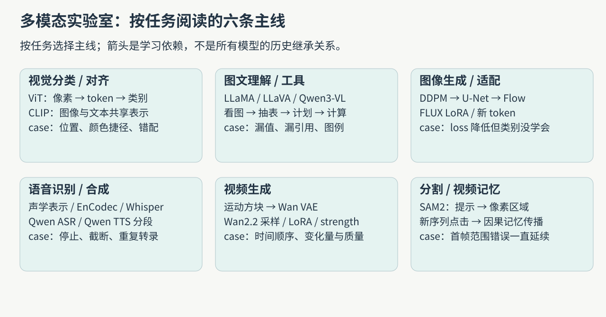
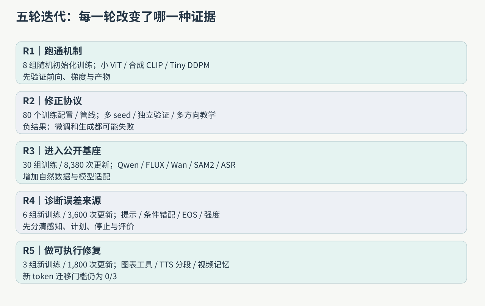
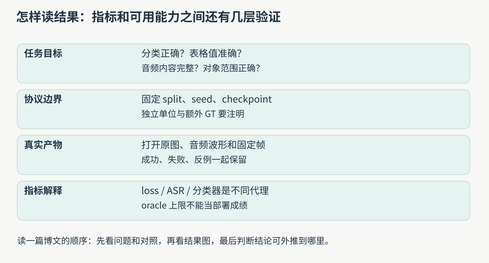

学习多模态容易遇到一个问题：论文名越来越多，实验也跑了不少，但“模型为什么这样设计”“这轮到底验证了什么”仍然没有连起来。我们把五轮学习与实测整理成 13 篇博文，按任务分组，让每篇都从使用问题出发，走到模型结构、训练目标、真实结果和具体反例。

这是一组实验室学习记录。文中业务背景用于说明任务价值，不代表我们已经部署了相应产品；数字来自已保存的训练、推理与独立审计，而非论文榜单。本系列也不宣称穷尽全部主流模型。

## 先选一条你关心的主线

图 1 将阅读路径按输入、输出和问题拆开。ViT、CLIP、LLaVA 是理解上的递进；扩散、flow、音频和视频则有各自的训练目标，它们不是一条严格线性的历史继承链。只想先学懂一个方向，可以沿对应文章顺序阅读，再回到其他主线比较共用机制。

| 顺序 | 文章                                                                                | 读完应能解释                                  |
| ---- | ----------------------------------------------------------------------------------- | --------------------------------------------- |
| 01   | [ViT：图片变成 token](/posts/projects/multimodal-lab/01-vit-from-pixels)            | mean pooling、位置消融、patch、颜色捷径与错例 |
| 02   | [CLIP：图文对齐](/posts/projects/multimodal-lab/02-clip-alignment)                  | 正负配对、多正样本、microbatch 与语义检索     |
| 03   | [语言模型到视觉语言模型](/posts/projects/multimodal-lab/03-language-and-vlm)        | Transformer、LoRA、视觉连接器与真实问答评分   |
| 04   | [图表理解到可执行工具](/posts/projects/multimodal-lab/04-chart-tools)               | 提表、计划、受限计算、oracle 与端到端失败     |
| 05   | [DDPM、U-Net 与 flow](/posts/projects/multimodal-lab/05-diffusion-and-flow)         | 时间条件、去噪、结构修复、训练与采样的区别    |
| 06   | [FLUX LoRA 的条件诊断](/posts/projects/multimodal-lab/06-flux-lora-diagnosis)       | 条件错配、噪声分布、loss 与任务能力为何分离   |
| 07   | [六个新 token 的条件学习](/posts/projects/multimodal-lab/07-new-token-conditioning) | 梯度怎样到达输入向量，为什么新模板检验失败    |
| 08   | [音频表示与 ASR](/posts/projects/multimodal-lab/08-audio-representation-and-asr)    | 声学表示、codec、Whisper 负迁移与评分规范化   |
| 09   | [长文 TTS 与分段](/posts/projects/multimodal-lab/09-long-form-tts)                  | EOS、截断、分段预算、双 ASR 与重复转录        |
| 10   | [视频生成与 Wan](/posts/projects/multimodal-lab/10-video-generation)                | 时间顺序、视频 VAE、采样与适配强度的边界      |
| 11   | [SAM2 提示分割](/posts/projects/multimodal-lab/11-promptable-segmentation)          | 提示歧义、三候选、验证选 step 0 与点击反馈    |
| 12   | [SAM2 视频记忆](/posts/projects/multimodal-lab/12-sam-video-memory)                 | 因果传播、坐标陈旧、首帧范围错误与固定反例    |

导航页加 12 篇专题，共 13 篇。系列的 `order` 从总纲开始；上表是专题阅读顺序。每篇的结果表只比较相应协议内的条件，不把 MNIST、自然图像、语音和视频的百分比放进一个“模型排名”。

## 五轮迭代分别完成了什么

第一轮在 2026-09-30 跑通 8 组 H100 训练：MLP/CNN/ViT 的数字分类、正确与错配图文对齐、带时间与无时间 DDPM。首轮教学试跑有单 seed、每轮查看测试集等边界，后续才补正式验证协议。

第二轮扩展为 80 个训练配置或管线，覆盖视觉、图文、语言、音频、视频和图像生成，另有冻结表示评估。ViT 引入独立验证集与三个 seed；也记录 Whisper LoRA 退步、有限感受野的图像生成失败及 U-Net 修复。配置数不是独立生产模型数，不同管线也不具备相同预算。

第三轮进入 Qwen、FLUX.2 Klein、Wan2.2、SAM2.1 等公开基座与自然数据。完成 30 组梯度训练、8,380 次更新，另有冻结表征统计拟合。产物包括图像、TTS、视频和分割。之后方法复盘修正 ChartQAPro 评分，系列只采用审计后的口径；旧的“看起来提升”不能跳过正式评分规则。

第四轮不再把所有问题都归结为训练量不够，先做图表提取与提示、图像条件错配、TTS 停止、视频适配强度和 SAM 点击诊断。新增 6 组图像训练、3,600 次更新，保留高噪声重配的 `0/3` 门槛失败。其他大量实验是冻结推理或离线评分，不计作新增训练。

第五轮完成图像抽表→模型计划→受限计算的工具链、长文 TTS 分段、原生 SAM2 视频记忆，以及六个新 token 的梯度学习。只有图像新条件部分新增 3 组正式训练、1,800 次更新；图表、音频和时序部分使用冻结模型。可执行工具改善了部分任务，同时新词模板迁移仍失败。

| 第五轮代表结果          | 数字           | 必须一起读的条件                                  |
| ----------------------- | -------------- | ------------------------------------------------- |
| 图表 direct→工具链      | 54.17%→71.67%  | 48 个新测试图、240 个问题；年份分面图没有改善     |
| 新长文英文 Qwen ASR WER | 14.25%→1.99%   | 12 个新文本中的英文组；主要改善集中在一个失败文本 |
| 新长文中文 Qwen ASR CER | 47.54%→0.76%   | 分段预算更大，不能算相同计算成本的纯对照          |
| SAM2 框独立→记忆        | 36.47%→93.29%  | 独立对照复用首帧坐标，含坐标陈旧因素              |
| 六新 token 迁移门槛     | 0/3 seeds 通过 | 两个 held-out 模板、两个 evaluator 的共同门槛     |

上表用于找到对应文章，不用于跨任务比较提升大小。分割的 IoU、语音的编辑率和问答准确率测量的对象不同，也有不同样本单位。

## 每篇博文怎样阅读，怎样核实

先看任务的输入输出：分类标签、文本答案、生成图像、声学序列、逐帧区域。随后看训练究竟改了哪些参数，推理是否用了额外信息。最后把结果表和固定样例一起打开。只看 loss 会漏掉条件失败；只看精选图片会漏掉总体失败；只看 oracle 会误以为部署系统有真值辅助。

文中的原理图是本次绘制，密集公式和张量用 SVG 保证数值可检查；位图来自实测图、固定帧或已保存输出，转换为 WebP 便于阅读。case 注明选择规则，不把目视观察写成人工盲评。DAVIS 案例带数据来源与 CC BY-NC 4.0 说明。

图表案例会走完整条链：原图→抽到的表→模型计划→计算输出→错误在哪层。TTS 案例把原文、停止状态和两种 ASR 输出分开，SAM2 案例同时展示首帧和后续帧。读者可据此判断失败是输入表达、模型预测、工具执行还是评价代理造成的，而不是笼统说“模型不好”。

所有专题都有对应的 `labs/` 入口和 `runs/` 记录说明。博客仓库保存可阅读文章和轻量配图；训练权重、大媒体和完整实验包继续留在原实验室档案。来源账本、图片源 SHA 与内容核验记录另外保存，便于后续更新时核对。

## 下一次更新怎样接着写

当新的实验完成，先在该专题补一行迭代记录，再补固定案例与结果表；如果任务边界发生变化，例如图像问答变成视频对话，再独立开篇并从总纲链接。旧负结果保留，新的证据说明修正了什么。论文方法、计划卡和已执行实验分别标注，避免把“找到论文”算成“复现完成”。

本次系列完成的是五轮已有实验的可读整理。后续新增实验将沿用上述记录与核验方式，在相应专题中持续更新。
