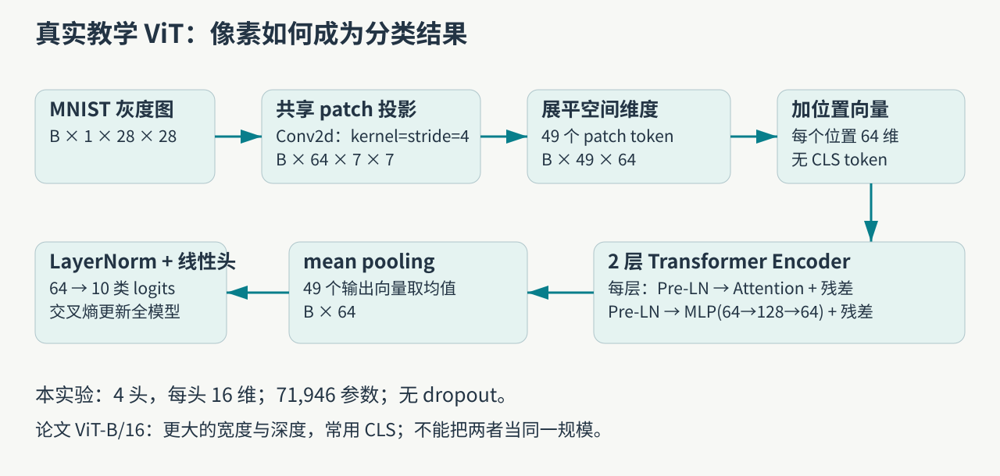
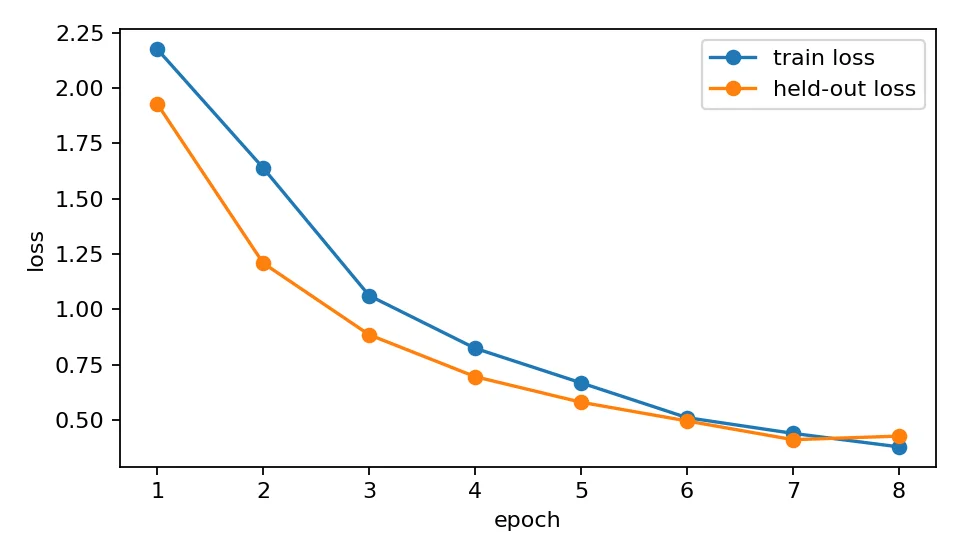
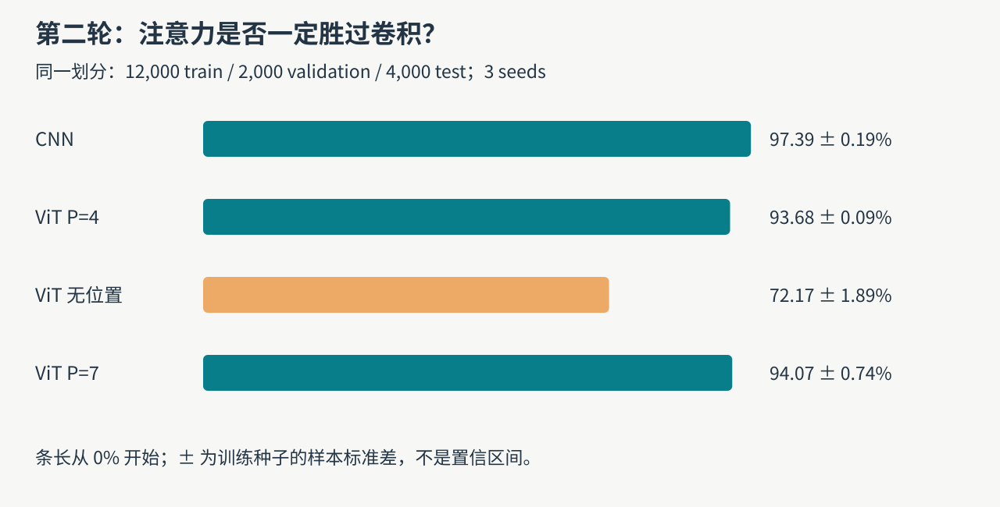
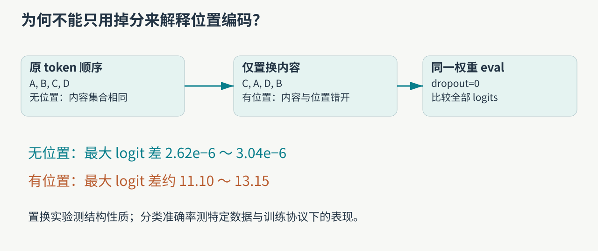
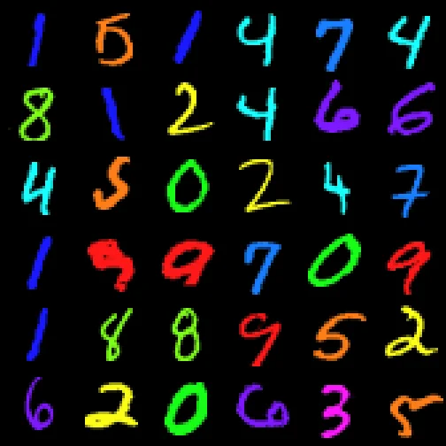
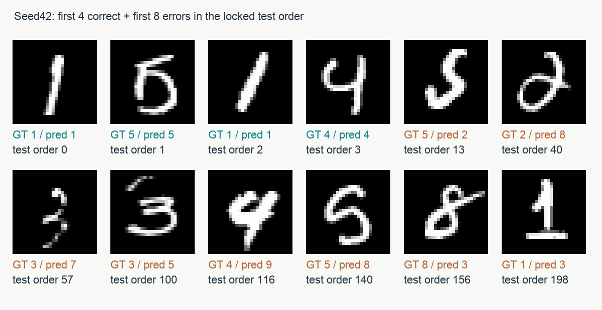

一张图片经过 ViT，并不会自动变成“理解了图片”的模型。模型先把局部像素转成向量，再用注意力交换信息，最后由训练目标决定哪些信息值得保留。这篇用我们前两轮 H100 实验回答三个具体问题：图片怎样变成 token，位置编码究竟提供什么，以及为什么 100% 准确率也可能只是走捷径。

[系列总纲](/posts/projects/multimodal-lab/00-series-guide) · 下一篇：[CLIP 图文对齐](/posts/projects/multimodal-lab/02-clip-alignment)

## 从业务问题理解模型的边界

商品分类、文档页面分类、工业图像初筛，都可以先写成“图片→一个有限类别”。这是 ViT 分类器适合研究的任务形式。我们的实测使用 MNIST 手写数字，目的是把机制压缩到可检查的规模，并没有上线商品识别系统；数字上的分数不能作为工业场景的准确率承诺。

ViT 是单模态视觉模型。它输出的特征可以进一步接入 CLIP 的文本塔、视觉语言模型的连接器或分割解码器，但分类损失没有教它生成语言，也没有教它找出每一个目标像素。先把表示和任务头分开，后面的多模态路线就容易理解。

## 按实际代码走一遍张量

图 1 对应实际训练代码，不是照搬论文结构。每张灰度图是 `1×28×28`，`kernel=stride=4` 的卷积把不重叠的 `4×4` 区块映射为 64 维向量，因此得到 `7×7=49` 个 token。投影权重在不同区块之间共享，所以模型不用为每个空间位置单独学习像素变换。

| 实际环节        | batch=B 的形状 | 含义                                 |
| --------------- | -------------- | ------------------------------------ |
| 输入            | `[B,1,28,28]`  | 原始灰度像素                         |
| patch 卷积      | `[B,64,7,7]`   | 每块从 16 个像素映射到 64 维         |
| 展平、转置      | `[B,49,64]`    | 49 个向量成为序列                    |
| 位置向量        | `[1,49,64]`    | 广播到各样本，对每个位置加可学习向量 |
| 单头 Q/K/V      | `[B,49,16]`    | 4 头，每头 64/4=16 维                |
| 单头注意力分数  | `[B,49,49]`    | 每个查询位置读取所有位置             |
| 两层 encoder 后 | `[B,49,64]`    | 长度和隐藏宽度保持不变               |
| mean pooling    | `[B,64]`       | 所有 token 输出取均值                |
| 分类头          | `[B,10]`       | LayerNorm 后线性输出 10 类 logits    |

这里没有 CLS token；原课程用 CLS 举过概念算例，那是另一套教学配置。我们的模型是 2 层、4 头、隐藏维度 64、MLP 中间维度 128，共 71,946 个声明参数。论文 ViT-B/16 的宽度、深度和训练规模更大，不能把同名架构当成相同模型。[ViT 原论文及官方实现](https://github.com/google-research/vision_transformer)。

对单个头，注意力计算为 $A=\operatorname{softmax}(QK^\top/\sqrt{16})$，输出为 $AV$。softmax 在键位置维度进行。假设一个 token 对三个位置的权重是 `[0.2,0.3,0.5]`，对应的 V 是 `[1,0]、[0,1]、[2,2]`，它得到 `[1.2,1.3]`。这是手算示例，帮助理解“读取并加权”，不是实验测得的注意力。

每层采用 Pre-LN：归一化后做注意力，再加回残差；归一化后做 MLP，再加回残差。注意力交换不同位置的信息，MLP 变换每个位置的通道表示。训练用交叉熵直接接收 logits，反向传播更新 patch 投影、位置、encoder 和分类头。输入 softmax 概率再交给 `CrossEntropyLoss` 会改变预期计算，应避免。

## 第一轮：先让完整训练闭环跑通

第一轮用 6,000 个训练样本和 2,000 个官方测试样本，seed=42，训练 8 epoch。MLP、CNN、ViT、去位置 ViT 使用相同 batch=128、AdamW、学习率 0.001。固定保留第 8 轮，结果如下。

| 模型       | 第 8 轮测试准确率 |  参数量 |
| ---------- | ----------------: | ------: |
| MLP        |            91.45% | 101,770 |
| CNN        |            95.90% | 105,866 |
| ViT        |            85.95% |  71,946 |
| ViT 去位置 |            56.50% |  71,946 |

图 2 用于观察优化是否进行，不能把每个点当成一次独立实验。第一轮每轮都查看了测试结果，没有独立验证集；虽然没有按测试选择权重，它仍然不是盲测。迭代的第一项进展因此不是“换更大模型”，而是修正实验协议。

## 第二轮：补验证集和三个训练种子

第二轮固定 `12,000 train / 2,000 validation / 4,000 test`，CNN 与三种 ViT 各跑 seed 42/43/44、12 epoch，只用最高验证准确率选择 checkpoint，再评估固定测试集。

| 条件        | 测试准确率均值 ± 样本标准差 |
| ----------- | --------------------------: |
| CNN         |               97.39 ± 0.19% |
| ViT patch=4 |               93.68 ± 0.09% |
| ViT 无位置  |               72.17 ± 1.89% |
| ViT patch=7 |               94.07 ± 0.74% |

这些 seed 共用一个数据划分，标准差反映训练随机性，不是完整数据不确定性的置信区间。两轮数据量、训练轮数和选权重方式都变了，所以 `85.95→93.68` 不能写成某一个代码改动的收益。

CNN 在小数据、短预算里最好，可能与局部结构先验有关；这属于解释方向，不能据此判定大规模 ViT 也一定更差。patch=7 把 49 个 token 减到 16 个，注意力矩阵元素从 2,401 减到 256，约为 10.65%（不含其他计算）。与此同时，patch 投影和局部聚合发生变化，所以不是纯粹只省注意力计算的对照。其均分稍高、seed 波动也更大，没有证据支持“patch 越大越好”。

## case：为什么去掉位置仍能识别数字

没有位置向量，patch 内仍然保留笔画、弧线和交叉等局部内容。分类可以利用这些局部特征的集合，所以结果不会自动掉到 10% 随机水平。要测结构性质，可以在 patch 投影之后置换 token，仅改变排列，不改变内容。

图 4 中，无位置分支在浮点误差内输出不变，最大 logit 差约 `2.62e-6～3.04e-6`；有位置分支保持位置向量原位，只置换内容，差异约 `11.10～13.15`。这个结果对应无位置 self-attention 的置换等变性和 mean pooling 的置换不变性。若把内容和位置一起搬走，则干预问题就变了。

公开小模型中“无位置”仍声明了 `pos` 参数但前向没有用到，所以与有位置模型的声明参数数相同，不代表位置参数实际获得了梯度。

## case：100% 准确率的颜色捷径

第二轮另建两个三通道 CNN：一组让数字与颜色完全对应，另一组随机分配颜色。测试图保留同一个数字，只改变颜色。

图 5 展示彩色 MNIST 输入样例，没有标注模型预测。颜色关联训练组在原颜色、随机颜色和统一错一类的评估中分别为 100%、17.68%、0%；这些结果来自保存的评估指标。仅看同分布测试，会把学会颜色映射误认为学会数字形状。

图 6 复用图 5 的输入样例，并非随机颜色训练组的预测输出。该对照组在上述三种评估中分别为 97.30%、97.20%、97.35%，数字来自保存的评估结果。这个对照支持主动打断捷径的价值；实验只有一个训练 seed，不能据此给出工业鲁棒性置信区间。这里改变的是训练分布，不能算 ViT 的架构收益。

## case：打开固定错例，而不是只记一个均分

图 7 使用第二轮 ViT seed42 已保存的预测，正确样本取测试顺序前 4 个，错误样本取前 8 个，没有先看哪张最漂亮。图中的 GT 是数据标签，pred 是模型结果，test order 可回查清单。读者可以比较同一数字在笔画倾斜、闭环或连接方式变化时的表现；这些目视观察是提出下一步假设的入口，并不能单凭几张图证明误差都来自书写歧义。

复现时，先对照 `labs/train_lab.py` 的 `TinyViT`，再读 `labs/round2/vision_experiments.py` 的验证选权重与 token 置换。完整清单在 `runs/round2/vision/mnist_split.json`，预测在每个 run 的 `test_predictions.json`，本文结果对应已保存日志。新训练必须另建输出目录，避免覆写这条证据链。

## 读完以后怎样接上多模态

先手算 patch=4 和 patch=7 的张量，再解释“无位置还能分类”与“不能区分 token 排列”为何可以同时成立。随后进入 CLIP：图像塔还在把像素变成向量，但训练目标变成图与文本的对应关系。这个目标的变化，才是从视觉分类走向跨模态对齐的关键。

方法参考：[Attention Is All You Need](https://arxiv.org/abs/1706.03762)、[ViT 原论文](https://arxiv.org/abs/2010.11929)、[Google 官方 ViT](https://github.com/google-research/vision_transformer)。所有结果图来自本实验记录或按原始预测重绘；手算示例已与实测区分。
