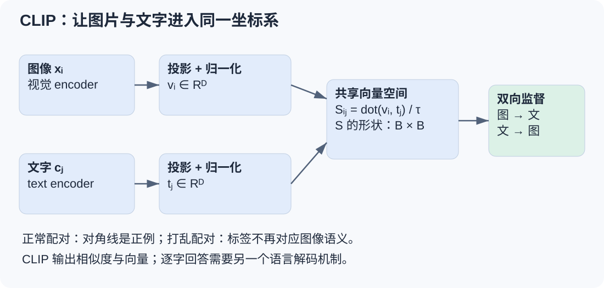
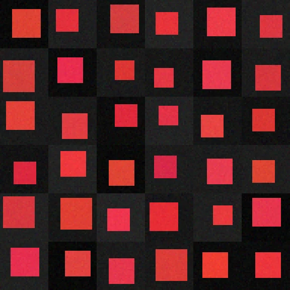
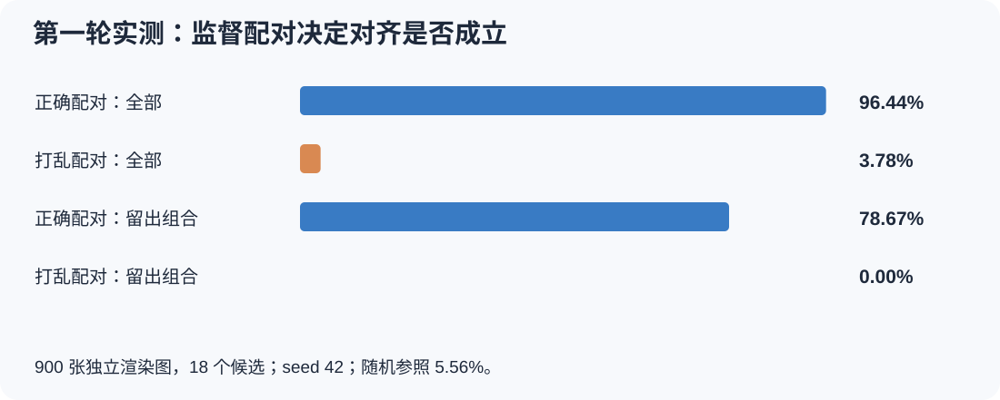
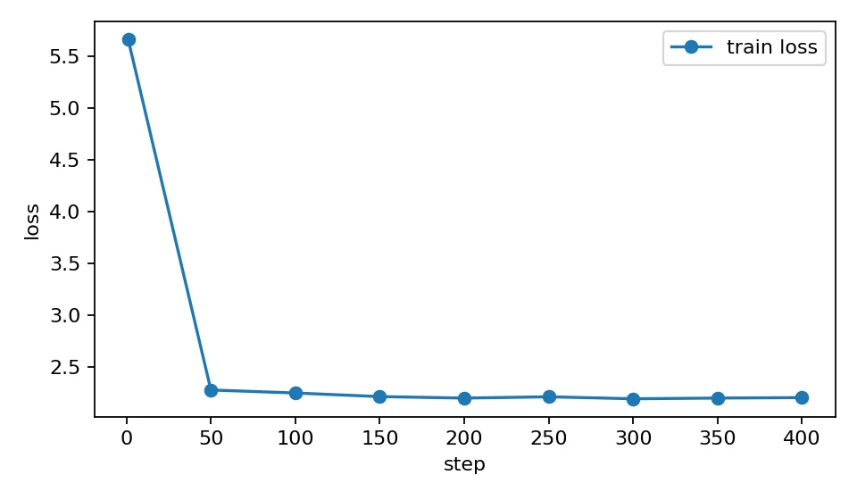
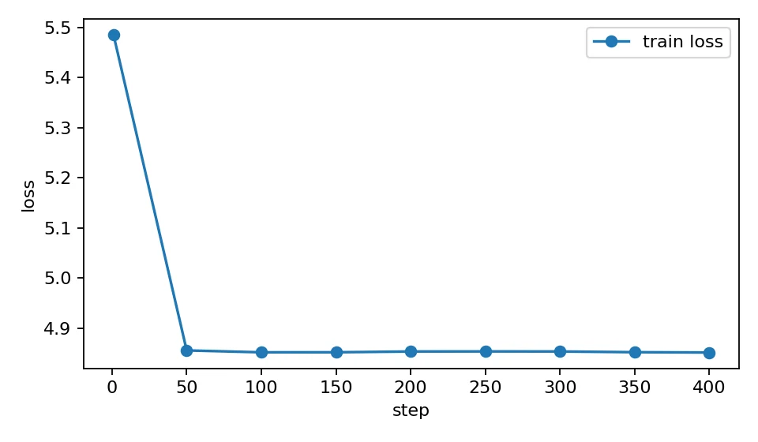
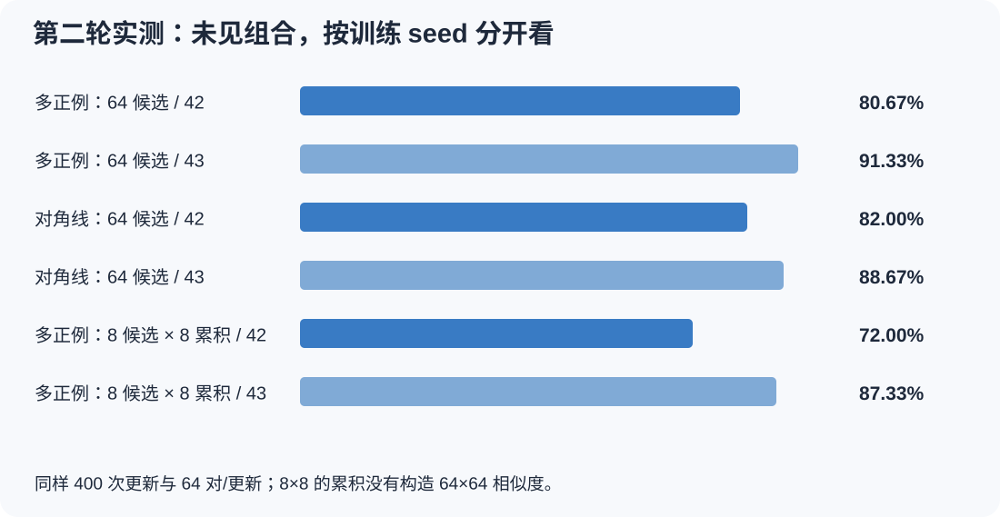
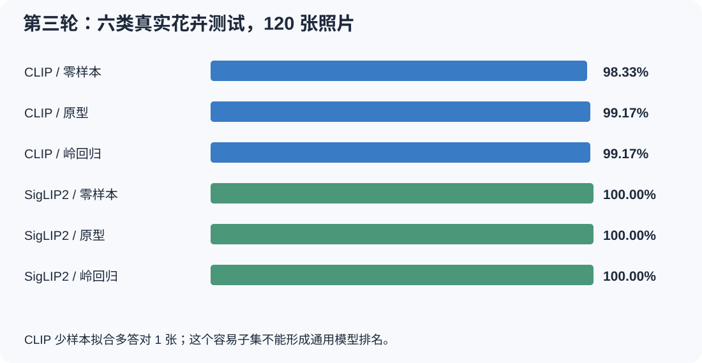

[系列总纲与阅读路线](/posts/projects/multimodal-lab/00-series-guide)

当一个图片分类器只能回答“这是第几类”，我们很快会遇到另一个需求：输入一句描述，让系统找到对应图片。商品图库、素材检索、图片去重和内容组织都可能需要这种能力。这里的业务场景用于说明方法的用途；本项目完成的是教学与研究实验，没有上线商品检索服务。

CLIP 给出的入口很直接：把图片和文字分别编码，让匹配的图文向量靠近。它不需要为每个新文字标签临时训练一个分类头。但“红色方形”能检索成功，并不意味着它会区分“红色方形在蓝色圆形左边”与反方向的关系，更不意味着它能逐字回答一个问题。

这篇按三轮实验展开。第一轮验证正确图文配对是否真的必要；第二轮检查重复语义、梯度累积和组合泛化；第三轮使用公开 CLIP 与 SigLIP2，在真实花卉照片上确认表示能力与评价边界。所有数字来自保存的实际预测。我们没有从零复现网络规模的原版 CLIP 预训练。

## 两个编码器如何建立共同坐标系

图中两条支路可以使用不同的原始特征宽度，投影以后必须进入相同的维度。箭头末端是相似度矩阵和训练目标，不是语言生成器。

设一个 batch 有 $B$ 个图文对。图像塔得到向量 $v_i$，文本塔得到 $t_j$，各自进行 L2 归一化，再计算：

$$
S_{ij}=\frac{v_i^\top t_j}{\tau}.
$$

矩阵的每一行让一张图片与 batch 内的所有文字竞争；每一列让一段文字与所有图片竞争。配对顺序正确时，对角线是监督目标。两方向交叉熵取平均，就得到经典的对称对比目标。温度 $\tau$ 控制分布尖锐程度；相似度分数本身并不是经过跨任务校准的“正确概率”。这一机制可对照 [CLIP 原论文](https://proceedings.mlr.press/v139/radford21a.html)与[官方 forward 实现](https://github.com/openai/CLIP/blob/main/clip/model.py)。

为了手算，假设 batch 中只有“红圆、蓝方、绿三角、黄圆”四对样本。第一张红圆图除了要接近“红圆”，还需要与其他三个文字区分。如果四个分数完全相同，这一行正确概率为 1/4，损失为 $\log 4$。因此比较不同 batch 的 loss 绝对值时，要记住候选数本身改变了任务难度。

推理阶段可以预先编码一组候选文字，再选与图片最相似的一条。这是零样本分类和图文检索的基本方式。模型选择的是已有候选；如果要描述图片中所有内容，仍需要生成机制，见[下一篇视觉语言模型实验](/posts/projects/multimodal-lab/03-language-and-vlm)。

## 第一轮：先确认监督真的把两种模态连起来

我们从头训练了一个小双塔模型，参数总数 327,617。训练图 1,800 张，覆盖 15 个颜色×形状组合；测试图 900 张，有 18 个候选描述。红圆、绿方、蓝三角三个组合不进入训练。测试使用独立渲染 seed 与另一种文字模板；词汇仍来自封闭的小词表。

两个条件使用同样的 400 次更新：正常图文配对，以及打乱图文对应的监督。它们都是 seed 42 的教学实验，只有一个训练 seed。

这是保存的同一语义样本网格。它让读者看到模型需要忽略哪些变化：方形的大小、位置与轻微颜色噪声。网格集中展示红色方形，不是整个数据集的类别分布，也不能拿来证明覆盖丰富的视觉场景。

| 配对监督 | 总体 Top-1 | 已见组合 | 留出组合 |
| -------- | ---------: | -------: | -------: |
| 正常配对 |     96.44% |  100.00% |   78.67% |
| 打乱对应 |      3.78% |    4.53% |    0.00% |

18 个均等候选的随机参照为 5.56%。正常配对与打乱组的差距说明，这个实验中的共享空间依赖正确的语义监督。打乱组低于随机参照并不奇怪：一次有限实验没有保证每个错误映射都均匀随机，也没有足够 seed 用来估计稳定差异。

两张图保留了原训练过程。阅读顺序应该是先看监督定义，再看曲线，最后看固定测试候选集上的结果。loss 是当前训练目标的数值；只有与独立检索评价一起看，才能判断学到的空间是否有用。

第一个成功 case 是训练中见过的颜色×形状：正常配对在这些组合上全部正确。第一个失败 case 是组合迁移：三个属性组合虽然由已知的颜色词与形状词组成，正常配对也仅达到 78.67%。这支持“有一定组合迁移，但尚不可靠”，不能写成学会了开放世界的语义组合。

## 第二轮：重复语义究竟是正例还是负例

如果 batch 中有两张红圆，它们的文字都叫“red circle”，只把对角线当正例会制造一个矛盾：第一张红圆被要求远离第二条语义相同的文字。这样的负例没有真正的语义差别。

第二轮比较了三种条件：真实 batch 64 的多正例目标、真实 batch 64 的对角线目标，以及 microbatch 8 做 8 次梯度累积。每次优化更新都处理 64 对，全部训练 400 次更新。18 种组合留出 3 种；独立渲染的测试图仍为 900 张。两个训练 seed 为 42、43，checkpoint 按验证集选择。

多正例目标根据颜色×形状标签建立正集合。同一语义的多个文字都能作为正确目标。评价也匹配这个定义：图到文使用 18 个语义候选；文到图允许命中同语义任一图，而不是要求找到唯一的原始配对。

| 条件                  | 总体 Top-1，seed 42 / 43 | 留出组合，seed 42 / 43 |
| --------------------- | ------------------------ | ---------------------- |
| 多正例，真实 64 候选  | 96.78% / 98.56%          | 80.67% / 91.33%        |
| 对角线正例，64 候选   | 97.00% / 98.11%          | 82.00% / 88.67%        |
| 多正例，8 候选×8 累积 | 95.33% / 97.89%          | 72.00% / 87.33%        |

已有组合各组均为 100%，所以总分差别主要来自未见组合。多正例修正了监督语义，却没有在这里稳定胜过对角线目标。一个 seed 更好，另一个没有更好；不能为了介绍“更合理的损失”就把负结果省略。

### Case：8×8 次累积为何不是 64×64 对比

microbatch 8 的每次前向只建立一个 8×8 矩阵，一个样本只看见当批另外 7 个候选。下一批重新前向，不会自动把上一批的向量搬进相似度矩阵。累积 8 次增加的是本次参数更新涵盖的样本量，不是每个样本的对比候选数。

想扩大负例池，必须显式缓存、拼接、重算特征或跨卡聚合，还要处理梯度与目标索引。第二轮没有引入这些机制。因此这个对照回答的是“普通梯度累积是否等于更大的对比候选池”：实现上不等价，本次小候选池的留出组合成绩也较弱。不过只有两个 seed，不足以推出所有任务中扩大候选池必然改善。

### Case：相同词汇、不同顺序，模型可能根本分不出来

我们的 MiniCLIP 文本塔对 token embedding 求均值。逆序文本后，向量最大差约 $4\times10^{-8}$，处于浮点误差范围。也就是说，不管训练多久，它都不能仅凭这个表示区分含相同 token、顺序不同的两句话。

我们另外训练了一个结构化比较任务：“左边数字是否小于右边数字”。无序数字对按组划分，每组同时包含两个方向，避免只记一侧标签。词袋模型在 8 条测试上为 50%；带位置的 Transformer 为 75%，即 6/8。后者也没有充分证明掌握一般比较规则，测试过小，验证损失仍高。这是表达能力的教学反例，不是原版 CLIP 的关系推理 benchmark。

这个 case 对检索系统很实际：如果需求依赖“左边、前后、属于谁、几个”，不能只用简单名词命中的成绩选模型。应先确认表示能区分任务所需差别，再设计对应的反事实例子。

## 第三轮：公开预训练表示在真实照片上有什么用

前两轮的小模型从随机初始化训练，第三轮换成冻结的公开权重：`openai/clip-vit-base-patch32` 与 `google/siglip2-base-patch16-224`。它们在 H100 上完成真实图像与文字前向，但没有更新神经网络参数。

数据是 Oxford Flowers102 的六类子集：60 张训练、60 张验证、120 张测试，保留官方集合归属。类别为 pink primrose、balloon flower、fire lily、sunflower、rose、passion flower。文字模板固定为“a photo of a 类别名, a type of flower.”，没有用测试结果搜索更好的描述。[Oxford 官方数据](https://www.robots.ox.ac.uk/~vgg/data/flowers/102/)

三种用法分别提供不同信息：

- 零样本：图片与类别文字向量比较，不用这六类照片拟合新分类头。
- 原型：每类十张训练照片的归一化向量取均值，再归一化，选择最近的类别中心。
- 岭回归：用冻结图像向量拟合六维 one-hot 分类目标，正则只按验证集选择。

| 模型    |          零样本 |            原型 |          岭回归 |
| ------- | --------------: | --------------: | --------------: |
| CLIP    | 118/120，98.33% | 119/120，99.17% | 119/120，99.17% |
| SigLIP2 |   120/120，100% |   120/120，100% |   120/120，100% |

CLIP 少样本拟合只多答对一张，SigLIP2 在这个子集上已没有剩余提升空间。两模型的网络、预训练数据与配方不同，所以该表不能分离某一种损失的因果作用；也不能据此宣布 SigLIP2 在所有任务更好。有关该模型的训练方法，应阅读 [SigLIP2 论文](https://arxiv.org/abs/2502.14786)，而不是把这 120 张的对照当成论文机制复现。

另一个 case 来自生成图片评价。我们随后用这两个编码器检查生成花卉的类别一致性，但“分类器选中了 rose”只说明某种语义代理匹配。它不保证植物结构正确、画面自然、物体数量准确或没有伪影。真实照片校准很有价值，却不能消除生成图像与照片之间的分布差异。

## 三轮迭代留下的可复用方法

| 迭代   | 实际新增                                       | 得到的证据                        | 保留的边界                   |
| ------ | ---------------------------------------------- | --------------------------------- | ---------------------------- |
| 第一轮 | 正常与 shuffled 双塔训练                       | 正确配对能建立有用的小型共享空间  | 单 seed、合成图、词袋文本    |
| 第二轮 | 多正例、候选池、两个 seed、词序反例            | 监督语义与优化 batch 必须分开描述 | 没有证明多正例稳定提高准确率 |
| 第三轮 | 公开 CLIP/SigLIP2 的冻结真实前向，原型与岭回归 | 预训练表示已能完成六类照片分类    | 容易小子集，不能当作通用排名 |

复现实验时，最值得保留的是逐例结果、数据切分和真实相似度矩阵尺寸。当前工程的入口分别为 `labs/round2/vision_experiments.py` 与 `labs/round3/image/evaluate_representations.py`；原记录保存在各轮 `runs` 目录。原型和岭回归属于统计拟合，不能混计成两次深度网络反向传播训练。

读者可以先手算一个 4×4 的对称对比目标，再检查一个重复语义 batch，最后解释为何词袋无法识别顺序。如果这三步都能讲清楚，CLIP 就不只是一个模型名字，而是一组可以落到代码和评价里的约束。

继续阅读：[从语言模型到视觉问答：LoRA 提升了什么，没提升什么](/posts/projects/multimodal-lab/03-language-and-vlm)。
