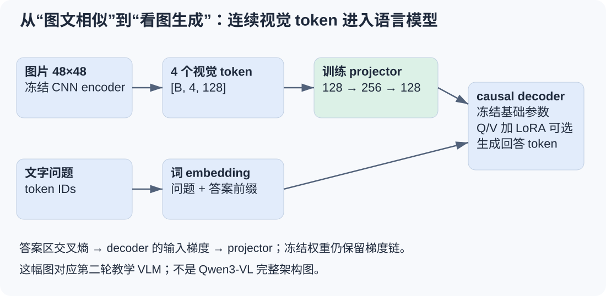
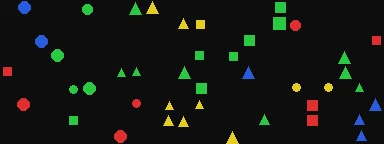
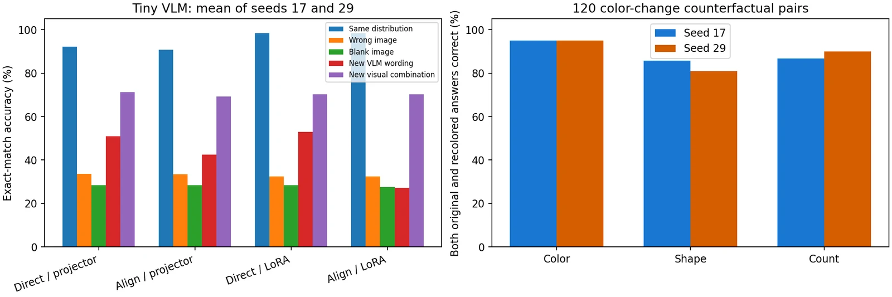
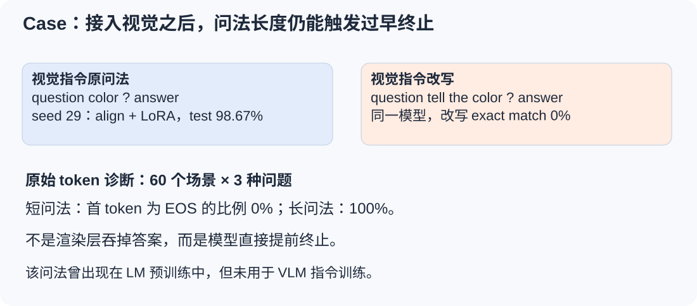
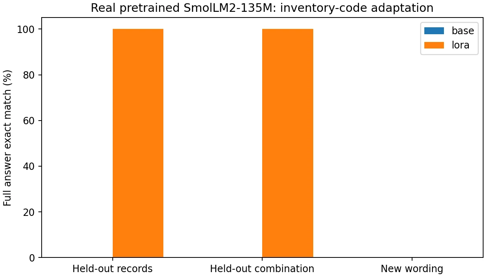
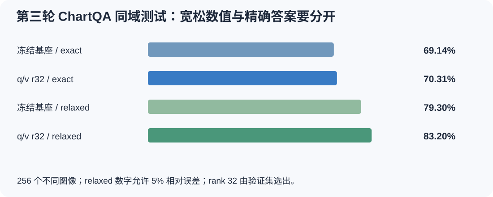
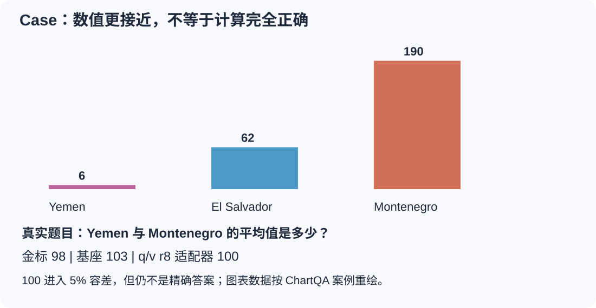
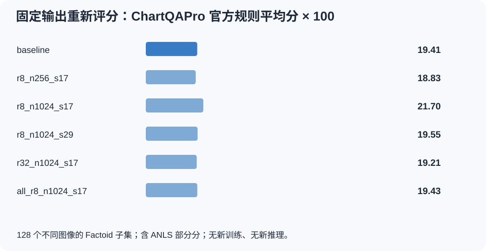

[系列总纲](/posts/projects/multimodal-lab/00-series-guide) · [前篇：CLIP 图文对齐](/posts/projects/multimodal-lab/02-clip-alignment)

图文检索能挑出候选描述，视觉问答还要根据图片与问题生成答案。报表阅读、图片客服、设备巡检和文档助手都可能需要这一步。但模型能生成流畅文字，并不说明它用了图片；训练准确率很高，也不说明换一种问法或换一个图表来源仍可靠。

本项目沿两条线推进：先从零搭小模型，检查视觉 token、答案遮罩和梯度；再使用公开语言与视觉语言基座，运行真实 LoRA 适配。最有教学价值的结果并不只有涨分：一个小 VLM 换问法后从 98.67% 变成 0%；SmolLM2 能把文字转代码，却对改写格式敏感；Qwen3-VL 在同域 ChartQA 上提高了宽松分数，外部 ChartQAPro 没有证明提高。

这些都是实验系统，本文的业务场景是潜在用途，没有上线后的用户指标。

## 从下一个 token 到图片条件回答

纯文本 decoder 训练的是下一个 token。例如输入 `[BOS, 红色, 圆形]`，监督目标依次是 `[红色, 圆形, EOS]`。因果 attention 遮罩保证一个位置不能读取未来答案；训练提供真实前文，推理则把刚生成的 token 接回输入。

原始 2023 年 LLaMA 是 decoder-only 语言基础模型，采用 RMSNorm、RoPE、SwiGLU 等设计。LLaVA 是另一条连接路线：将视觉编码器特征适配为语言模型可接收的连续向量，再训练视觉指令回答。初版连接 CLIP 视觉编码器与 Vicuna；后者基于 LLaMA。模型名相近不代表输入接口一样，也不能通过给文本模型一个图片路径就获得视觉能力。[LLaMA 论文](https://arxiv.org/abs/2302.13971)、[LLaVA 论文](https://arxiv.org/abs/2304.08485)

这幅图对应本项目的小模型，而不是完整 LLaMA 或 Qwen3-VL。连续视觉 token 不需要变成词表中某个汉字；它们以 embedding 的形式进入语言计算。

经典 LLaVA 路线通常先训练连接视觉与语言的 projector，再做视觉指令微调。版本的细节必须分开：初版使用线性投影，LLaVA-1.5 常见配置使用两层 MLP 和 336px 视觉输入。[LLaVA-1.5 技术报告](https://arxiv.org/abs/2310.03744)

对视觉问答，交叉熵通常只监督助手回答与结束标记。图片位置、用户问题和 padding 作为条件参与前向，却不要求模型重复生成。实现中应逐条核对生成提示是否是完整监督序列的精确前缀，避免图像展开后 labels 错位，或预处理与模型各 shift 一次。

另一个容易误解的地方是冻结：冻结语言模型参数，并不等于把语言模型前向放进 `no_grad`。若只训练 projector，回答损失仍要穿过语言模型，计算对视觉输入的梯度。参数可以不更新，输入梯度不能断开。

## 第二轮机制实验：小 decoder 接上视觉以后学到了什么

第一轮只完成基础视觉与对齐试跑，没有训练 LLM 或 LLaVA。第二轮实际完成 13 个语言方向训练任务：2 个小语言模型、2 个视觉编码器、8 个小 VLM，以及 1 个公开 SmolLM2 LoRA 适配。

教学 decoder 为 3 层、隐藏宽度 128、4 个 heads、词表 24，共 609,408 参数；使用 learned position、LayerNorm 与 GELU，因此不冒称复现了 LLaMA 的全部细节。文本来自固定语法枚举的 1,944 条不同序列，并划分训练、验证和测试。它远比自然语言建模简单。

两个 seed 17、29 各训练 600 次更新。测试答案首 token 准确率均为 100%。改变未来后缀后，前缀 logits 最大变化均为 0，验证了此实现的因果遮罩性质。测试 CE 分别为 0.65127、0.63948；这里 CE 是 batch 损失平均，不能包装成精确 token 加权的全语料困惑度。

训练数据为 3,000 场景，验证、同分布测试、组合 OOD 各 300 场景。每个场景对应颜色、形状、数量三道问答。训练排除红色三角形和蓝色方形，这两个组合专门用于 OOD；同一场景全部问题进入同一集合。

视觉 encoder 使用三个 stride-2 卷积块，将特征池化成四个 128 维 token。它先训练 700 步预测颜色、形状、数量，再冻结。两个 seed 的同分布属性平均正确率为 99.89%、99.78%，组合 OOD 仅 52.33%、49.67%。所以后续视觉问答的新组合失败，不能全部归因于语言 decoder：上游表示已经存在明显缺口。

### 四臂比较：先对齐和直接问答

每个 seed 共享自己的视觉与语言前置 checkpoint。projector 为 `128 → 256 → GELU → 128`；LoRA 在每层 attention 的 Q/V 中加入 rank 8、alpha 16 的 A/B。projector-only 训练 65,920 参数，加入 LoRA 后为 78,208，其中新增低秩参数 12,288。

直接组训练 400 步 QA；对齐组训练 100 步 caption 加 300 步 QA。更新次数、每次样本数和前向长度相同，但 caption 的监督 token 多于短 QA，且对齐组少了 100 步问答暴露。因此这是固定更新/样本预算下的路线比较，不是严格相同监督 token 预算，更不是对“大规模视觉预训练价值”的否定。

| 条件               | 同分布 test | 错图 test | 新 VLM 问法 | 组合 OOD |
| ------------------ | ----------: | --------: | ----------: | -------: |
| 直接 + projector   |      92.22% |    33.56% |      50.94% |   71.22% |
| 先对齐 + projector |      90.72% |    33.39% |      42.44% |   69.33% |
| 直接 + LoRA        |      98.50% |    32.39% |      52.94% |   70.28% |
| 先对齐 + LoRA      |      98.44% |    32.39% |      27.28% |   70.28% |

表中是两个训练 seed 的均值，不是置信区间。所有模型按验证集回答 exact match 选权重。LoRA 提高了本任务的同分布表现；caption 阶段没有稳定带来额外收益；新组合与新问法仍有明显问题。

左图支持模型在使用图像：错图后显著下降。但循环错图并非每条都改变了答案，不能称作完美反事实。黑图经过 encoder 与把视觉特征直接置零也不是同一干预，原始记录分别保留。

右图只改变物体颜色，保留位置、形状、数量。直接 LoRA 的两个 seed 都有 95% 的颜色问答在改色前后同时正确。这是一个成功 case：输出随真实视觉属性变化。与此同时，换色后形状答案改变率为 14.17%、15.00%，数量答案也有变化。模型用了颜色，却没有充分解耦属性。

### 失败 case：98.67% 之后，改写为什么变成 0%

训练问法是 `question color ? answer`，改写为 `question tell the color ? answer`。seed 29 的先对齐 LoRA 在原 test 为 98.67%，改写后 0%。对冻结权重再做 token 诊断，60 场景×3 问题中，短问法首 token 为 EOS 的比例为 0%，长问法为 100%。大量空回答来自提前结束，不能归咎于展示层过滤。

这里“新问法”准确指未用于 VLM 指令训练，它曾出现于纯文本 LM 预训练。短模板、位置与终止格式过拟合是合理解释，但没有单独控制每个因素，不能当成已证明的唯一原因。诊断没有重训、没有根据 test 再挑 checkpoint。

## 公开语言基座：SmolLM2 学会文字到结构化代码

小模型机制跑通以后，我们下载固定 revision 的 `HuggingFaceTB/SmolLM2-135M`，在 H100 上执行真实 Q/V LoRA。这个实验只有文字输入，不是公开 VLM 微调；它用于检验参数高效适配与输出契约。[官方模型卡](https://huggingface.co/HuggingFaceTB/SmolLM2-135M)

潜在用途是库存文字编码。例如 `three blue circles` 应输出 `B,C,3`。输入本身提供代码字典，所以这是结构化转换，而非新世界知识学习。60 个 Q/V projection 注入 rank 8、alpha 16 的 LoRA，共 460,800 可训练参数。seed 41，训练 200 步，验证选中 step 200。

| 每组 180 条       | 基座严格 exact | LoRA 严格 exact | LoRA 删除空白后的 exact，事后诊断 |
| ----------------- | -------------: | --------------: | --------------------------------: |
| 新记录、同模板    |             0% |            100% |                              100% |
| 留出颜色×形状组合 |             0% |            100% |                              100% |
| 改写指令          |             0% |              0% |                            63.89% |

原模板中，基座常继续复述代码字典，LoRA 能输出精确代码。改写后 `G,C,2` 可能变成 `G, C, 2`：语义字段正确，严格字符串协议失败。另有 `G, C,`，确实遗漏数量，删除空白也无法修复。

63.89% 是看过失败后的离线格式诊断，没有改变 0% 的主指标。它说明格式和内容需要分开记录，不能把严格全错解读为语义全部消失，也不能把能删除空白的部分包装成训练之后的新提升。

## 第三轮：真实 Qwen3-VL 图表适配

随后我们使用固定公开 `Qwen3-VL-2B-Instruct`，真实参数量 2,127,532,032，完成五组 LoRA。其视觉 encoder 与语言 decoder 已继承大规模预训练能力；本轮研究的是下游适配。官方模型使用 DeepStack 融合多层视觉特征与 interleaved-MRoPE，不能把上面四 token 教学模型当成它的精确架构。[Qwen3-VL 官方模型卡](https://huggingface.co/Qwen/Qwen3-VL-2B-Instruct)

选定数据为 ChartQA：1,024 训练图、96 验证图、256 测试图，保留官方归属并按 RGB 像素哈希去重。本轮只下载了三个训练分片的第一个再抽样，因此不是全训练集均匀样本。适配集合无直接图片交集，也不能证明基座预训练未见过数据。[ChartQA 论文](https://arxiv.org/abs/2203.10244)

每组训练 192 次更新，microbatch 2、累积 4，有效 batch 8，总呈现 1,536 题；BF16 基座，没有 4-bit 量化，不能叫 QLoRA。只监督助手答案。checkpoint 在 step 0、64、128、192 上按验证 relaxed 分数选择，允许选择没有更新的 step 0。

LoRA 的变化写成：

$$
W'=W+\frac{\alpha}{r}BA.
$$

rank 控制低秩更新容量，增加它不是免费提高能力。它减少可训练状态，却不会消除基座前向、激活与视觉输入的显存。[LoRA 原论文](https://arxiv.org/abs/2106.09685)

| 实际配置                         | 可训练参数 | 选中 step | Test exact | Test relaxed |
| -------------------------------- | ---------: | --------: | ---------: | -----------: |
| 冻结基座                         |          0 |         0 |     69.14% |       79.30% |
| q/v r8，256 图，seed 17          |  1,605,632 |        64 |     70.31% |       81.25% |
| q/v r8，1,024 图，seed 17        |  1,605,632 |        64 |     69.92% |       80.08% |
| q/v r8，1,024 图，seed 29        |  1,605,632 |       128 |     69.53% |       80.86% |
| q/v r32，1,024 图，seed 17       |  6,422,528 |       192 |     70.31% |       83.20% |
| all-linear r8，1,024 图，seed 17 |  8,716,288 |        64 |     69.53% |       81.25% |

rank 32 的 relaxed 提升为 3.91 个百分点，按测试图像配对 bootstrap 的 95% 区间为 [0.78,7.03]。exact 仅提高 1.17 个百分点。rank 32 只有一个训练 seed，且探索了五种配置，没有多重比较校正，因此应保留为待新数据确认的候选，不能写成高 rank 普遍更优。

### Case：从 103 变成 100，并没有算出 98

这张图按 ChartQA 冻结案例中的数值重绘，采用本项目自己的排版。该 case 比较的是 q/v r8、1,024 图、seed 17，而不是总表的 r32 候选。

题目要求 Yemen 与 Montenegro 的平均值，真值为 98。基座答 103，适配器答 100，后者进入 5% 容差，所以 relaxed 从错变对；它仍不是 exact 正确。另一条实际回退 case 问 France 是 Argentina 的多少倍，目标 2.88，基座 2.8 在容差内，适配器 2.7 超出容差。适配并非只修错误，也可能破坏原正确行为。

## 外部检验：评分审计为什么是一次真正的迭代

我们另外选了 ChartQAPro 128 个不同图像的单轮 Factoid 题，不训练，仅作外部迁移诊断。旧输出采用自定义短提示；后续核对作者固定评分源码与 VLMEvalKit 固定实现，离线重算全部 6×128 条预测。两种官方实现逐题一致，没有重新推理，也没有更新模型。

| 固定模型                         | 官方规则平均分×100 | 相对基座差值的配对 95% 区间，百分点 |
| -------------------------------- | -----------------: | ----------------------------------- |
| 基座                             |              19.41 | —                                   |
| q/v r8，256 图，seed 17          |              18.83 | [-5.20,4.00]                        |
| q/v r8，1,024 图，seed 17        |              21.70 | [-1.41,6.15]                        |
| q/v r8，1,024 图，seed 29        |              19.55 | [-4.48,4.84]                        |
| q/v r32，1,024 图，seed 17       |              19.21 | [-4.85,4.30]                        |
| all-linear r8，1,024 图，seed 17 |              19.43 | [-4.18,4.06]                        |

这是旧提示生成的外部小子集，按官方规则重新评分，不是官方全量 ChartQAPro 成绩，更不是 exact 准确率。官方文本评分含 ANLS 部分分。所有差值区间仍跨 0，结论仍是没有证明外部泛化改善。[作者评估入口](https://github.com/vis-nlp/ChartQAPro)、[固定评分源码](https://github.com/vis-nlp/ChartQAPro/blob/f0c861b695adce63ffc76e247a49919d2dcaed8b/evaluate_predictions.py)

几个实际例子能说明评分为何不能替代语义复核：

| ID     | 标准答案       | 基座输出       | 官方规则分 | 可见问题                                         |
| ------ | -------------- | -------------- | ---------: | ------------------------------------------------ |
| pro_20 | `10%`          | `10`           |          1 | 单位约定影响规则结果                             |
| pro_79 | `Maths`        | `math`         |        0.8 | 近似文字得到部分分                               |
| pro_58 | `2011 to 2012` | `2013 to 2014` |     0.8333 | 此题 Year 未标 YES，错年份仍因文本相似得到部分分 |
| pro_96 | `18000`        | `4,000`        |        0.6 | 逗号导致数字解析回退到文本相似，错数值有部分分   |

因此我们同时保留官方分、严格数值/语义判断和格式通过率。换评分规则是测量审计，不是模型能力提升；测试错例也不能被拿来逐条补解析器，再报告为新独立效果。

## 迭代的价值，在于把错误定位到可检查的地方

| 阶段           | 已完成的变化                                         | 可以支持什么                                        |
| -------------- | ---------------------------------------------------- | --------------------------------------------------- |
| 第二轮小模型   | 因果遮罩、视觉 token、projector、Q/V LoRA 与图像干预 | 机制链路能训练，模型确实依赖部分视觉信息            |
| 第二轮公开 LM  | SmolLM2 文字编码 LoRA 与格式诊断                     | 参数高效适配有效，但模板鲁棒性仍需验证              |
| 第三轮公开 VLM | 五组 Qwen3-VL LoRA，同域与外部测试                   | 同域候选改善，尚未证明跨数据集改善                  |
| 方法反思       | 官方规则离线审计，冻结全部输出                       | 测量口径被核实，错误年份/数值不能仅凭部分分视为正确 |
| 第四、五轮     | 分辨率、输出协议、抽表和受限计算诊断                 | 进一步区分感知、字段绑定、执行和最终回答            |

机制代码入口为 `labs/round2/language_suite.py`，公开 LM 为 `language_pretrained.py`，真实 VLM 为 `labs/round3/vlm/train_eval.py`，评分审计为 `labs/method_reflection/audit_chartqapro.py`。各轮保留切分、原始 token、完整预测、验证选择与失败日志；本文所有图是原实测图的 WebP 副本或由冻结数值重新绘制的原创图。

下一步最值得看的并不是再增加一排 rank，而是把“读图错、计划错、算术错、格式错”拆开。[下一篇图表工具实验](/posts/projects/multimodal-lab/04-chart-tools)将沿一张图的表格、计划、操作数和答案走完整条链。
