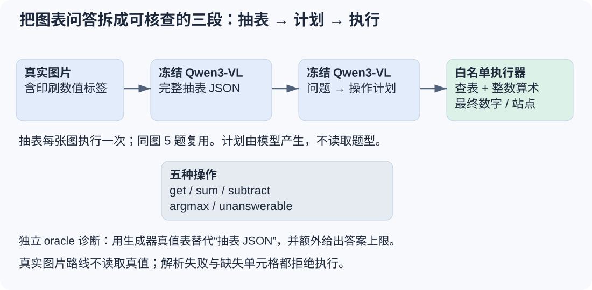
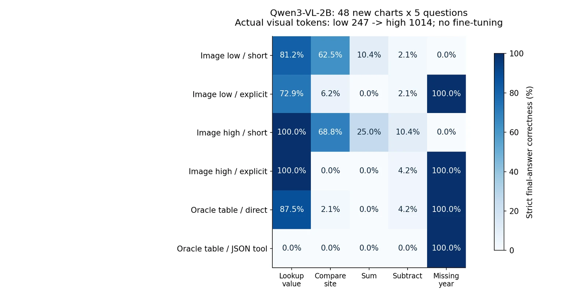
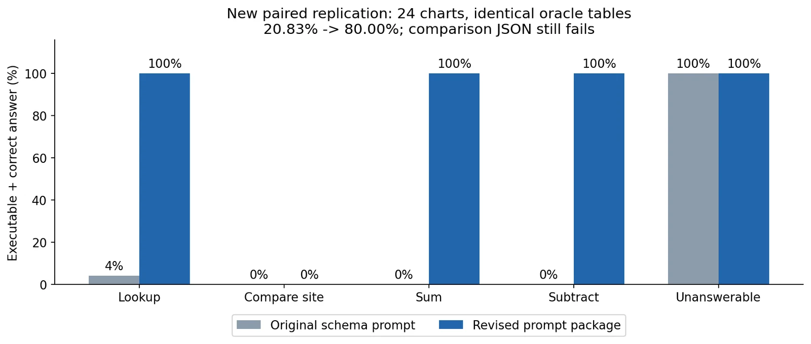
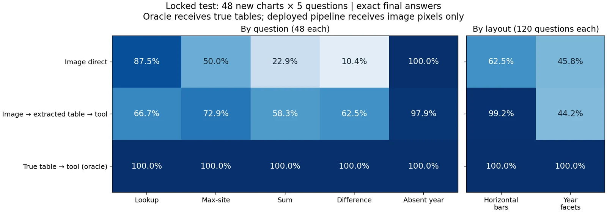
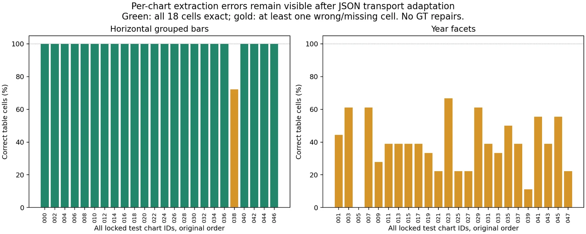
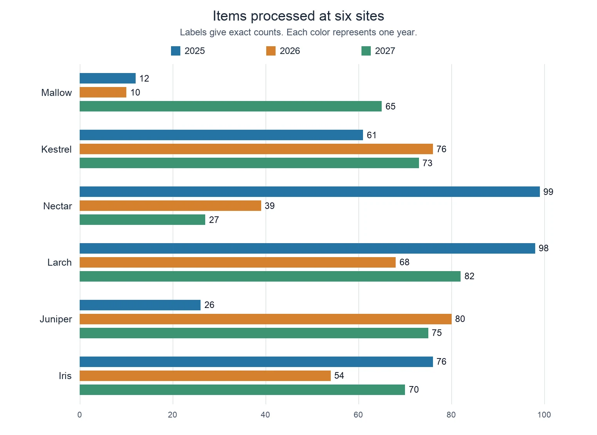
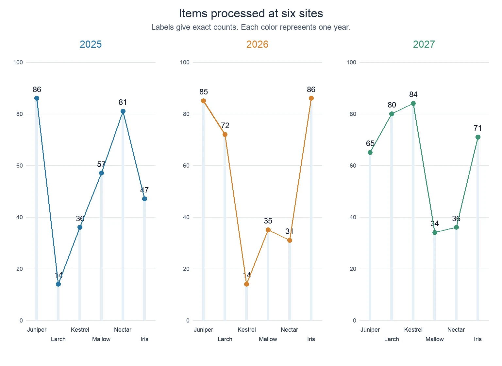
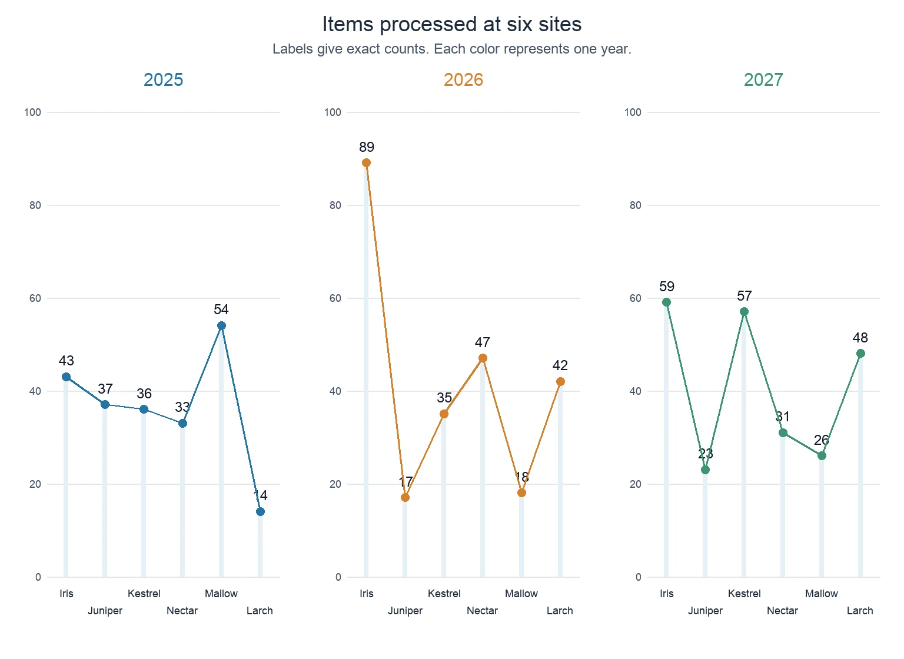
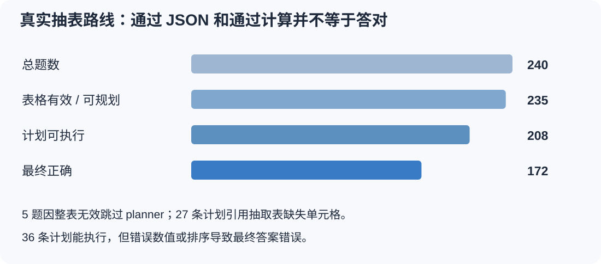

[系列总纲](/posts/projects/multimodal-lab/00-series-guide) · [前篇：视觉语言模型与评分审计](/posts/projects/multimodal-lab/03-language-and-vlm)

假设一个报表助手需要回答“2027 年两个站点合计处理多少条”“哪个站点最多”。模型既要读出数字，也要把站点和年份对应起来，还要选择运算并满足输出格式。只看到最终答案错，很难知道应该增加图像分辨率、继续 LoRA，还是调整工具协议。

我们用第四、第五轮实验把这件事拆开。第四轮先提供正确表格，检查输出与工具计划；第五轮补上真正的图片提表，接通“图片→表格→模型计划→白名单计算→答案”。第五轮在 48 张新合成图、240 题上，从直接问答 54.17% 到实际工具路线 71.67%。但水平柱图接近满分，分面图略退步。这个差别比总体涨分更能指导下一步。

这是研究与教学原型，尚未上线报表业务。模型全部冻结，没有通过这两轮训练更新权重；增加的是推理功能、接口与可核查证据。

## 先把责任边界画清楚



图中的两个 Qwen3-VL 模块复用同一冻结基座，不是两个独立训练模型。每图提表一次，再供同图五题复用。模型负责看图与选操作，执行器负责按表计算；执行器不能纠正错误读数。

这种分解与 [DePlot 图表到表格方法](https://arxiv.org/abs/2212.10505)、[Program of Thoughts 运算外置方法](https://arxiv.org/abs/2211.12588)有关。本项目借用的是分解思路，没有运行 DePlot 权重，也没有复现两篇论文的全量 benchmark。我们的执行器更窄，不执行任意 Python、`eval` 或通用生成代码。

## 第四轮：正确表格也不会自动带来正确答案

第三轮 LoRA 的同域收益没有证明外部泛化改善。继续训练前，我们先用合成图表做冻结诊断。第一阶段锁定 48 张测试图，每图五题。比较低/高视觉预算、短/显式指令、正确表格直答、正确表格工具。

低预算实际处理为 608×416，247 个视觉 token；高预算为 1248×832，1,014 个。代码核验真实输入，不只改一个配置上限。六条路线的严格答案正确率如下：

| 路线                  |   总体 |   查值 | 比较站点 |   加法 |   减法 | 缺失年份 |
| --------------------- | -----: | -----: | -------: | -----: | -----: | -------: |
| 低预算 + 短提示       | 31.25% | 81.25% |   62.50% | 10.42% |  2.08% |       0% |
| 低预算 + 显式提示     | 36.25% | 72.92% |    6.25% |     0% |  2.08% |     100% |
| 高预算 + 短提示       | 40.83% |   100% |   68.75% | 25.00% | 10.42% |       0% |
| 高预算 + 显式提示     | 40.83% |   100% |       0% |     0% |  4.17% |     100% |
| 正确表格直答          | 38.75% | 87.50% |    2.08% |     0% |  4.17% |     100% |
| 正确表格 + 原工具提示 | 20.00% |     0% |       0% |     0% |     0% |     100% |



相同总体分数可能包含完全不同的行为。高预算两种提示都为 40.83%，但显式提示把缺失年份从全错变成全对，同时让比较题常返回最大数值而非站点名。它没有单调地提高每项能力。

事后对原输出做完整算式审计：高预算显式组的 96 道加减题中，59 条输出的操作数、运算与结果都正确，却不满足“只输出数字”。例如 `56 + 46 = 102` 在主协议下仍错误。该审计不回改主分；没有从长解释中随意挑一个数字补分。

原工具路线更直接暴露了字段绑定问题：192 条失败计划照抄 schema 中的字面 `site`、`year`，计算器找不到目标字段。模型能生成像 JSON 的文字，与能生成当前问题的可执行计划，是两件事。

### 新数据复验提示修改，而不是在旧 test 上补答案

我们先锁定提示修订，再生成 8 张开发图、24 张测试图，数值与顺序和第一阶段不同。修订把指令放在问题之前，明确替换占位符，并加入两个无重合站点/年份的具体例子。同一新测试表格、问题、模型、解码与执行器，配对比较旧/新提示。



旧提示为 25/120，20.83%；修订为 96/120，80.00%，差值 59.17 个百分点，按 24 图聚类区间为 [57.50,60.00]。查值、加法、减法、缺失年份四类正确；24 道比较题仍全部失败。

两组都得到正确表格，因此这个结果只支持工具协议改善，不能当作图片感知提升。提示修订是指令位置、占位符约束与示例的组合，也不能单独归功于某一个例子。

## 第五轮：补上真正的提表模块

第五轮不再假装已经有正确表格。程序生成 60 张新图：12 张开发、48 张测试，两种布局各占一半。每图六个站点、三个年份、18 个整数；五题固定覆盖查值、argmax 站点、加法、减法、缺失年份。

数字在图上有精确印刷标签，题目为英文。两种布局都在开发集出现，因此这是新数值与新顺序的检验，不是从未见布局或自然图表泛化；缺失信息只测试不存在的 2031 年。

开发第一轮遇到了一个真实失败：模型 12/12 抽表输出都包在完整 JSON 代码围栏中，严格入口全部拒绝，60 题按上游失败计分。第二轮只允许整串恰好是一个完整 JSON 代码块时去掉外层围栏，再执行严格 schema。模型原输出逐张一致，感知没有因此提高。

适配不会补行、改数、从说明文字搜答案，也拒绝围栏外文字、多代码块、重复字段与错字段。开发结果确定接口后，提示、执行器、源码与测试输入 SHA 写入锁定协议，再运行测试；测试错误没有触发补解析器。

### 三条路线的信息完全不同

| 路线         | 实际输入            | 答案来源                             |
| ------------ | ------------------- | ------------------------------------ |
| 直接问答     | 图片 + 问题         | 模型直接输出                         |
| 实际工具路线 | 图片抽出的表 + 问题 | 模型生成操作计划，程序执行           |
| oracle 工具  | 生成器真值表 + 问题 | 同一计划提示与程序，额外提供正确表格 |

图片模式只读取公开输入目录，不读真值表、标准计划、答案或题型。oracle 在另一个进程显式读取单独真值。记录核对 planner 接收的表等于模型抽出的表；没有用正确表格兜底。

使用冻结 `Qwen3-VL-2B-Instruct`，H100、BF16、greedy、batch 6。原图 1536×1120，实际处理 1184×864、999 个视觉 token。两条图片路线预算一致；抽表最多 600 个新 token，直接答案 64，计划 128。[固定官方模型](https://huggingface.co/Qwen/Qwen3-VL-2B-Instruct/tree/89644892e4d85e24eaac8bacfd4f463576704203)

## 总体提高，版式分层却给出两个结论



原实测图中的“deployed pipeline”指具有图片入口的实验路线，尚未部署线上服务。oracle 明确额外获得真值表，不能算到图片问答能力里。

| 路线，240 题         | 正确数 | 正确率 | 查值 / 最大站点 / 求和 / 差值 / 缺失年份，各 48 题 |
| -------------------- | -----: | -----: | -------------------------------------------------- |
| 图片直接问答         |    130 | 54.17% | 42 / 24 / 11 / 5 / 48                              |
| 实际抽表工具         |    172 | 71.67% | 32 / 35 / 28 / 30 / 47                             |
| 正确表格工具，oracle |    240 |   100% | 48 / 48 / 48 / 48 / 48                             |

主差为 17.50 个百分点，以 48 张图为单位做 4,000 次配对 bootstrap，探索性 95% 区间为 [9.17,25.42]。同图五题没有被当成五个独立样本。收益同时包含表示、输出协议与执行机制变化，不能只归因于计算器。

| 版式，每种 24 图×5 题 |       直接问答 |        实际工具 |            差值 |
| --------------------- | -------------: | --------------: | --------------: |
| 水平分组柱图          | 75/120，62.50% | 119/120，99.17% | +36.67 个百分点 |
| 年份分面图            | 55/120，45.83% |  53/120，44.17% |  −1.67 个百分点 |

单值查读也从 42/48 退到 32/48。完整提表可能额外引入行列对应与漏行问题，不能因为总体好就默认每题都应走工具。在已开启测试上按题型挑路线，也不能再声称是新的独立成绩。

### 提表质量揭示了总体平均的盲点



| 可观察层                 | 实际测试结果            |
| ------------------------ | ----------------------- |
| 原生 JSON                | 0/48                    |
| 去整块围栏后 schema 有效 | 47/48                   |
| 全表精确正确             | 23/48，全部是水平柱图   |
| 精确单元格               | 593/864，68.63%         |
| 水平柱图单元格           | 427/432，整表正确 23/24 |
| 分面图单元格             | 166/432，整表正确 0/24  |

格式有效只保证程序可以读表，不保证表是对的。分面图经常漏站点，或把同一面板内容拼成跨年份行。这是从保存字段观察到的错误类型，不是对模型内部思考过程的证明。

## 成功 case：同一张水平柱图，答案链可以逐步复算



`test_000` 的完整表格全部正确。模型抽出 Larch 在 2025/2026/2027 为 `[98,68,82]`，Iris 为 `[76,54,70]`。读者可以先从图上找到同色年份，再沿站点定位数值。

问题是：“For Larch, what is the number in 2027 minus the number in 2025?” 直接模型输出 `82 - 98 = -16`。内容可复算，但主协议要求整串纯数字，所以严格计错。

实际工具路线产生：

```json
{
  "op": "subtract",
  "cells": [
    ["Larch", "2027"],
    ["Larch", "2025"]
  ]
}
```

执行器检查两个引用存在，按顺序算 82−98，输出 `-16`，通过主评价。这不是把解释末尾的数字摘出来；模型提供明确操作与引用，程序按表执行。

同图求和为 Larch 2027 的 82 加 Iris 2027 的 70，计划为 `sum`，最终 152；argmax 返回 Larch；2031 年问题返回 `unanswerable`。工具路线同图五题全部正确，但一个成功图不能代表所有布局。

## 失败 case 一：计划正确，引用却不存在



`test_001` 抽表仅保留 Juniper、Larch、Mallow、Iris 四行，漏掉 Kestrel 和 Nectar。题目要求 Mallow 与 Kestrel 在 2026 的合计。模型生成了正确形式：

```json
{
  "op": "sum",
  "cells": [
    ["Mallow", "2026"],
    ["Kestrel", "2026"]
  ]
}
```

但 Kestrel 不在抽取表内，执行器返回 `cell_unavailable`，不执行、不补数。这条计划与问题匹配，却不是成功工具调用。原标准答案为 49，直接问答给了 109，也未答对。

同图的减法更隐蔽：抽取 Mallow 为 `[57,35,36]`，计划引用 2027 与 2025，程序正确算出 36−57=−21；真值答案为 −23，所以最终仍错。执行器的算术完全一致，只证明按错误表算对，不证明图片读对。

## 失败 case 二：完整 schema 不成立，五题都拒绝



`test_005` 的 JSON 声明年份 `2025,2026,2027`，但例如 Iris 行输出 `[43,37,36,33,54,14]`，六个值无法和三列一一对应。严格 schema 拒绝整表，五题都按上游失败计分，planner 没有调用。

直接问答在此图的查值题输出 57，是正确的；实际工具路线因为完整表失败，连这一题也失败。这就是总分提升不能覆盖每个局部退步的真实例子。系统没有让人工猜“前面三个应该对”，也没有使用真值回填；保存拒绝轨迹比悄悄补救更有研究价值。

## 把错误分成可以行动的层



240 题中，5 题因为一张整表无效跳过 planner。实际运行的 235 条计划全部匹配原题所需操作和引用；其中 27 条引用缺失单元格，无法执行。208 条可执行，172 最终正确；剩下 36 条读到错数或得到错误排序。

68 条最终失败中，5 条为整表 schema 失败，另外 63 条涉及所需抽取信息错或缺失。分类依赖外部可检查的表与引用，不把生成解释当成真实内部推理。

比较题还做了一项新图验证：给正确表格，配对运行第四轮的旧比较提示与第五轮具体 schema 示例。旧提示 0/48 正确，新提示 48/48；旧输出包含 24 条不合法 JSON、3 条错误字段、21 条字面 `year`。实际抽表路线的 47 条可规划比较题都产生正确年份操作，却仅 35/48 最终正确。协议问题修好了，感知问题仍在。

还有一层需要警惕：35 道比较题最终正确，只有 24 道的相关整列完全抽对。某些非最大值错了，最大站点仍可能碰巧没变。最终答案正确不能替代中间证据验证，正如最终答案错也不能唯一归因于计算器。

## 新功能、成本和证据如何保留

第五轮新增的命令行入口接受一张图片与自然语言问题，不要求真值或题型。工程内可使用：

```bash
python labs/round5/understanding/answer_chart.py \
  --image ./my-chart.png \
  --question "Which site processed the most items in 2026?" \
  --model ./models/Qwen3-VL-2B-Instruct \
  --out ./runs/my-chart-check
```

模型目录要指向兼容固定 checkpoint，环境需按该实验 README 准备。入口实际用开发图跑过抽表、直接答案、工具计划三次生成并返回 Juniper；这是功能验证，不是额外独立测试成绩。

它保留图片、完整提示、原始抽表、计划、执行轨迹与答案。独立 CPU Decimal 审计复算操作与结果，逐条核对图片模式输入隔离。开发失败与接口修订没有覆盖，正式测试结果也保留原始未解析文本。

正式测试同步 `generate` 用时：直接 15.90 秒，抽表 29.32 秒，抽取表计划 21.98 秒。工具两段合计 51.30 秒，约是直接问答的 3.23 倍。这是 batch 6、每图五题复用的模型生成时间，不含模型加载、预处理、传输和 CPU 评价，不能当服务端端到端延迟。模型过程峰值 PyTorch allocated 约 5.35 GiB，不能替代整卡总显存。

开发、锁定测试与接口检查共 1,090 次真实生成。次数说明运行链路完整，不是 1,090 个独立实验，更不是 1,090 次训练。

## 这一轮应当怎样继续

第四轮回答了“正确表格下，协议和输出仍会错”；第五轮证明“自动提表可以接通，而且某一版式收益明显”。真正留下的新问题是年份分面图的区域、站点与行列绑定。

最有依据的后续候选是先按固定规则裁分面、分块提表，再在新的图上确认。该方法当前没有运行，不能写进已完成收益。自然来源图表、没有印刷标签的数值读取、平局、局部缺失和更复杂计划也尚未验证。

读者可先手算 `test_000`，再解释 `test_001` 为什么计划正确也算不了，最后解释 `test_005` 为什么直接答对一题但完整工具路线全部拒绝。如果能沿这三条轨迹定位责任层，就能把“模型不行”转成具体、可验证的下一项实验。
