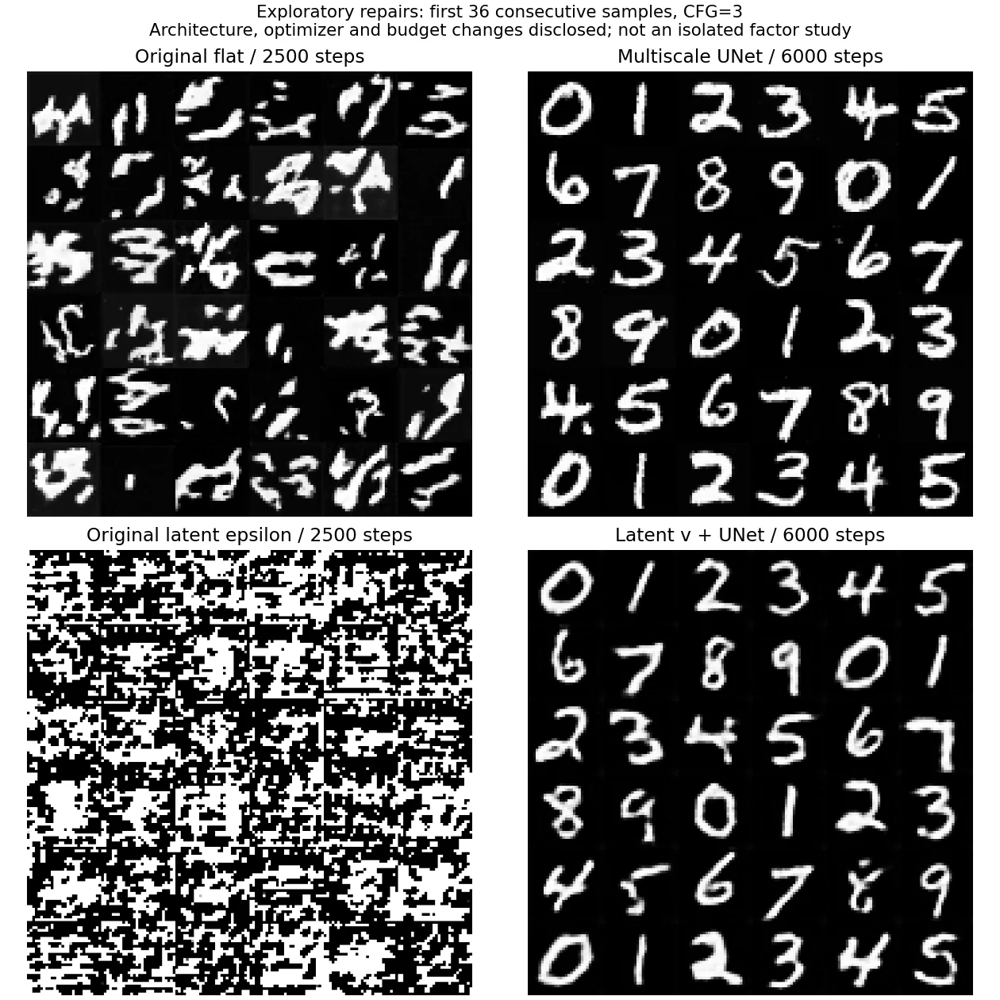
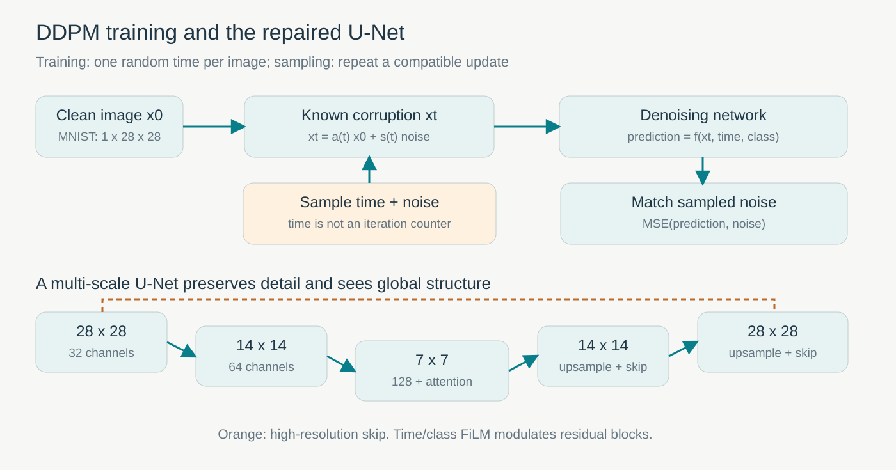
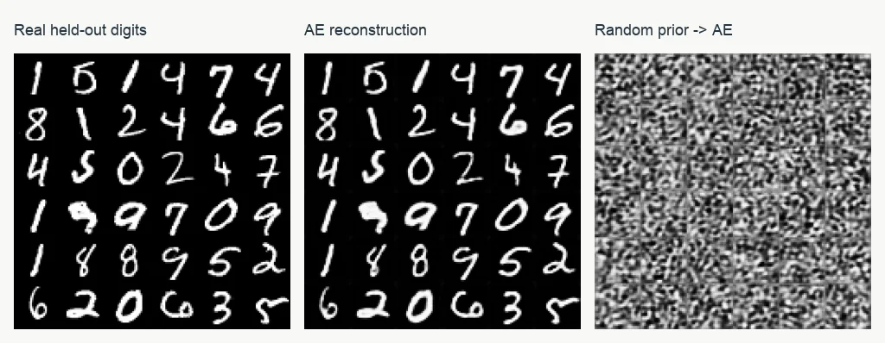
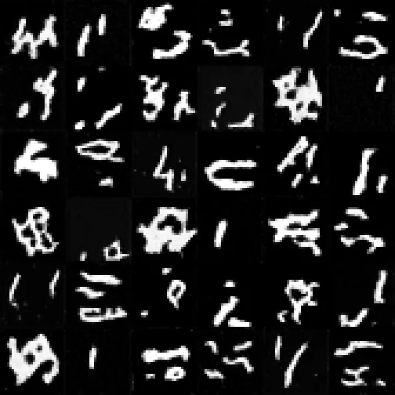
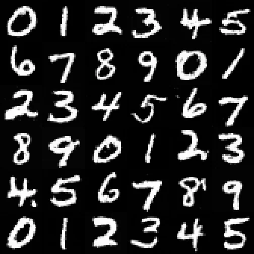
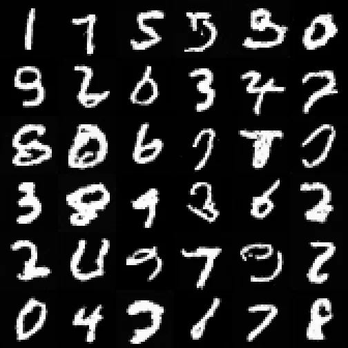
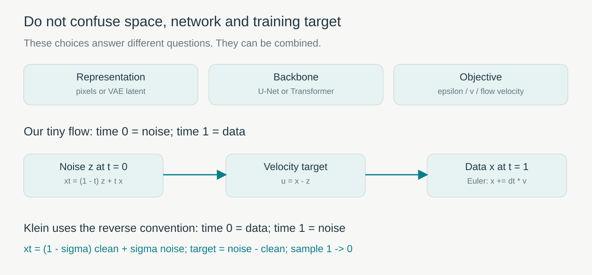
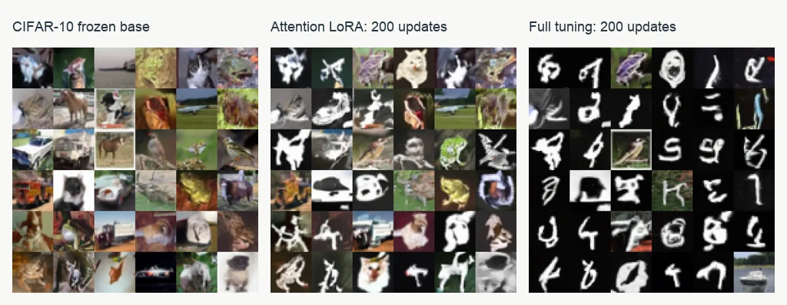

[系列总纲](/posts/projects/multimodal-lab/00-series-guide) · 下一篇：[FLUX 的条件学习诊断](/posts/projects/multimodal-lab/06-flux-lora-diagnosis)

我们的第一批图像生成模型并没有直接成功。去噪误差下降了，采样出来的数字却只剩碎笔画；潜空间模型甚至生成了整块黑白噪声。后来加入多尺度 U-Net、重新训练潜空间 v 预测器，才得到完整的 0–9。

这个过程很适合学习生成模型：公式能运行、训练有梯度、loss 变小、图片可辨、类别可控，是五个不同的检查点。本文按这条顺序解释原理，保留没有成功的实验，以及修复结果能支持到什么程度。

这里的业务背景是**教学与技术验证**。在实际产品中，条件生成可服务于素材草图、可控合成数据、风格适配等用途；我们的手写数字任务是在较小预算下验证这些机制，没有部署成素材生产系统，也没有证明它能替代真实业务数据。

## 先看一次真正的失败和修复



图 1：每格都按固定顺序展示连续前 36 张，没有按效果挑图。上排是像素生成，下排是潜空间生成；左边原配置训练 2,500 步，右边修复套件训练 6,000 步，采样均展示 CFG=3。修复同时改变了结构、训练预算和其他训练设置，因此这张图展示的是一次完整修复，不能独自证明某一模块的因果贡献。

原像素模型能画局部笔画，却很难把它们组成目标数字。原潜空间模型更加极端：解码前的潜变量偏离训练分布，输出接近饱和噪声。修复后能看到完整数字，不过“看起来改善了”还需要固定样本和指标支持。我们稍后会把同样 6,000 步的平铺网络加回来，检查改善是否仅来自多训几步。

## DDPM 为什么有监督标签，却不用人工标注噪声

分类器接收图像、输出类别。生成器要学习的是一批图像的分布，并从随机起点产生新样本。[DDPM](https://arxiv.org/abs/2006.11239) 把这个任务分成很多不同噪声强度下的去噪问题。

训练时先拿到真实图像 x0，再自己抽取高斯噪声 epsilon 与时间 t：

```text
alpha_t     = 1 - beta_t
alpha_bar_t = alpha_1 * ... * alpha_t
xt          = sqrt(alpha_bar_t) * x0
              + sqrt(1 - alpha_bar_t) * epsilon
prediction  = network(xt, t, condition)
loss        = mean((prediction - epsilon) ** 2)
```

epsilon 是程序生成的，所以训练标签已知。这不是让网络直接照抄图像：它看到的是 xt，噪声越强，真实结构越少。训练通常每张图随机取一个 t，执行一次前向和反向，不必在每次更新中跑完全部去噪轨迹。

时间 t 表示当前噪声水平，不是“这是第几次参数更新”。如果网络不知道 t，同样一条淡笔画可能被当作真实结构，也可能被当作强噪声残留。这就是时间条件的作用。



图 2：上半部分区分已知的加噪过程与需要学习的噪声预测；下半部分是本实验 U-Net 的空间路径。橙色虚线示意一条高分辨率 skip，类别和时间通过 FiLM 调制残差块。图中没有把预测网络输出误画成最终图像。

第一轮用 147,041 参数的微型无条件去噪网络比较“输入 t”和“固定 t”。相同测试噪声下，最终噪声 MSE 分别是 0.06472 与 0.07124。按低、中、高噪声分桶，带时间条件的误差也较低。但那一轮在训练中反复查看同一测试子集，所以它是机制演示，不能作为完全盲测的最终基准；也没有类别控制指标，不能从这一差距推导生成质量。

第二轮加入数字类别。数据固定为 12,000 张训练图，既定验证与测试集合各取前 1,000 张；验证噪声 seed919，测试 seed920。像素缩放到 [-1,1]，生成模型每组训练 2,500 次更新、batch64。

这里存在两种条件：时间告诉模型“噪声有多重”，类别告诉模型“希望画哪个数字”。去噪成功和类别对应学成需要分别评价。

## 从压缩开始：重建得好不代表会随机生成

进入潜空间之前，我们先训练了一个很小的自动编码器 AE：

```text
image: [B, 1, 28, 28]
    -> convolutional encoder
latent: [B, 4, 7, 7]
    -> decoder
reconstructed image: [B, 1, 28, 28]
```

浮点标量从 784 个缩为 196 个，是四倍的元素数缩减，不是四倍的文件压缩率。没有量化与熵编码，latent 仍是浮点数组。



图 3：左、中两列对应同一批测试数字；右列直接从标准高斯采样 latent 再解码。重建保留了笔画，随机先验输入却没有得到完整数字。三张原始网格整体并排，没有用某几个好格子替代全部结果。

这是第一个可逐步理解的 case。编码器只需要把真实数字送到某个可解码区域，并不自动把整个 latent 空间整理成标准高斯。因而“D(E(x)) 接近 x”与“D(z) 是真实图像，z~N(0,I)”是两项不同要求。

小 AE 的独立测试 MSE 为 0.008730，PSNR 为 26.61 dB。另一个小 VAE 增加均值、对数方差和很弱的 KL 正则，MSE 为 0.008153，PSNR 为 26.91 dB；其验证和重建使用 posterior 均值。VAE 与 AE 的参数量分别为 7,241 和 5,189，不能把这点差距全部归因于 KL，更不能把这个小 VAE 等同于生产模型的公开 VAE。

[Latent Diffusion](https://arxiv.org/abs/2112.10752) 的启发是：先在压缩表示中建模，最后解码回像素。但它仍要求压缩器、latent 尺度、生成目标和采样器相互兼容。压缩不会自动修复生成器。

## 第一次加入类别：loss 不大，类别却近似随机

第二轮 DDPM 使用 200 步 cosine 噪声表，时间和类别 embedding 注入四个同分辨率卷积残差块。它没有下采样，也没有全局注意力。我们还训练了“固定时间”和“打乱训练标签”两组对照。

| 2,500 步配置           | 独立测试目标 MSE | 50 步、CFG1 类别吻合 | 50 步、CFG3 类别吻合 |
| ---------------------- | ---------------: | -------------------: | -------------------: |
| DDPM，seed42           |          0.04962 |                8/100 |               11/100 |
| DDPM，seed43           |          0.04948 |                9/100 |               12/100 |
| 固定时间，seed42       |          0.05101 |                7/100 |               11/100 |
| 打乱标签，seed42       |          0.05073 |                8/100 |                5/100 |
| Tiny DiT，seed42       |          0.08156 |               11/100 |               15/100 |
| Tiny Flow，seed42      |          0.22714 |                7/100 |               24/100 |
| latent epsilon，seed42 |          0.13464 |               14/100 |               16/100 |

类别吻合由独立 MNIST 分类器判断，分类器在真实测试图上的准确率为 97.525%。它是可能误判的代理，生成图偏离真实分布后尤其如此。每个设置只采样 100 张；这些数值不是稳定的模型排名。

表中的 MSE 也不能横向统一排序：DDPM 预测 epsilon，Flow 预测速度，latent 还改变了空间与尺度。将 0.04962 和 0.22714 直接相除来宣布 DDPM 更强，没有评价意义。



图 4：Flow 的 CFG3 在本次代理上比 CFG1 高，但网格仍包含许多难以识别的结构。更改训练目标没有让小型网络自动获得完整数字结构。

第二个 case 是这批碎笔画。去噪网络可以改善局部纹理误差，却尚未建立整体拓扑：0 的闭环、8 的上下两个环、4 的交叉位置都需要更大范围的信息。局部信息不足是合理诊断，但我们不能仅凭现象宣布它是唯一原因，还必须做结构与预算对照。

## 修复 U-Net：让局部细节和整体结构同时有通路

新的 U-Net 从 28×28 降到 14×14、7×7，再上采样回原图；通道数是 32、64、128。高分辨率 skip 传递笔画细节，7×7 瓶颈的 attention 整合全图信息，时间和类别用 FiLM 产生缩放与平移。

修复套件共六组，每组 6,000 次更新、batch64、AdamW lr=2e-4、EMA=0.995，仍使用 200 步 cosine 表和 10% 空条件 dropout。每 500 步用固定验证噪声评价 EMA 权重，选择验证目标最低的 checkpoint；六组都选到第 6,000 步。测试只在选择后计算。

| 6,000 步修复套件                 |    参数数 | 100 步、CFG1 吻合 | 100 步、CFG3 吻合 | 训练与验证秒数 |
| -------------------------------- | --------: | ----------------: | ----------------: | -------------: |
| pixel U-Net，正确标签，seed42    | 1,185,985 |            86/100 |           100/100 |          91.37 |
| pixel U-Net，正确标签，seed43    | 1,185,985 |            86/100 |           100/100 |         103.72 |
| pixel U-Net，乱标签，seed42      | 1,185,985 |             9/100 |             8/100 |         103.05 |
| pixel U-Net，乱标签，seed43      | 1,185,985 |            11/100 |            13/100 |          92.52 |
| 平铺网络，正确标签，seed42       |   158,593 |            16/100 |            20/100 |          31.75 |
| latent v U-Net，正确标签，seed42 | 1,187,716 |            95/100 |           100/100 |          91.09 |

同样 6,000 步，平铺网络仍只有 16%/20%，所以改善不只是多做了 3,500 次更新。不过 U-Net 的容量、层级结构、FiLM 和全局 attention 一起变化，参数量和 FLOPs 也没有配平；本轮没有分别证明每一个模块的收益。相对原 2,500 步实验还换了优化与 EMA 设置，必须称为看过失败之后的探索性修复。

### 正确条件与乱条件：相近 loss，完全不同的控制



图 5：提示类别按 0–9 循环，整体数字连续可辨，个别 4、5 较潦草。代理吻合率高与可视结构改善方向一致，但 100 张上的 100% 不等于所有未来样本都正确。



图 6：乱标签网络仍能生成数字形状，却不能按照请求类别输出。阅读时按同一顺序检查每个格子，区分“像一个数字”与“是我指定的数字”。

这是第三个 case。正确标签 seed42 的测试 epsilon MSE 为 0.03767，乱标签为 0.03850，数值很近；类别吻合却从 100/100 降到 8/100。模型学到数字分布，并不意味着它学到正确的条件映射。之后 FLUX 的代号实验也会出现这个问题，只是图像更漂亮，更容易误导人。

CFG 使用有条件与空条件预测的组合：

```text
prediction = prediction_null
             + guidance * (prediction_cond - prediction_null)
```

guidance=1 只需要条件分支；本实验 guidance=3 每步需要条件与空条件两次前向。100 个采样时间点分别对应 100 次与 200 次网络前向，因此 CFG3 的提升付出了更多推理计算。没有测量多样性代价，也没有据此证明质量满分。

采样使用相容的确定性 [DDIM](https://arxiv.org/abs/2010.02502) 跨时间更新。不能简单跳过原 DDPM 递推中的若干步，把剩余计算当成有效少步采样。

## 潜空间的另一次失败：除以接近零的量

原 latent epsilon 模型使用：

```text
xt = alpha * x0 + sigma * epsilon
x0_estimate = (xt - sigma * epsilon_prediction) / alpha
```

末端 alpha_bar 约为 6.0716e-8，alpha 是其平方根。噪声预测有小误差，除以很小的 alpha 后就可能被放大；异常 latent 送入只见过正常 latent 的 decoder，会产生严重失真。latent 也不能机械套用像素 [-1,1] 裁剪。

修复真实重训 v 预测器，使用：

```text
v       = alpha * epsilon - sigma * x0
x0      = alpha * xt - sigma * v
epsilon = sigma * xt + alpha * v
alpha**2 + sigma**2 = 1
```

这组恢复 x0 的公式不需要除以极小 alpha。用已知真实 v 检查端点，float32 最大重建误差为 4.7684e-7；修复后的生成 latent 标准差约 0.9826/1.0165，解码输出有限值比例均为 100%，同时出现完整数字。

第四个 case 因此有三层证据：代数检查通过、潜变量尺度正常、输出可辨。它支持这套修复管线的成功，却不能单独量化 v 的贡献，因为 latent 修复也换了网络和预算。我们没有把旧 epsilon checkpoint 直接代入 v 公式，更没有执行渐进蒸馏；参数化背景来自 [Progressive Distillation](https://arxiv.org/abs/2202.00512)。

## DDPM、DiT 与 Flow 到底分别改变了什么



图 7：可以把 latent、Transformer 和 flow 目标组合起来。小实验的 time0=噪声、time1=数据；后面的 Klein 实验采用反向约定，目标符号也随之改变。

Tiny DiT 将 28×28 图像切成 4×4 patch，得到 49 个 token，隐藏维 64、三层 Transformer，时间和类别通过 AdaLN 调制。它是受 [DiT](https://arxiv.org/abs/2212.09748) 启发的教学实现，参数量未与卷积网络匹配，也不是官方 DiT 权重。

Tiny Flow 仍使用同一个平铺卷积网络，只把目标改为直线路径速度：

```text
t = 0: Gaussian noise z
t = 1: real image x
xt = (1 - t) * z + t * x
target_velocity = x - z
sample: xt += dt * velocity_prediction
```

这是 [Flow Matching](https://arxiv.org/abs/2210.02747) 的一个直线路径教学特例。独立抽取图像和噪声，不代表求解了整批数据的最优传输。训练回归速度，采样积分速度，时间方向与更新符号必须一致。

因此，U-Net 换成 Transformer 是骨干变化；像素换成 latent 是表示变化；epsilon 换成速度是目标变化。把三者混成“后一代一定优于前一代”，会丢掉真正能定位问题的变量。

## 公开模型适配：下载权重之后还要证明什么

第二轮还下载并校验了 [google/ddpm-cifar10-32](https://huggingface.co/google/ddpm-cifar10-32)，一个 35,746,307 参数的**无条件**生成模型。它没有文字编码器，不能输入 prompt。我们用 6,000 张 MNIST 图缩放到 32×32、复制为 RGB，比较冻结基座、attention rank8 LoRA、全量微调，后两者各训练 200 次更新。



图 8：左列主要保留自然图像外观；LoRA 增加黑底白笔画，但仍有大量自然结构；全量适配迁移更明显，仍出现自然图残留和畸形数字。三列都展示完整的固定 36 张网格。

| 配方     | 可训练参数 | 测试 epsilon MSE | 选择步数 |
| -------- | ---------: | ---------------: | -------: |
| 冻结     |          0 |         0.012970 |        0 |
| LoRA     |     73,728 |         0.010338 |      200 |
| 全量微调 | 35,746,307 |         0.009105 |      200 |

这是第五个 case：去噪误差确实下降，视觉域迁移也有迹象，生成仍没有彻底成功。LoRA 与全量使用不同学习率和随机过程，因此不能据此断言 LoRA 普遍弱于全量。更不能把无条件域适配写成文本到图像微调。

## 这几轮留下的可复用检查顺序

| 迭代           | 实际完成的工作                                   | 新增认识                         |
| -------------- | ------------------------------------------------ | -------------------------------- |
| 第一轮         | 微型无条件 DDPM，有/无时间输入                   | 时间有帮助；去噪分数不是图片质量 |
| 第二轮         | AE/VAE、DDPM、DiT、Flow、latent 和公开 DDPM 适配 | 损失下降可能保留碎笔画或错误域   |
| 第二轮追加修复 | 六组 U-Net/flat/乱标签/latent v 真实训练         | 结构、数值与条件控制必须分别检查 |
| 后续承接       | FLUX 完整文字—latent—Transformer 管线            | 大模型仍会出现条件学习与损失分离 |

实际排查时可以沿一条样本走：先检查真实图像归一化，再检查加噪公式，再检查目标与调度器是否一致，再看网络能否建立整体结构，最后比较正确条件与错条件。每一步都要保存固定样图，而不是只留下最后一行 loss。

本文数值来自冻结实验的 metrics、sampling_curve 与修复 summary；核心出处为 `runs/ddpm_time`、`runs/ddpm_no_time`、`runs/round2/image`、`runs/round2/image_repair`、`runs/round2/image_pretrained`。所有图片是本项目真实输出或原创机制图。采样网格、代理指标与训练成本分别报告，没有将下载、公式检查或多次采样计为新的训练。

下一篇将把同一个疑问带到自然图片：当花看起来很漂亮、MSE 也降低时，为什么模型仍没有学会六个新代号？
