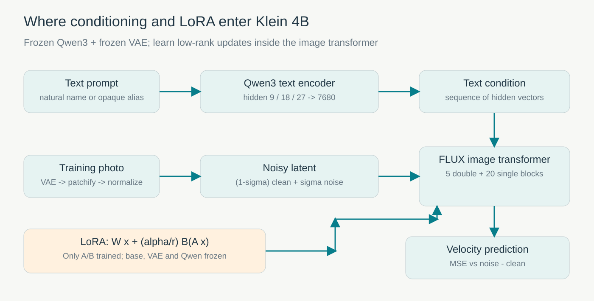
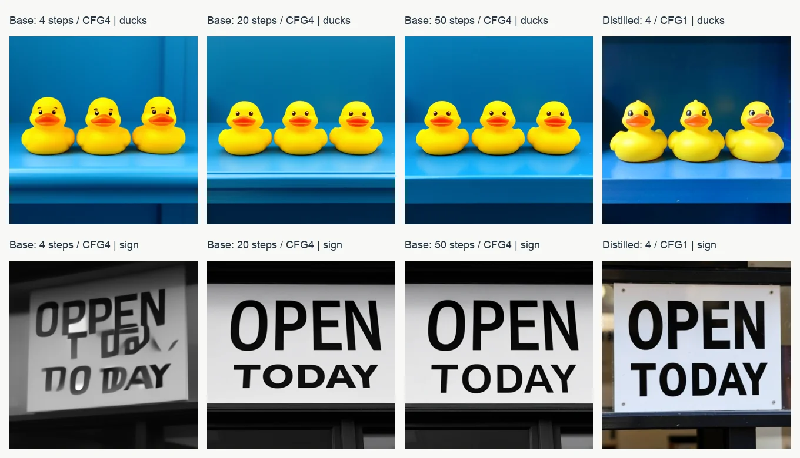
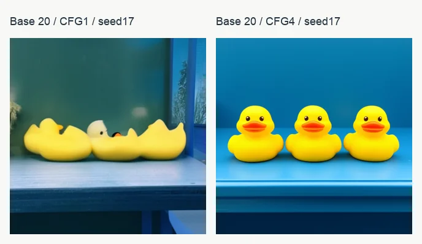
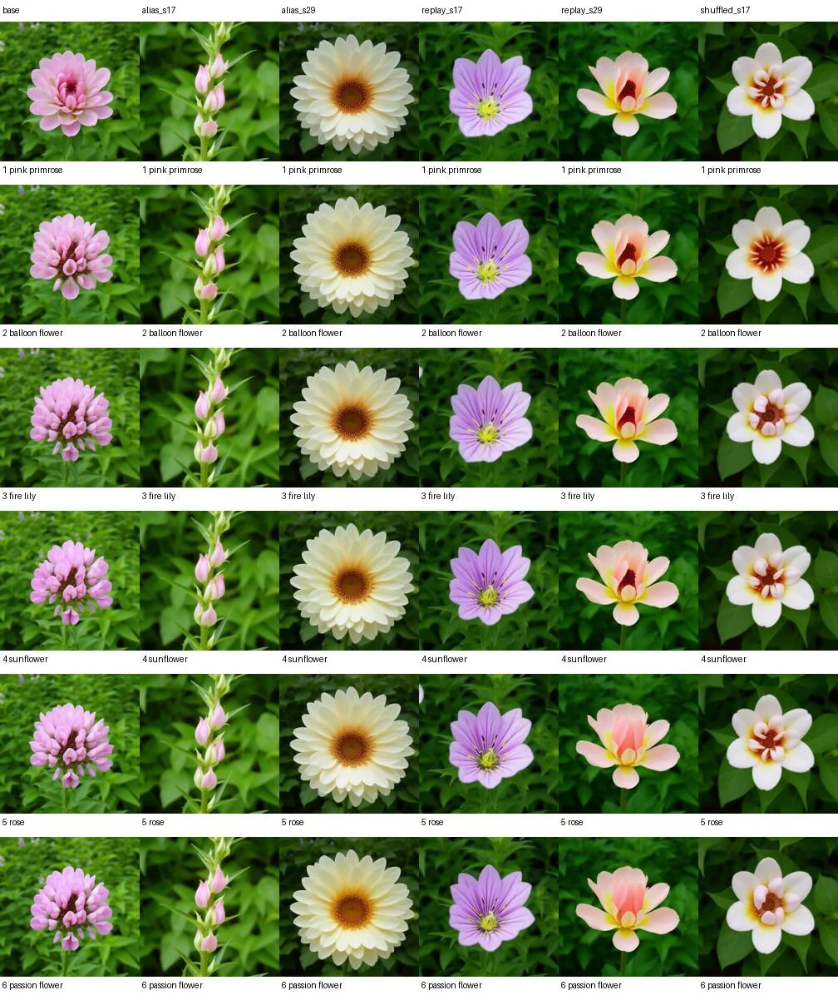
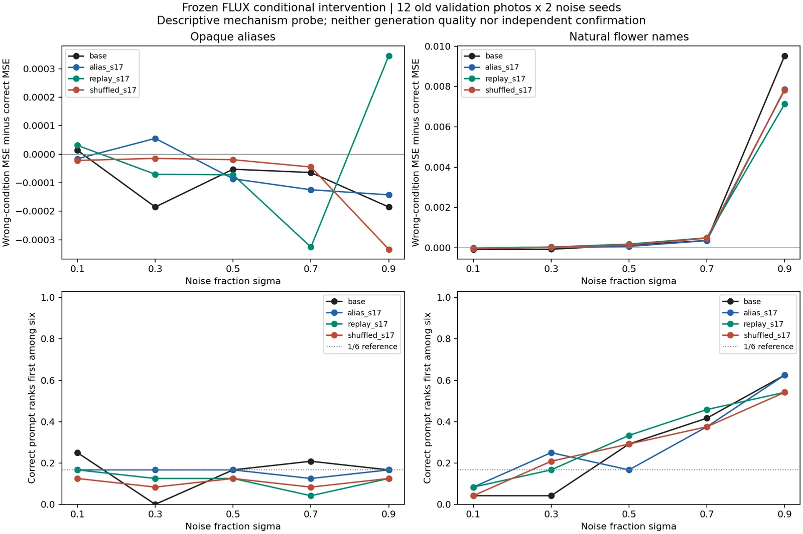
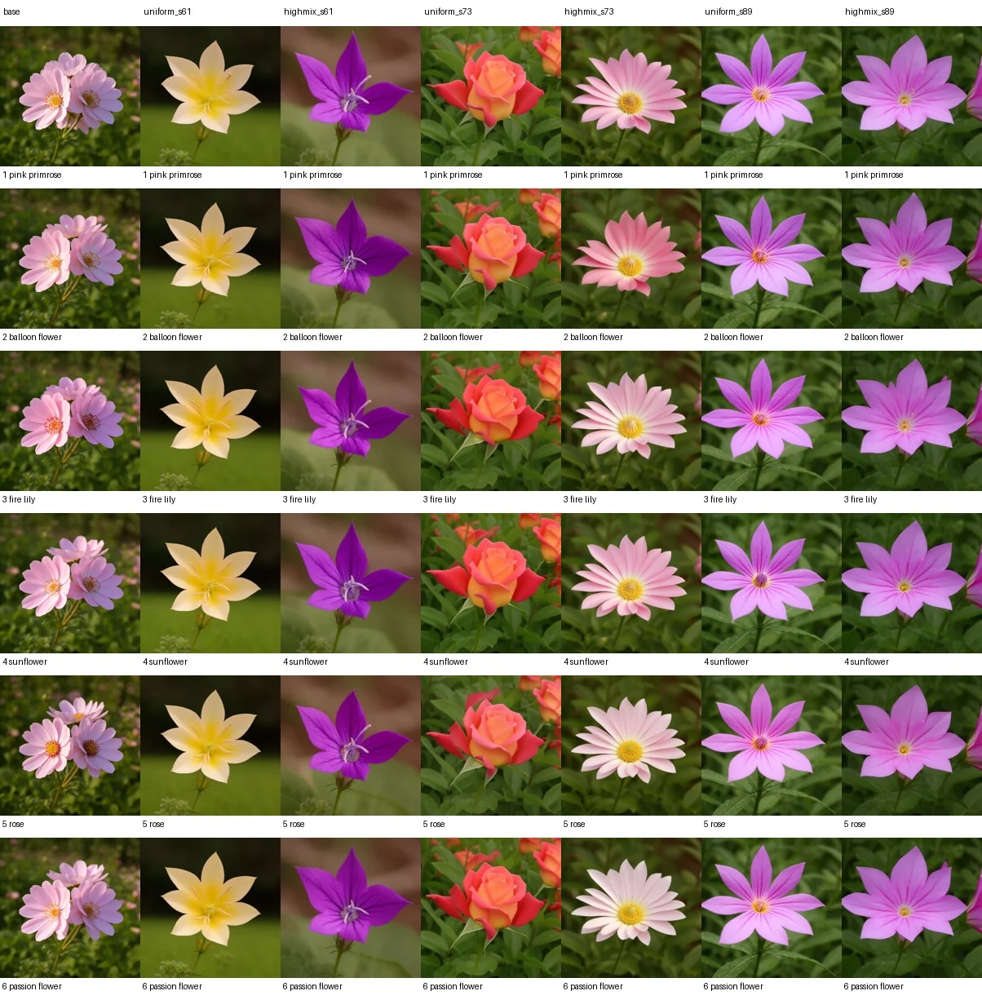
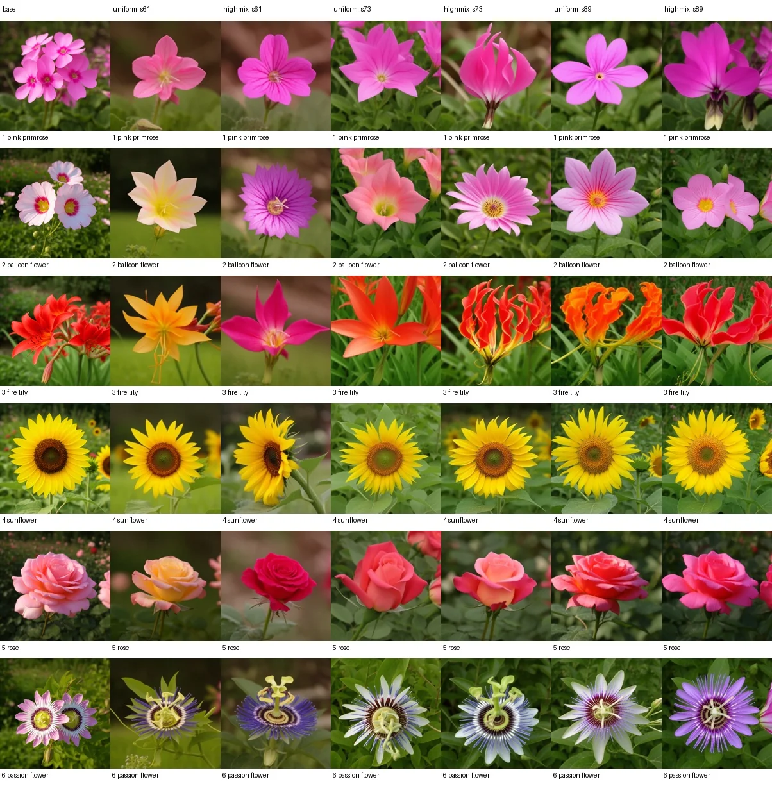
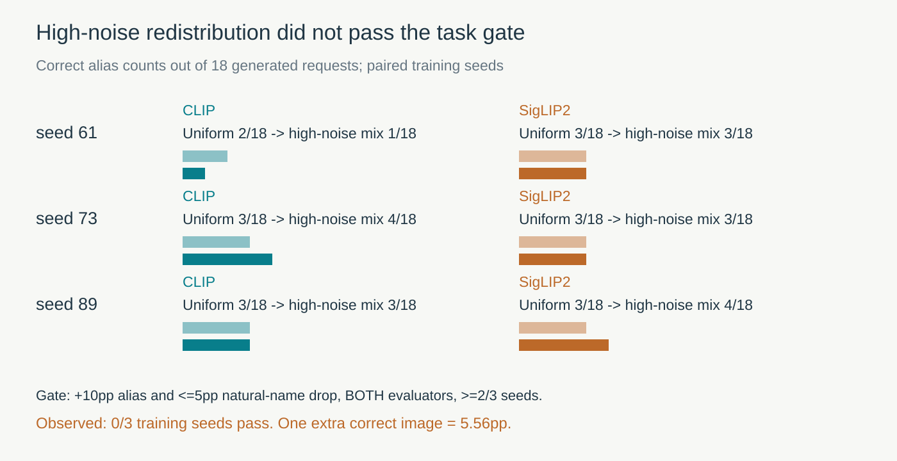

[系列总纲](/posts/projects/multimodal-lab/00-series-guide) · 上一篇：[DDPM 与生成修复](/posts/projects/multimodal-lab/05-diffusion-and-flow) · 下一篇：[六个新词向量](/posts/projects/multimodal-lab/07-new-token-conditioning)

当生成图已经足够漂亮，实验反而更容易被误读。输入六个不同的花卉代号，模型每次都画出漂亮的花；LoRA 的测试 MSE 也下降。可把六张图排在一起，就会发现它们并没有对应六种花。

第三轮实验从 MNIST 小模型走到了完整的 FLUX.2 Klein 4B 文生图管线，完成自然花名适配和任意代号学习。第四轮先冻结模型、逐项更换文字条件，再做三对高噪声采样分布训练。最终结论是：**这套 LoRA 配方能改变花卉外观，却没有建立可靠的新代号对应；提高高噪声比例的方案也没有通过继续投入的门槛。**

这个任务的潜在业务背景是商品代号、内部素材标签或个性化概念的控制。名称与视觉概念如果没有稳定绑定，生成系统即使提供高清、漂亮的图，也不能可靠执行产品要求。本项目用六类已知花卉作为教学代理，没有开展真实商品生产或客户评测。

## 完整模型中，文字和图片在哪里相遇

实验使用 [FLUX.2 Klein base 4B](https://huggingface.co/black-forest-labs/FLUX.2-klein-base-4B) 与 [蒸馏版 Klein 4B](https://huggingface.co/black-forest-labs/FLUX.2-klein-4B)，固定到各自公开 revision，校验官方文件大小和 SHA。基础版作为适配对象，蒸馏版另做少步采样和 adapter 迁移观察，两者权重不同。

文字先经过 Qwen3 编码器，提取第 9、18、27 层隐藏状态并拼接成 7,680 维条件序列。图片经过 VAE posterior mode 编码，将 32 通道潜变量按 2×2 patch 组合，并使用预训练 BN 统计归一化。图像 Transformer 在带噪 latent 与文字条件上预测速度；本检查点配置包含 5 个双流块和 20 个单流块。它不是将整段提示压成一个花卉类别 ID，再交给分类器画图。



图 1：训练照片提供真实 latent，文字提供条件，LoRA 改变图像 Transformer 中指定投影的低秩更新。VAE 和 Qwen3 冻结。模型结构与接口以本项目固定的配置及 [Diffusers v0.37.0 训练源码](https://github.com/huggingface/diffusers/blob/v0.37.0/examples/dreambooth/train_dreambooth_lora_flux2_klein.py) 为准，不把别的 FLUX 版本细节混入这一实验。

这里的 Flow 时间约定与上一篇 Tiny Flow 相反：

```text
sigma = 0: clean image latent
sigma = 1: Gaussian noise
xt = (1 - sigma) * clean + sigma * noise
target_velocity = noise - clean
sampling: move from sigma 1 toward 0
```

训练一次随机取一个 sigma，回归这个时刻的速度；生成则从噪声逐步积分到图片 latent，逆归一化并解码。我们使用连续均匀 sigma 作为教学适配设置，不声称复刻了基础模型的大规模预训练配方。

LoRA 将线性映射改写为 `W(x) + (alpha/r) * B(A(x))`，冻结 W，学习 A、B。rank 越大，可训练参数通常越多，但“参数多”并不等于“类别更准确”；本实验会直接出现相反例子。它节省优化器状态，基础权重和激活仍然占显存。[LoRA 原论文](https://arxiv.org/abs/2106.09685)

## 先不训练：步数、蒸馏与 guidance 的真实差别

第三轮锁定六条原创提示，覆盖颜色、数量、空间关系、招牌文字、自然场景与水彩风格；每条用 seed17/29。基础版比较 4/20/50 步、CFG4，另有 20 步 CFG1；蒸馏版比较 1/4/8 步 CFG1，共 84 张 512×512 图。

| 检查点与设置        | 每图中位秒数 |
| ------------------- | -----------: |
| 蒸馏版，1 步，CFG1  |        0.086 |
| 蒸馏版，4 步，CFG1  |        0.215 |
| 蒸馏版，8 步，CFG1  |        0.388 |
| 基础版，4 步，CFG4  |        0.388 |
| 基础版，20 步，CFG4 |        1.774 |
| 基础版，50 步，CFG4 |        4.387 |
| 基础版，20 步，CFG1 |        0.911 |

文字表示预先缓存，时间不含下载、模型加载和文字编码；全部原始计时包含首次样本开销，没有删去慢样本。H100 上同一进程顺序运行，也不是严格服务性能基准。



图 2：上排提示为“三只黄色橡皮鸭排在蓝色架子上”；下排要求招牌精确写 OPEN TODAY。四列使用同一 seed，右列换了蒸馏检查点及其推荐式 guidance 设置，因此它是检查点比较，只有前三列构成同一基座的步数对照。

**Case 1：文字渲染。** 基础版 4 步的招牌出现多重、破碎文字，20 和 50 步的本样本更清楚。它说明少步求解在这一基础检查点上可能不足，但不能推导每一张 50 步图都比 20 步好。蒸馏版 4 步可以得到清楚文字，因为它的权重已改变，不能把这个结果写成“只换采样器就能提速八倍”。

**Case 2：数量与结构。** 在图 2 的这一个 seed 下，三种基础步数都能看见三只鸭子，主体正确并不意味着材质、边缘和空间关系完全相同。我们还发现 guidance 变化比主体分类分数更容易暴露问题：



图 3：左图可见鸭子外形粘连与变形，右图三只主体分离更清楚。此图没有为每个外形打人工分，说明的是固定 case 中的条件遵从与形态变化，不是整批质量排名。

主体识别很粗。即使某个图像编码器能把两图都判为“鸭子”，它也可能漏掉粘连、数量或错误文字。之后的花卉评价也必须保留这一边界。

## 自然花名 LoRA：目标函数确实改善，任务收益没有统一改善

数据来自 [Oxford Flowers102 官方照片与划分](https://www.robots.ox.ac.uk/~vgg/data/flowers/102/)，选择 pink primrose、balloon flower、fire lily、sunflower、rose、passion flower。每类官方 train10、val10、test 按图像编号取前20，共 60/60/120 张。预处理固定居中裁方并缩到 512×512，不使用测试图生成 caption。

这个任务属于对现有视觉先验的适配，无法确认公开照片是否已出现于基础模型预训练。train/val/test 隔离指的是本次适配阶段。

五个 LoRA 都训练 300 次更新，batch1、学习率1e-4。每100步在固定验证照片、噪声与 sigma0.25/0.5/0.75 上测 MSE，从第0步到第300步中选择最低者，随后报告独立测试。

| 变体                | 可训练参数 | 测试速度 MSE | CLIP 花类吻合 | SigLIP2 花类吻合 |
| ------------------- | ---------: | -----------: | ------------: | ---------------: |
| 基座                |          0 |     0.717390 |         10/12 |            10/12 |
| rank8，seed17       |    983,040 |     0.715898 |         11/12 |            10/12 |
| rank8，seed29       |    983,040 |     0.715835 |         10/12 |            10/12 |
| rank32，seed17      |  3,932,160 |     0.715774 |          8/12 |             7/12 |
| rank8 allstream     |  5,898,240 |     0.712516 |         10/12 |             9/12 |
| rank8，循环错配花名 |    983,040 |     0.715854 |          9/12 |             9/12 |

MSE 是120张独立测试照片、每图三个固定时刻的速度误差；类别吻合来自每组12张新生成花卉图，两项统计对象不同。两评估器使用已固定的文字分类表示。真实持出花卉上的校准准确率接近饱和，仍不能保证生成图像上同样可靠。

allstream 的测试 MSE 改善最多，降幅约0.68%，生成类别却没有最好。rank32 参数更多，代理反而下降。更值得注意的是循环错配花名：它也获得几乎相同的 MSE 改善。

**Case 3：错配监督。** 如果训练图是玫瑰、caption 却固定循环到另一类，模型仍可通过带噪图像学习花卉域内统计并降低速度误差。MSE 在“看着一张已有花图去噪”时测量的能力，不等于“没有图片，只给文字从噪声画指定花”的能力。错配仍改善，足以否定“只要 MSE 下降，就证明文字类别学对了”的解释。

## 把已有花名换成任意代号

看到自然名称任务接近饱和之后，第三轮追加六个代号 zxflw01–zxflw06，与六类照片一一对应。数据不变，花也不是新发现的类别，只是请求它们的符号变了。

五个配置均 rank16、alpha16、allstream、600更新，共11,796,480个可训练参数：纯代号 seed17/29、50%代号与50%自然名混合 seed17/29，以及固定循环错配代号 seed17。根据“代号与自然名称验证 MSE 均值”选择 checkpoint，生成每配置24张，加基座共144张。

纯代号 seed17 的测试代号 MSE 从0.717487变为0.713661，自然名从0.717390变为0.713608。两个目标几乎一样地改善；但12张代号输出只得到 CLIP2/12、SigLIP2 1/12，与可靠的六类绑定相去甚远。



图 4：行对应六个目标类，列对应基座与不同训练方案。比较同一列中的六行，观察代号变化有没有真正改变花类。图中呈现的是固定生成 seed，评价表另包含第二个 seed，不能把两者混为不同训练重复。

**Case 4：外观变化与映射失败。** 有的 adapter 把六个代号都画成相近花型，有的把它们整体转向另一种颜色或排列。它确实影响了生成器，却没有按请求区分六类。类似情形在业务上可能表现为“SKU 变了，商品样式没变”，不能以画面漂亮掩盖映射错误。

混合 seed17 的自然名生成代理达到12/12，而纯代号 seed17为9/12；seed29 没有重现同样优势。混合两组只有293/295次代号曝光，纯代号组有600次，抽图 RNG 也没有逐步配平。因此不能把这一差距单独归因于防遗忘，更不能等同于 [DreamBooth](https://arxiv.org/abs/2208.12242) 的基座先验保持。

## 第四轮冻结诊断：模型究竟有没有读到文字

“代号没学会”有几种可能：输入被截断，缓存误用，不同代号被编码成完全相同向量，或下游能感知不同向量却没有学到正确对应。它们需要不同的修复，因此我们先不训练。

四组冻结权重：基座、纯代号 seed17、混合 seed17、错配 seed17。取原验证集每类前两张，共12张照片，两个固定噪声，sigma0.1/0.3/0.5/0.7/0.9，每张同时配六代号、六自然名和空条件。共6,240个前向条件样本，形成960条归纳记录；独立照片只有12张，绝不是6,240张新测试图。

主诊断量为：

```text
condition_gap =
mean(MSE under five wrong class conditions)
- MSE under the correct class condition
```

差距为正，表示正确条件在这张带噪照片上更有帮助。我们同时保存空条件误差、正确条件在六候选中的排序、条件改变后的预测变化。



图 5：代号与自然名上方面板的纵轴尺度不同，不能只看线条高度比较强弱；下方面板是带噪照片条件排序或向量变化，并非生成准确率。区间来自12张旧验证照片的探索性重采样。

入口审计确认：每条完整模板有32个有效token，没有被512长度截断；第13号位置的代号token发生变化，缓存表示两两不同。全序列余弦接近0.999，是因为共享模板及填充位置占多数；变化位置的相似度较低。因此“向量很相似”不足以证明模型看不到差别。

在 sigma0.9，基座自然花名条件差距为+0.009532，正确条件排第一的比例62.50%；代号差距为-0.000185，排序16.67%。更换代号确实改变预测向量，缺少的是正确绑定。自然花名在 sigma0.5 的差距仅+0.000119，说明噪声较强时文字帮助更显著，但**这一观察不能保证提高高噪声训练比例就有效**。

## 只改变噪声分布，实际结果是什么

基于上述观察，我们锁定三对训练 seed61/73/89，每组600更新：

```text
A: sigma ~ Uniform(0, 1)
B: with probability 0.5, sigma ~ Uniform(0, 1)
   otherwise, sigma ~ Uniform(0.7, 0.95)
```

训练图片顺序、adapter 初始化、基础高斯噪声流按同一 seed 配对；图片 RNG、sigma RNG 和噪声 RNG 分开。两分支初始完整张量 hash 相同，图片 ID 每步一致，第1/300/600步噪声指纹相同。这样能把“多换了样本”从解释中排除。

唯一的干预是实际 sigma 分布，仍用不加权速度 MSE。因此改变的是优化目标的期望分布，不是同一目标下的纯方差缩减。这也是本项目提出的探索方案，没有把它称为官方推荐。

固定取第600步，生成前锁定一个模板、六类别、三个新 seed6201/6202/6203，代号与自然名分别生成，每模型36张，七个配置共252张。它比最初候选设计规模小，没有多模板泛化实验。



图 6：每列换 adapter，每行换目标类。列内六行依然很接近，训练经常把整体外观改变了，却没有把六个符号分开。这里展示全部固定面板，目标类别由行标签给出。



图 7：自然花名比任意代号更能引起目标结构变化，但局部外观仍会随 adapter 改变。自然名保持与代号获取是两项成绩，不宜只展示其中更好的一个。

**Case 5：同一 adapter 的六代号。** seed61 的均匀组常输出黄白花型，高噪混合组更多输出紫花；seed73 两组也有明显外观差别。但在各自列中，从 primrose 请求换到 sunflower，请求类别没有形成稳定区别。这种列间变化证明 adapter 在工作，列内同质说明任务还没完成。

| 训练 seed     | CLIP 代号正确数 | SigLIP2 代号正确数 | CLIP 自然名正确数 | SigLIP2 自然名正确数 |
| ------------- | --------------: | -----------------: | ----------------: | -------------------: |
| 61，均匀→混合 |             2→1 |                3→3 |             15→14 |                16→14 |
| 73，均匀→混合 |             3→4 |                3→3 |             16→14 |                16→14 |
| 89，均匀→混合 |             3→3 |                3→4 |             15→14 |                15→15 |

每格分母18。预定门槛为代号至少提升10个百分点、自然名下降不超过5个百分点，同一训练 seed 在两评估器都满足，至少2/3 seed通过。18张的小面板里，多对1张仅5.56个百分点；至少需要多对2张，而自然名少对1张已超出容许下降。



图 8：两评估器中最大的代号提升都只有一张。三个训练 seed 的联合通过数为0/3；原型和ridge敏感性分析也为0/3，没有更换主指标来挽救结论。

干预确实执行了：混合组选择高区间分支的步数为301/282/315；实际 sigma≥0.7 的步数由均匀组173/192/178增至379/370/403。失败不能归因于“高噪声没有真的增加”，但它也不能唯一说明是哪种条件学习瓶颈。

## 怎样把负结果变成下一轮的输入

| 迭代             | 完成的内容                         | 支持的判断                           |
| ---------------- | ---------------------------------- | ------------------------------------ |
| 第三轮冻结生成   | 84张基础版/蒸馏版多设置图片        | 同基座步数变化与换权重必须分开       |
| 第三轮自然名适配 | 五组 LoRA、独立目标 MSE、168张采样 | 更小回归误差没有统一变成任务收益     |
| 第三轮代号追加   | 五组600更新、144张生成             | 当前配方没有建立六代号映射           |
| 第四轮冻结干预   | 6,240前向条件样本，12独立照片      | 文字入口可区分；自然语义高噪帮助更大 |
| 第四轮配对训练   | 六组、3,600更新、252张图           | 增加高噪比例的联合门槛0/3失败        |

六组训练循环合计635.71秒，峰值 PyTorch allocated 8.03 GiB；252次缓存文字到图像的采样合计499.68秒。它们不含模型加载、旧缓存制作等全部开销，不能用来承诺端到端成本。两种 sigma 分布下的平均训练 loss 也不能直接排名。

这次决策是停止扩大这一噪声重配方的训练量，转向条件输入本身。下一篇会把可训练位置移到六个新 token 的输入向量，先检查反向路径和持久化，再检验新模板。它是一个已经实际运行的新实验，不意味着我们提前认定它一定成功。

本文图片是原创结构图和冻结结果中的真实生成图，不含复制论文插图。数值可沿 `runs/round3/image/results/analysis`、`runs/diagnostic_round/image/conditions` 和 `runs/diagnostic_round/image/noise_training` 的逐图记录复算。所谓未通过门槛只适用于这批六类照片、提示、种子和预算，不等于证明所有高噪训练或所有 FLUX 条件适配无效。
