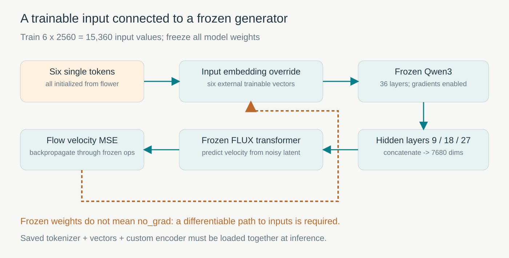
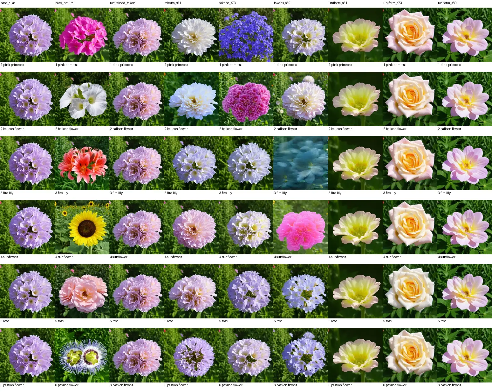
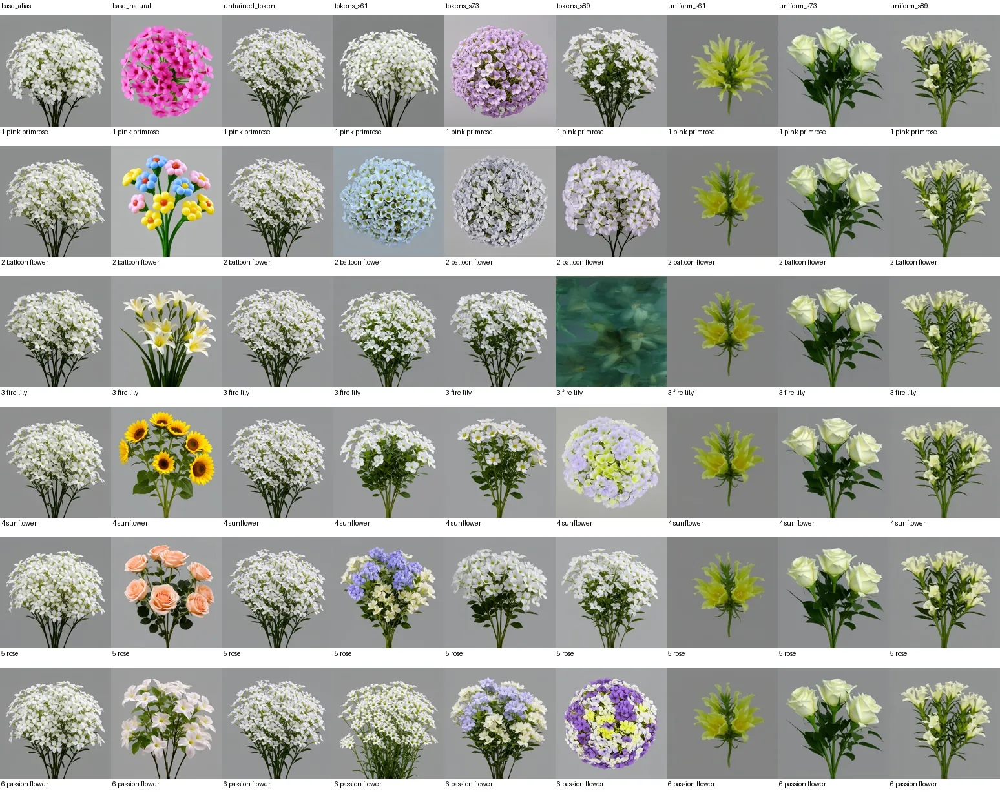
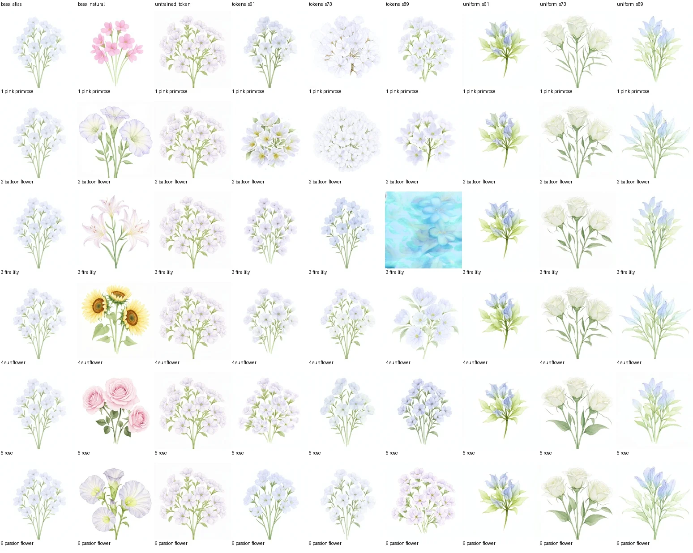
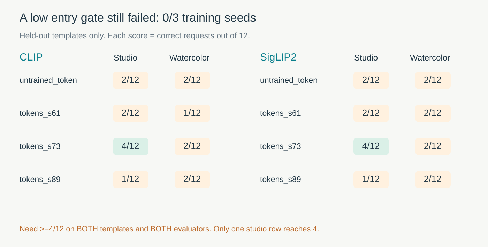
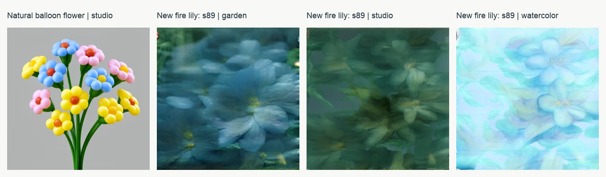

[系列总纲](/posts/projects/multimodal-lab/00-series-guide) · 上一篇：[FLUX LoRA 的条件诊断](/posts/projects/multimodal-lab/06-flux-lora-diagnosis)

上一轮把高噪声训练比例增加了，六个花卉代号仍然没有稳定对应六类花。第五轮换了干预位置：冻结 Qwen3、FLUX Transformer 和 VAE，只训练六个专用 token 的输入向量。

工程接口跑通了：能够把新 token 放进新提示，载入保存的向量，生成图片；反向传播、保存重载与普通提示编码保持均通过检查。任务却没有完成：三个训练 seed 在两种新模板、两个评估器下，都未通过预定的继续门槛，结果是 **0/3**。

这篇文章把“代码能工作”和“新词语义学成”分别拆开。小参数量很有吸引力，但只有保存了有效梯度，不代表模型学会了我们希望的含义。

## 为什么考虑训练一个新词

在实际素材系统里，我们可能希望某个专用标记指向特定产品、角色或风格，再把它放进“棚拍”“水彩”“户外”等不同提示中。这个方向的价值在于保持大型基础模型冻结，用少量产物携带专用概念。

[Textual Inversion 原论文](https://arxiv.org/abs/2208.01618) 提出在冻结文生图模型中学习新词嵌入。我们的实验借用这个**训练位置**，移植到 Klein 的 Qwen3 隐状态接口，研究六类已有花卉与六个新符号的绑定。它不是原论文少样本个性化基准的完整复现，也不是从零学习花卉知识；底座原本就拥有大量花卉先验。

LoRA 改变的是生成器指定权重中的低秩更新。新词方法改变的是“输入这个符号时，文字编码器收到什么向量”。两个位置可以联合训练，但这一轮只学习新向量，避免同时修改两处。

| 方法                | 本项目的可训练位置          | 主要问题                                   |
| ------------------- | --------------------------- | ------------------------------------------ |
| 第三、四轮代号 LoRA | 图像 Transformer 的低秩 A/B | 生成器能否把冻结的任意代号表示绑定到花类   |
| 第五轮新 token      | 文字输入中的六行向量        | 条件入口改变后，冻结生成器能否执行正确绑定 |
| 自然花名基座        | 不训练                      | 预训练语义能提供什么参照与反例             |

这里的背景仍是技术与教学验证。六类花不是某个商业产品，不包含真实生产效果或客户偏好数据。

## 输入向量只有六行，梯度却要走过整个条件接口

新增 `<flwconcept1>` 至 `<flwconcept6>`，每个是一个完整 token，对应2,560维输入向量：

```text
6 tokens * 2560 values = 15,360 trainable parameters
```

六行都从同一个普通词 `flower` 的向量初始化。没有把 sunflower 的词向量预先塞进向日葵的那一行，也没有加入区分类别的小扰动。因此初始状态没有六类身份信息。

输入提示在新 token 位置使用外部可训练向量，其他位置继续使用原词表。之后经过冻结 Qwen3 的第9、18、27层，拼接成7,680维条件序列，再送入冻结 FLUX，计算 `noise-clean` 速度损失。[固定版本 Klein 编码接口](https://github.com/huggingface/diffusers/blob/v0.37.0/src/diffusers/pipelines/flux2/pipeline_flux2_klein.py)



图 1：蓝色箭头是前向数据流，橙色虚线概括梯度回到新输入向量的路径；实际梯度穿过冻结的编码与生成运算。冻结权重不等于禁用计算图，原来用于缓存文字的 `no_grad` 路径不能直接用来训练输入向量。

如果把 Qwen3 编码放在 `torch.no_grad()` 里，生成器可以看到新向量产生的条件，却无法把“图片预测错了”的信号传回新向量。这是一个很隐蔽的工程失败：loss 仍有数值，程序可能仍能输出图，目标参数却没有真正学习。

正式训练前，我们另外做了3步功能检查：

- 普通提示的自实现编码与官方编码逐 bit 相同，最大绝对差为0。
- 未训练六 token 的编码完全相同，符合共同初始化的设计。
- 当前请求概念行具有非零有限梯度，冻结模型权重没有参数梯度。
- 保存再加载的向量及输出编码完全一致。

这3步是独立 probe，不计入正式1,800次更新。AdamW 优化整张六行表，历史动量可能使当前没有直接梯度的行继续变化，所以“仅当前行有梯度”也不意味着“这一步只更新当前行”。

模型文件与原词表不改写。产物包含新增 tokenizer、六行外部向量和编码代码；使用时必须加载这个接口。直接把新字符串发给没有载入向量的原模型，不会自动获得相同含义。

## 怎么训练，怎么避免边看图边换规则

正式训练 seed61/73/89，每组600步、batch1。AdamW 学习率0.005、weight decay0、梯度范数裁剪1，数据仍是原60张花卉训练照片。训练模板固定为：

```text
A natural close-up photograph of <flwconceptN> flowers,
detailed petals and a garden background.
```

三组初始化相同，照片与噪声顺序随训练 seed 改变。图片ID、均匀sigma和高斯噪声流复用第四轮对应均匀 LoRA 计划，并保存第1/300/600步噪声指纹。固定使用第600步向量，不根据生成图挑 checkpoint。

旧 LoRA 是参考条件，不是严格单因素对照：新 token 的 tokenization、初始语义与参数化都变了。即使照片与噪声计划配对，也不能把差距完全归因于“训练位置不同”，更不是等参数量比较。最直接的比较是**同一新 token 接口的训练前后**。

生成前锁定9个配置、3个模板、6类、2个新生成 seed7201/7202，512×512、20步、CFG4：

| 模板         | 是否出现于新词训练 |
| ------------ | ------------------ |
| 花园近景照片 | 是                 |
| 灰背景棚拍   | 否                 |
| 白纸水彩     | 否                 |

九个配置为原代号基座、自然花名基座、未训练新词、三份训练新词、三份旧均匀 LoRA。每配置36请求，共324次正式生成。棚拍和水彩检验的是有限的提示迁移，不代表自然语言任意组合能力。

## 先看全配置，不先挑好看的格子

以下三张联系图均固定生成 seed7201，列顺序完全一致：代号基座、自然花名、未训练新词、token seed61/73/89、旧 LoRA seed61/73/89。行依次为 pink primrose、balloon flower、fire lily、sunflower、rose、passion flower。



图 2：训练模板中的输出。有些新向量改变了颜色、花团排列，却没有稳定生成六种不同目标。先纵向检查同一列，判断类间是否有区别，再横向看同一请求的变化。



图 3：自然名列出现明显的类间差异；新词列常保留相近浅色花团。部分灰背景被保持，不意味着目标花类被保持。第三行 token seed89 的蓝绿局部是需要保存的反例。



图 4：很多输出仍有白纸与浅色笔触，但类别区分很弱。风格看起来像水彩、图片不完全相同、目标类正确，是三项不同观察。

三个面板覆盖162/324次请求，没有按分数选择格子。原实验目视检查也是这个固定范围，没有冒充全324张的盲评或植物学专家标注。

**Case 1：向日葵没有因输入变成新 token 就被学会。** 自然名列可见典型黄色花盘；不少训练后 token 请求仍生成浅色小花团。整体看起来像花、背景也正确，但向日葵请求没有得到向日葵的显著结构。这个例子直接说明“提示中的场景部分有效”可以与“新词类别失败”同时发生。

## 未训练基线为什么必然是 2/12

我们使用固定 CLIP 与 SigLIP2 的零样本六类吻合率作为主代理。每模板6类×2个生成 seed，共12张请求；prototype 和ridge只做敏感性分析，不重新拟合新生成图，也不挑得分最好的一种。

未训练六词来自同一向量，输入编码也相同。在某一模板、某一生成 seed 下，六个请求实际产生同一图片；评估器对这张图片给出一个固定类别。六个目标标签各出现一次，必然恰好对其中一个。

因此两个生成 seed 合计恰好2/12，16.67%。这是**构造性基线**，不代表人工确认了这张花图是什么，更不是依靠随机假设估计的模型知识。

这个设计也解释了为什么必须分别报请求数与去重数：未训练配置36请求只有6个不同SHA；其余八配置各36个不同SHA，整个正式矩阵324请求、294个不同图像SHA。不能把未训练36请求当作36张独立图片。

## 很低的迁移门槛，也没有通过

在训练前预定：同一训练 seed 相比未训练新词，**两个新模板、两个主评估器**都至少增加10个百分点；至少2/3训练seed满足才继续扩展。

每模板分母12，多对1张是8.33个百分点，不够；必须至少多对2张，即从2/12达到4/12，33.33%。这个门槛只是低成本继续研究的准入，不是“可上线”的质量要求，也不是统计显著性检验。

| 配置           | CLIP 花园 | CLIP 棚拍 | CLIP 水彩 | SigLIP2 花园 | SigLIP2 棚拍 | SigLIP2 水彩 |
| -------------- | --------: | --------: | --------: | -----------: | -----------: | -----------: |
| 原代号基座     |      2/12 |      1/12 |      2/12 |         2/12 |         2/12 |         2/12 |
| 自然花名基座   |     12/12 |     10/12 |     10/12 |        11/12 |        11/12 |        10/12 |
| 未训练新 token |      2/12 |      2/12 |      2/12 |         2/12 |         2/12 |         2/12 |
| token seed61   |      2/12 |      2/12 |      1/12 |         0/12 |         2/12 |         2/12 |
| token seed73   |      0/12 |      4/12 |      2/12 |         1/12 |         4/12 |         2/12 |
| token seed89   |      1/12 |      1/12 |      2/12 |         1/12 |         1/12 |         2/12 |
| 旧 LoRA seed61 |      2/12 |      2/12 |      2/12 |         2/12 |         2/12 |         2/12 |
| 旧 LoRA seed73 |      2/12 |      2/12 |      2/12 |         2/12 |         2/12 |         2/12 |
| 旧 LoRA seed89 |      2/12 |      2/12 |      2/12 |         2/12 |         1/12 |         2/12 |



图 5：seed73 仅棚拍达到4/12，水彩仍为2/12。同一 seed 需要在两个新模板都通过，所以它也没有达标。三个seed的联合通过数为0/3，prototype和ridge也各为0/3。

**Case 2：局部改善不能冒充模板泛化。** 如果只保留seed73棚拍，图表可以写成“准确率翻倍”。但两个评估器都认出的改进没有迁移到水彩，也没有在另两seed重现。完整的预定门槛让这一局部结果保持原来的解释位置：值得观察的单格，没有证实六类新词可靠学习。

三份新词配置合计108请求，两主评估器都只匹配15/108，13.89%。我们还把请求c类循环路由到c+1类向量；正确路由没有展示类别优势，错配复用反而得到CLIP19/108、SigLIP2 20/108。

这项诊断先验证“错配c类编码”等于“正常c+1类编码”，再复用已经生成的图重新计算标签，不是又生成108张，也不是新的独立样本。编码路由正确的工程检查与语义绑定正确的任务检查依旧不同。

## 代理塌缩，不等于像素完全相同

三份训练新词的36次水彩请求中，CLIP把35次判为balloon flower，SigLIP2把36次判为balloon flower。可以称为代理类别高度集中，却不能直接写成“所有输出一模一样”。

事实上，三份训练新词各36张图的SHA都不同。像素差异说明输出并非文件级重复；它不保证有正确、足够大的概念差异，更不能替代人类质量判断。

**Case 3：有颜色变化，但仍没有目标身份。** 水彩面板中新词列的花色和排列确实改变，一些花偏蓝，一些有浅紫小花团。评估器却把几乎所有目标压到同一类别。可能包含实际类间同质，也可能包含真实照片校准到水彩域的评估器偏差；本轮没有专家重标，不能只选择其中一个解释。两者都要求继续保留原图。

## 两种特别容易误导人的反例



图 6：左格为自然花名基座，后三格为新词seed89，全部是正式矩阵中的固定seed7201样本；它们是说明边界的case选择，不是代表整批平均水平。

**Case 4：分类代理可以把字面联想算作正确。** 灰背景棚拍中的自然名balloon flower出现彩色气球造型。CLIP判为错误类，SigLIP2却判为目标类。图片与“balloon”语义相关，并不等于真实的桔梗花形态正确。所以自然名10/12或11/12这类高分也不能直接写成植物学真实性。

**Case 5：新词改变了前景，也破坏场景约束。** token seed89的fire lily在花园、棚拍、水彩中都出现蓝绿模糊局部。棚拍并没有保持预期的灰背景整株构图，水彩也偏离其他格子的白纸独立花形。它不是只有花类没学成，某些输入还影响了原先有效的场景控制。三个模板的配对展示让这种持续失败更容易看见。

这些是助手对固定样本的有限目视观察，没有植物专家真值、盲法偏好、风格准确率或MOS。图像数量越多，越应该让具体失败可检索，而不是靠人工挑图替代评价。

## 少参数不意味着少显存

正式三组训练合计475.05秒，单组157.94–158.64秒，峰值PyTorch allocated15.41 GiB。324次缓存条件生成合计605.41秒，中位1.79秒/图，峰值8.09 GiB；两评估器与联系图导出阶段11.33秒。

这些是各阶段记录，不包含完整模型加载、旧缓存准备、文字条件预计算与传输。不能把15,360参数解释成“训练时只需存六个向量”：梯度仍需经过 Qwen3 和图像 Transformer 的运算图，激活需要显存。第四轮 LoRA 的训练采用文字缓存，反向路径不同，因此显存差距也不能被当作严格同管线的参数效率排名。

训练前100步与后100步平均loss没有统一下降，还混合了不同照片与sigma。本轮没有用这个平均数来宣称概念学习成功。冻结计算图的正确性由梯度与持久化检查证明，语义效果由独立生成协议验证。

## 保存的接口怎么调用

真实源码包含 `learn_tokens.py`、`generate_tokens.py`、`evaluate_tokens.py` 和 `run_prompt.py`。在多模态实验项目中，准备已校验的公开基座、匹配环境与保存的向量之后，可以将路径替换为自己的产物位置：

```bash
CUDA_VISIBLE_DEVICES=0 python labs/round5/image/run_prompt.py \
  --base ./models/FLUX.2-klein-base-4B \
  --vectors ./artifacts/tokens_s61/final.safetensors \
  --prompt 'A studio photograph of <flwconcept1> flowers on a plain gray background.' \
  --seed 7201 \
  --output ./new-example.png
```

这是已实现接口的调用规格，不是仅凭博客图片就能恢复权重的自包含示例。脚本要求提示包含已保存的新token，拒绝覆盖原文件；需要完整模型依赖和向量文件。实验档案保存三份最终向量，没有挑选本轮“最好seed”。

这个CLI额外在另一张H100上实跑一次，512×512图片SHA与正式矩阵同配置输出一致。它验证持久化后的新提示入口，没有计入324个正式请求，也没有单独当成新的训练实验。

## 我们核验了什么，仍然没有核验什么

| 检查层次     | 实际证据                                                     | 不能代替的结论                       |
| ------------ | ------------------------------------------------------------ | ------------------------------------ |
| 参数与梯度   | 1,800条更新均有限、非零，六向量变化                          | 不能证明六类语义绑定                 |
| 训练配对     | 图片ID、sigma逐步一致，三个噪声指纹匹配                      | 跨方法仍不是单因素比较               |
| 持久化       | 保存重载一致，CLI输出同SHA                                   | 不代表新提示普遍有效                 |
| 普通提示保持 | 54项自然提示编码不变                                         | 编码不变不是全领域生成质量保证       |
| 循环路由     | 54项编码等价检查通过                                         | 不代表正确路由比错配更有语义优势     |
| 数据与评分   | 324配置完整，294不同SHA；CPU float64重算1,944分类判断、162组 | 数学重放不是再跑图像编码器或专家重标 |
| 模板迁移     | 两新模板、两评估器、三训练seed                               | 0/3，不支持放大当前方案              |

这轮完成的功能是一个可训练、可保存、可在提示中加载的新词输入接口；完成的研究结果是这套接口、数据和预算下的有限迁移失败。它没有检验新主体个性化、两个新概念同时组合、颜色数量关系或独立新来源图片。

数值与图像来自 `runs/round5/image/formal`、`generation`、`evaluation` 及 `independent_audit.json`，源码在 `labs/round5/image`。公开博客只展示原创解释图和真实生成案例，不重复放入基础大权重或个人服务器信息。

继续研究时，先沿着“输入向量—编码序列—生成条件—实际类间差异”定位失败，再决定改监督、初始化、训练预算还是评价域。当前结果不支持只因可训练参数很少就扩大训练，也不支持宣称Textual Inversion思想整体无效。
