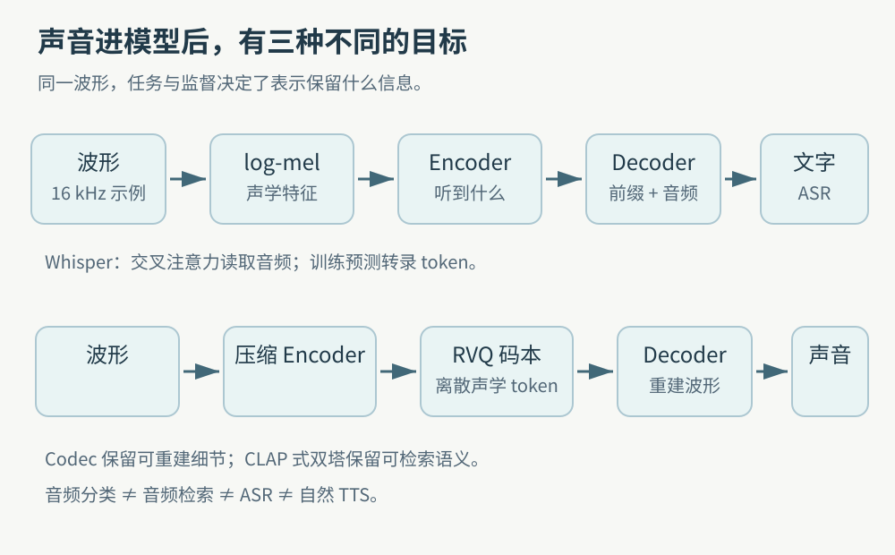
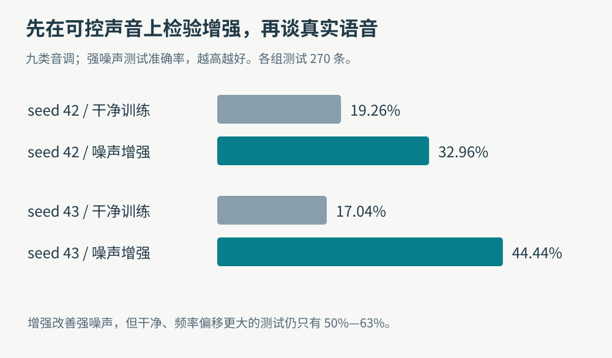
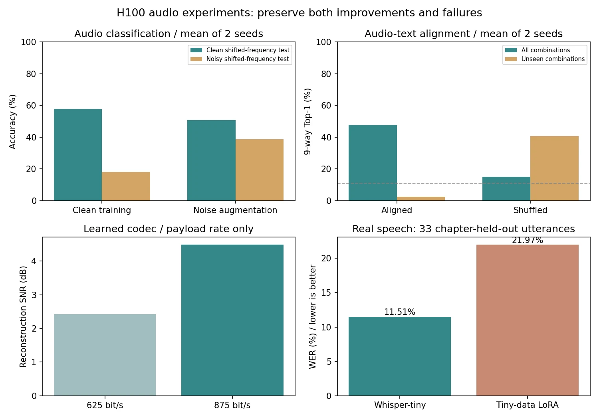
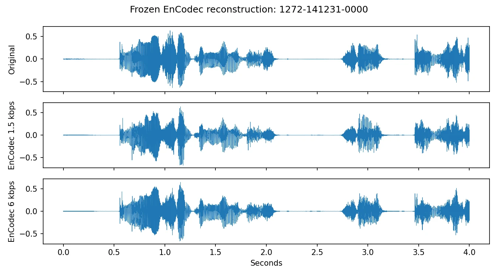
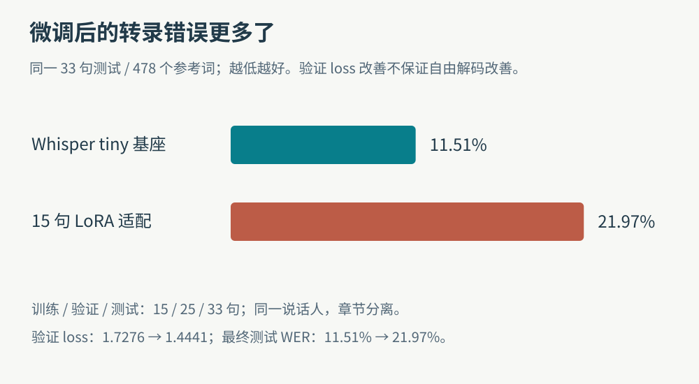
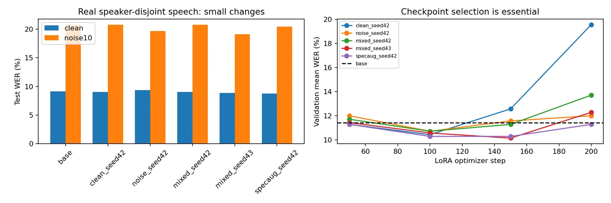

同一个“声音模型”可以做完全不同的事：给报警声分类、按描述检索音效、压缩一段录音，或者把会议语音转成文字。它们可能都用 Transformer，却没有相同的输入表示、训练目标和验收方式。

这篇把我们的音频实验按这四种功能串起来。第二轮先用可控音调检验机制，再实际运行公开 EnCodec 和 Whisper；第三轮补上说话人隔离、噪声增强和解码对照；第四轮审计文字评分器。自然 TTS 的长文、停止和分段问题放在[下一篇](/posts/projects/multimodal-lab/09-long-form-tts)。完整学习路线见[系列总纲](/posts/projects/multimodal-lab/00-series-guide)。

文中的会议转录、音效库和语音传输是潜在应用背景。实验室实际完成的是教学实验与公开模型的小规模评估，没有把它们描述成已上线的业务系统。

## 一段波形，三种表示

波形记录随时间变化的数值。2 秒、16 kHz、单声道有 32,000 个采样点；修改文件头的采样率会改变播放速度，真正重采样必须计算新序列。

声音分类和 Whisper 常先把短窗频谱转换为模型需要的声学特征。以 STFT 为例，窗口让我们看到“某个时刻有哪些频率”；mel 滤波器组进一步聚合频率，再取对数。具体采样率、窗口和维度必须由模型的 processor 确定，不能把一个教学参数照搬给所有模型。

另一条路线把波形编码为离散声学 token。它们是码本索引，既不是词，也不保证一个 token 对应一个音素。还有一条路线输出全局语义向量，用来判断声音与文字是否匹配。[Whisper 论文](https://arxiv.org/abs/2212.04356)、[EnCodec 论文](https://arxiv.org/abs/2210.13438)、[CLAP 论文](https://arxiv.org/abs/2211.06687)

_读图时先看输出：文字对应转录监督，重建波形对应保真监督，可比较向量对应配对监督。名字里都有“audio”，不意味着学到的是同一种能力。下方画的是公开神经 codec 的概念；我们的 toy codec 采用分阶段 AE 与 k-means，并非端到端 RVQ。_

## 每次迭代解决了什么

| 阶段             | 实际动作                                              | 新增认识                                                     |
| ---------------- | ----------------------------------------------------- | ------------------------------------------------------------ |
| 初始教材         | 梳理音频表示、ASR、CLAP、codec LM 的机制和待运行配方  | 先明确任务；教材里的建议规模不能算实验结果                   |
| 第二轮：可控机制 | 九类音调分类、音文配对/错配、学习码本、token LM       | 增强改善某种噪声；对齐不保证组合泛化；自由生成不等于自然语音 |
| 第二轮：公开模型 | EnCodec 两带宽重建；Whisper tiny 基座和 60 步 LoRA    | codec 可验证实际码率张量；极小样本适配造成明显负迁移         |
| 第三轮：改进方法 | 五个 Whisper LoRA 配置、说话人隔离、beam=5、Qwen3-ASR | 选择指标要接近任务；改解码和换基座也值得先测                 |
| 第四轮：检查量尺 | 复算 1,200 条系统输出的编辑距离与规范化               | 数值复算正确，仍可能与时间表达的语义判断不一致               |

这些层级是理解方式的递进，不是把四种不同任务拼成一个准确率排行榜。

## Case 1：先让“噪声增强有效”变成可证伪的问题

我们生成九类合成音调：低、中、高频段与上升、下降、稳定轨迹的组合。每段是 4 kHz 的 2,048 个采样点，随机化相位、振幅和起始频率。训练、验证、测试各 630、180、270 条，并让频率偏移区间互斥：训练 0–25 Hz、验证 35–55 Hz、测试 80–110 Hz 的绝对偏移。

模型是 STFT 后的小 CNN。对照只改变训练中是否加噪，均用噪声验证集选权重，然后各做一次最终测试。

_两次重复都改善强噪声测试；绝对准确率仍有限。增强组的干净测试分别为 51.48% 和 50.00%，低于干净训练的 52.22% 和 63.33%。因此它支持目标噪声下的收益，不能写成全面提高声音分类能力。_

如果潜在应用是报警声识别，这个结果提醒我们先说明目标分布：关心办公室背景噪声，还是未见设备的音调变化？增加噪声解决不了所有分布差异。当前声音是合成音调，结果也不能直接作为真实报警声准确率。

## Case 2：对齐成功，为什么未见组合几乎全错

音文对齐模型用小 CNN 编码声音，用两个属性 token 的均值嵌入编码文字，再归一化向量做对比学习。相似度矩阵的正确配对是正例，其他描述提供候选。这是 CLAP 式机制实验，没有加载真实 CLAP 大模型，也没有测试开放自然语言。

训练中完全移除“低频上升”和“高频下降”，最终仍在九个候选描述里检索。两个 seed 的正确配对总体 Top-1 为 46.67% / 48.89%，已见组合为 59.52% / 61.90%，未见组合却只有 1.67% / 3.33%。

_右上角的错配组在“未见组合”局部反而较高，但总体准确率只有 17.41% / 12.59%。这可能反映候选类别偏好；局部高分不能覆盖整体失效。左下角是自训 toy codec，不能与下文公开 EnCodec 跨数据比较。_

这里还有一个实验设计教训：多正例与单对角线目标结果相同。因为同标签文字 token 完全相同，重复文本的嵌入相同，这个结构让两个目标产生等价或很接近的梯度。它没有隔离出“多个不同描述表达同一语义”的问题，所以不能据此宣布多正例方法没有价值。

这类对照适合检索系统的研发：先确认模型有没有依赖配对，再检验未见组合。仅仅看到训练 loss 下降，还不知道它是在学语义、记类别还是利用重复描述。

## Codec：可还原的 token 是怎样学出来的

我们的 toy codec 将波形切成 32 个采样点的块，用 `32 → 96 → 16` 编码器和对称解码器训练连续重建；随后只用训练编码向量做 k-means，学习 32 与 128 两种码本；最后固定编码器和码本，训练量化后的解码器。

这是分阶段学习，不是 EnCodec，也不是端到端 VQ-VAE。逻辑 payload 按 `4000/32 × log2(K)` 计算：32 码本为 625 bit/s，128 码本为 875 bit/s。后者测试 MSE 从 0.08113 降到 0.05051，SNR 从 2.43 增到 4.48 dB；仍不能叫高保真压缩。

冻结 128 码本后，我们把每段声音变成 64 个离散 token，训练两层、隐藏维度 96 的因果 Transformer。800 步训练按验证交叉熵选第 200 步；测试 CE 为 3.4454，困惑度 31.36，低于均匀词表预测的 128。

teacher forcing 给模型真实的历史 token；自由生成只能读自己前一步的结果，错误会改变后续上下文。因此测试 CE 和用真实历史生成的波形，不能冒充自由生成质量。保存的自由采样 WAV 证明流程执行过，声音仍是教学音调，尚未具备自然 TTS。

### Case 3：公开 EnCodec 中，多四倍码率换来了什么

随后实际加载冻结的 `facebook/encodec_24khz`，在固定三条 LibriSpeech 语音的前 4 秒比较 1.5 与 6 kbps。16 kHz 原音频先真正重采样至 24 kHz，每条输入为 96,000 个采样点。

| 带宽     | 实际 codes 形状 | 量化层数 | 固定长度索引 payload | 三条平均 MSE | 平均 SNR |
| -------- | --------------- | -------: | -------------------: | -----------: | -------: |
| 1.5 kbps | `[1,1,2,300]`   |        2 |          1,500 bit/s |     0.003501 |  4.26 dB |
| 6 kbps   | `[1,1,8,300]`   |        8 |          6,000 bit/s |     0.001866 |  7.35 dB |

每秒 75 个时间帧、码本大小 1,024，每个索引 10 bit，于是 `75 × 码本层数 × 10` 得到 payload。前两维是编码块与 batch；`.pt` 保存张量以及试听用 WAV 的大小，都不是压缩码率。[EnCodec 官方实现](https://github.com/facebookresearch/encodec)

_观察相同时间区间的振幅与局部结构变化。三条样本均在 6 kbps 下降低 MSE、提高 SNR；波形误差不能替代音色、辅音和瞬态的盲听评价。这里没有 PESQ、MUSHRA 或人类偏好结果。_

三条只来自一个说话人，模型是否在预训练中见过相关材料未知。语音来源为 LibriSpeech / OpenSLR，作者 Vassil Panayotov、Guoguo Chen、Daniel Povey、Sanjeev Khudanpur，许可 CC BY 4.0；图为本实验波形分析。[原始数据与许可](https://www.openslr.org/12)

## Whisper 的训练流程与一次必须保留的负结果

Whisper 是音频编码器—文本解码器：编码器处理 log-mel，解码器用因果 self-attention 读取文字前缀，再用 cross-attention 读取音频表示。训练时对正确转录 token 计算交叉熵，预测当前 token 的输入不能包含当前答案。推理则逐步生成文字，语言、任务、时间戳与解码上限需要固定。[Whisper 官方仓库](https://github.com/openai/whisper)

LoRA 在冻结权重旁加入低秩更新 `ΔW=BA`。第二轮对编码器和解码器 attention 的 `q_proj`、`v_proj` 使用 rank 4、alpha 8，只训练 73,728 个参数。数据是同一说话人的 73 条公开朗读，按完整章节分成 15/25/33 条；训练 60 次更新，用验证 teacher-forcing loss 选权重。

_这是测试泛化退化。验证 loss 从 1.7276 降到 1.4441，并没有阻止自由解码 WER 变差。不能把“权重确实更新”写成“识别能力提升”。_

这次失败提出三个更具体的问题：数据是否足够覆盖目标分布？用于选权重的指标是否与最终任务一致？最终测试有没有隔离录音来源和说话人？我们没有根据测试结果悄悄重选另一 checkpoint。

## 第三轮：把选择规则改成任务指标

第三轮选取 LibriSpeech dev-clean 的 40 位说话人，以 24/8/8 位隔离；实际语音为训练 240、验证 24、测试 64 条。五个 LoRA 配置都训练 200 步：干净、白噪声、混合两种 seed、混合加 SpecAugment 式时间/频率遮挡。每 50 步计算验证集干净与 10 dB 白噪声 WER，以两者均值选权重，step 0 基座也参与。

_最终测试来自八位持出说话人、993 个参考词。每组可训练参数仍为 73,728。图表中的小幅变化应结合种子和说话人区间读取。_

| 同一第三轮测试       | 干净 WER | 10 dB 白噪声 WER |
| -------------------- | -------: | ---------------: |
| Whisper 基座，greedy |   9.164% |          20.745% |
| mixed seed42，greedy |   9.063% |          20.745% |
| mixed seed43，greedy |   8.862% |          19.134% |
| Whisper 基座，beam=5 |   7.754% |          18.026% |
| mixed seed43，beam=5 |   7.654% |          16.717% |
| Qwen3-ASR 0.6B       |   2.417% |           4.431% |

mixed seed43 的噪声 WER 比基座 greedy 低 1.611 个百分点，但按说话人配对 bootstrap 的 95% 区间约为 `[-3.638, 0.536]`，仍包含零。五组 LoRA 的额外收益区间都跨零；不能宣布稳定有效。

基座改 beam=5 的噪声差值为 -2.719 个百分点，区间约 `[-4.948,-0.541]`。这是小样本、探索性且未做多重比较校正的证据，提示在扩大训练前也应先检查解码。beam 和 greedy 的计时路径分别包含特征提取与预缓存特征，不能精确计算速度倍率。

Qwen3-ASR 在同一音频上明显更低，支持本批材料的系统选型；它同时改变架构、参数规模和预训练数据，不能将差异归因于一个单独技巧。第二轮的 11.51% 与第三轮的 9.164% 来自不同测试集，也不能解释成基座迭代后的提升。

### Case 4：强基座修复的词，与它新增的错误

噪声句 `3536-23268-0016` 包含 `obediently`、`impertinent`、`restraint`。Whisper 转录中分别出现 `Obedee and please`、`putting it wood`、`was strange` 等差异；Qwen 预测更接近参考，总计减少 13 个词级错误。

另一条干净句 `6313-66125-0004` 的参考片段是 `tumble's enough`：Whisper 与参考一致，Qwen 写成 `tumbles enough`，按同一规范化多出两个编辑错误。这里的案例按“改善最多”和“退步最多”事后选择，适合看失败类型，不代表随机样本的比例。

## 评分器也是实验的一部分

`WER=(S+D+I)/N`，分别是替换、删除、插入和参考词数。汇总时累加整个语料的错误与词数，不能直接平均单句 WER；插入很多时 WER 可以超过 100%。中文 CER 同样要冻结标点、空白、数字与字符规则。

实际时间例子：`seven thirty` 经 Whisper EnglishTextNormalizer 变成 `730`，`7:30` 变成 `7 30`。它们产生编辑差异，不直接证明声音把七点半读错。第四轮独立复算 1,200 条系统输出都与原数值一致，但换轻度规范化后 74 条错误数改变。数值正确和定义适合任务是两个问题。[规范化源码](https://github.com/openai/whisper/blob/main/whisper/normalizers/english.py)

对潜在会议转录应用，值得分别统计专名、数量、时间和否定句的错误，而不是只优化一个总 WER。当前没有会议、混响或多人重叠语音实测；白噪声收益也没有验证能迁移到真实咖啡馆噪声。

## 从这些实验继续学

可以先手算一个转录的 S/D/I，再比较“基座 beam”与“适配器 greedy”，最后给音文检索的未见组合结果写出一个替代解释。每个判断都需说明数据、对照和指标。

原实验入口包括 `labs/round2/audio_synthetic.py`、`audio_whisper.py`、`audio_encodec.py` 和 `labs/round3/audio/`。逐例转录、选权重记录、codec 张量与完整 WAV 已留在实验归档；文章使用冻结结果生成的图，不重新训练或覆盖历史证据。复跑应采用新输出目录，并先固定公开模型 revision、数据清单和评分代码。

接着读[长文 TTS：停止证据与分段反例](/posts/projects/multimodal-lab/09-long-form-tts)，可以看到为什么“听得懂”与“说得完整”需要不同证据。
