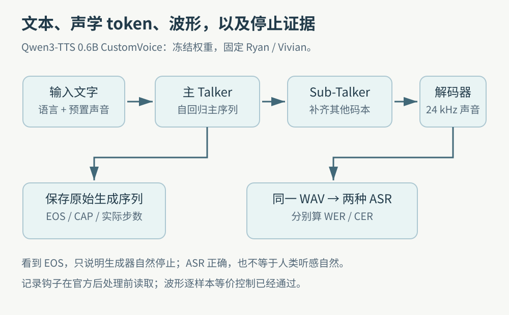
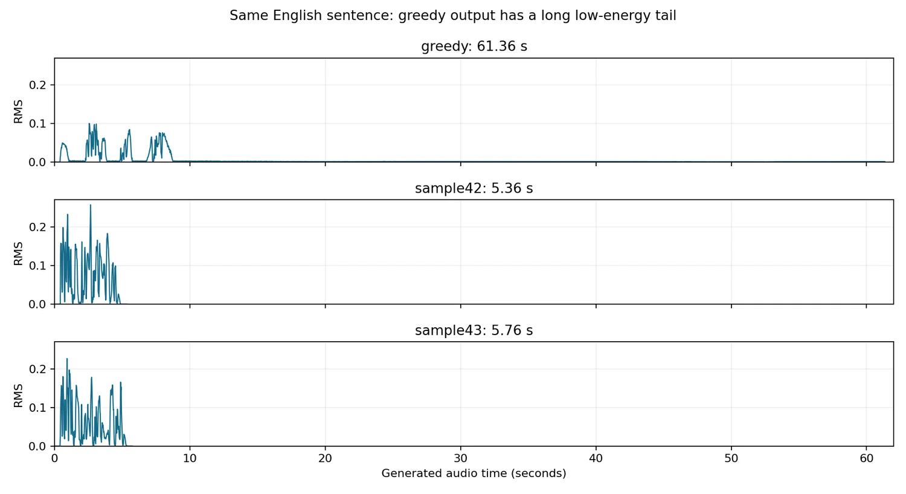
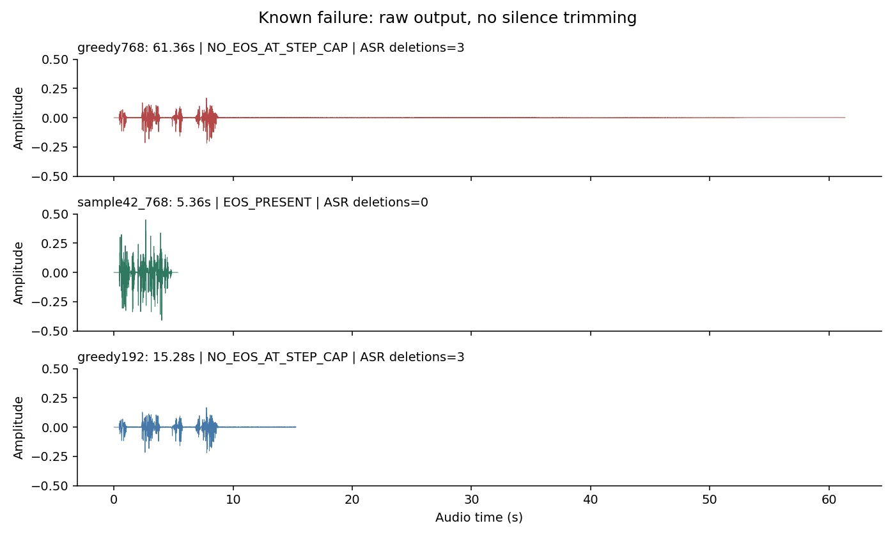
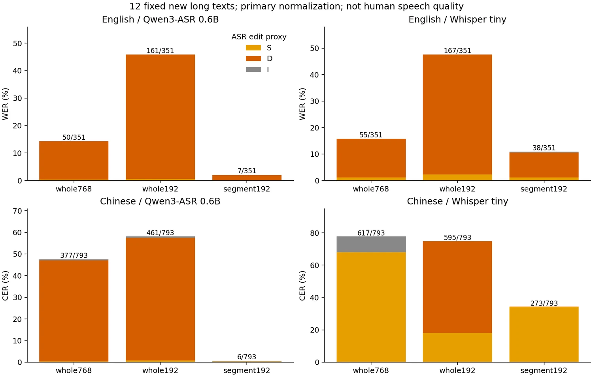
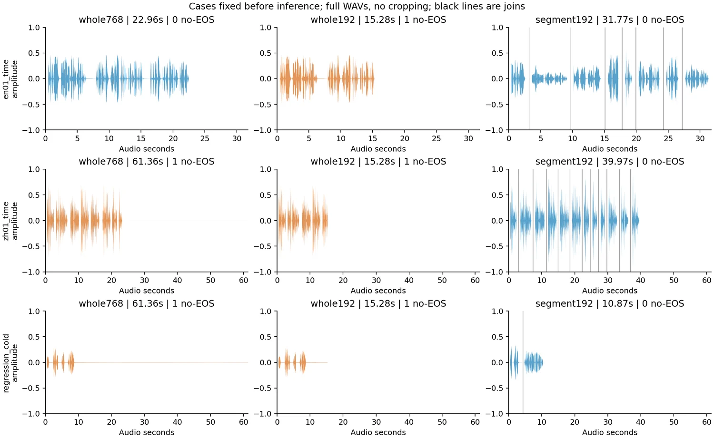
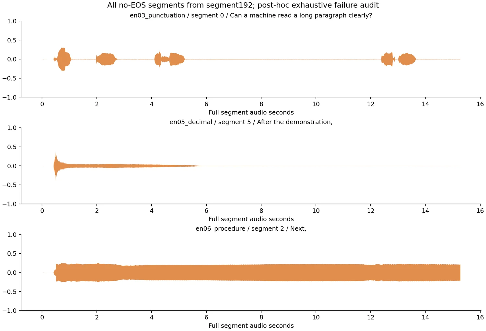
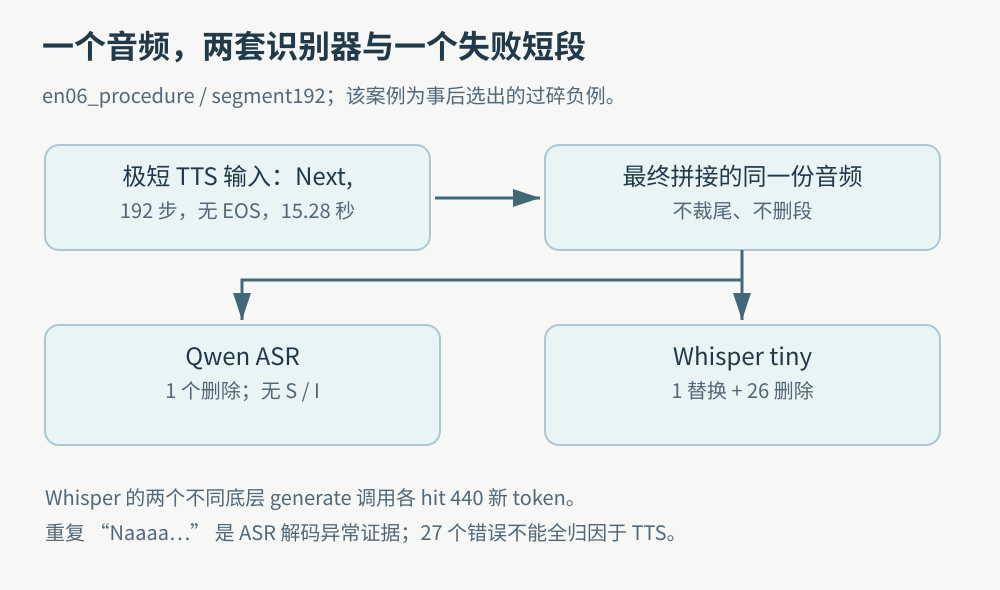
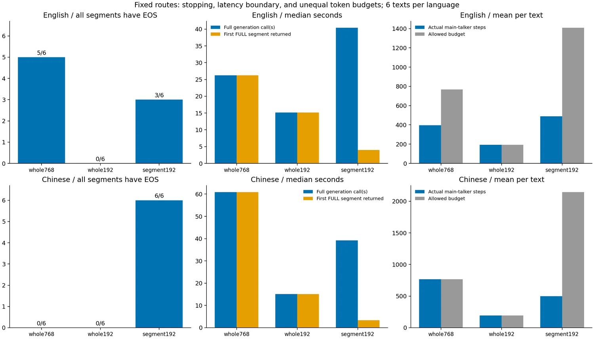

长文朗读、课程配音、语音助手都有一个很直接的验收问题：文字是否完整地说出来，而且及时结束？一段音频可以拥有不错的平均 ASR 分数，仍漏掉句末；也可以生成得很快，只是提前截断。我们在公开 Qwen3-TTS 上遇到的 61.36 秒异常，让后续迭代从“比较几个采样参数”转向“记录为什么结束”。

这篇沿着三轮实证讲清楚这个变化：第三轮发现异常，第四轮确认触及预算并保留短上限反例，第五轮用新长文检验固定分段。实验使用冻结模型，没有 TTS 微调，没有人类 MOS，也没有把候选策略上线。业务背景用于解释为什么需要这些指标。前置知识见[声音表示与 ASR](/posts/projects/multimodal-lab/08-audio-representation-and-asr)，导航见[系列总纲](/posts/projects/multimodal-lab/00-series-guide)。

## 先把声学 token 与文字 token 分开

Qwen3-TTS 的离散多码本路线先生成声学序列，再解码回波形。主 talker 与 sub-talker 协作产生多层码本信息；文字、语言和声音条件影响生成。我们选择 `Qwen3-TTS-12Hz-0.6B-CustomVoice`，英文 Ryan、中文 Vivian，BF16、SDPA、单条、非流式调用。

技术报告描述约 12.5 Hz 的声学时间帧、16 层码本及因果波形解码器。本文记录的“主 token 数”是主 talker 生成步数，不包括输入文字 token 或子码本的全部计算；不能把它直接解释为朗读词数。[技术报告](https://arxiv.org/abs/2601.15621)

该固定 0.6B CustomVoice 版本不支持 `instruct` 控制；官方代码会忽略此类参数。因此本文没有虚构“加情绪指令改善停止”的消融，也没有开展真人身份克隆。[官方模型功能表与实现](https://github.com/QwenLM/Qwen3-TTS)

_上方是生成链，下方是两条独立证据链。EOS 回答“模型有没有自然停止”；转录回答“识别器听出了什么”；人类听评才覆盖自然度、韵律和听感异常。_

## 每轮究竟增加了什么证据

| 阶段   | 实际规模与动作                                        | 当时可以回答的问题                                        |
| ------ | ----------------------------------------------------- | --------------------------------------------------------- |
| 第二轮 | toy codec LM 采样并解码合成音调；公开 EnCodec 重建    | 离散音频 token 与波形之间的链路是否跑通，尚非自然 TTS     |
| 第三轮 | 16 条中英文原创文本 × greedy / 两个采样 seed = 48 WAV | 能自然发声；固定旧句出现 61.36 秒低能量长尾，但未保存 EOS |
| 第四轮 | 旧句 + 八条新文本 × 三配置 = 27 WAV；记录原始 token   | 旧句结束于 cap；192 上限截断了原本正常的两个新长句        |
| 第五轮 | 12 条新长文 + 一条旧回归 × 三路线 = 39 最终 WAV       | 固定分段是否减少长文遗漏；是否引入极短片段失败；代价如何  |

第五轮进一步包含 139 次内部 TTS 请求、78 条有效双 ASR 转录及两套规范化的 156 条评分记录。同一文本的三份输出是配对样本；139 个片段也不是 139 条独立长文。研究计划里更大的盲听或噪声矩阵，没有执行就不计为实验。

## Case 1：61 秒音频，不等于读完了 61 秒内容

已知句是：

> Although the weather was cold, the children walked to the library and borrowed three books.

第三轮 greedy 音频长 61.36 秒，反转写止于 `...to the library and.`，缺少 `borrowed`、`3`、`books`；两个采样 seed 的输出为 5.36 和 5.76 秒，反转写完整。长音频 10 秒后的 RMS 仅 0.00135，峰值 0.00449。

_异常是长时间低能量输出；没有直接听辨时，不能把低能量自动叫作静音，也不能断言它一直在重复说话。两个采样 seed 的成功，只支持此案例，不能宣称采样普遍更可靠。_

它暴露了 RTF 的盲区。RTF 是生成秒数除以音频秒数；继续生成低能量尾部，分母也会继续增大，RTF 看起来仍正常。实际业务更关心“读完整段并交付”的时间，因此还需要内容完整性、异常尾部和停止原因。

第三轮只保存 WAV 和耗时，不能依据 `768/12.5` 接近时长便宣布没有 EOS。第四轮在官方后处理前记录原始生成序列，并用同一正常句验证：开关记录钩子，波形逐采样点完全相同。

## 记录 EOS，才能区分自然结束与预算中止

原始主序列含 EOS=2150 时记为 EOS；没有 EOS 且达到最大步数时记为 `CAP_WITHOUT_EOS`。一个正常控制有 41 个原始 token，末尾是 EOS，官方后处理后的声学 code 只有 40 个。只从最终声学 code 找 EOS 会误判，因为后处理已经截掉终止符。[固定源码](https://github.com/QwenLM/Qwen3-TTS/blob/022e286b98fbec7e1e916cb940cdf532cd9f488e/qwen_tts/core/models/modeling_qwen3_tts.py)

旧句的直接对照如下。

| 第四轮配置   | 原始主步数 | EOS          | 音频秒 | 内容代理观察              |
| ------------ | ---------: | ------------ | -----: | ------------------------- |
| greedy768    |        768 | 无，达到 cap |  61.36 | 缺最后三个词              |
| sample42_768 |         68 | 有           |   5.36 | 规范化参考一致            |
| greedy192    |        192 | 无，达到 cap |  15.28 | 仍缺同三个词，另出现 `Oh` |

_192-token 序列是 768-token 序列的严格前缀，两份旧 768 波形也与第三轮 SHA 相同。因此确认的是“提前停止同一路径”，不是内容生成已修复。模型为什么没正确续读与产生 EOS，仍未完全定位。_

## Case 2：把最大步数调小，会截掉原本正确的长句

第四轮另冻结八条新文本，不用旧失败句代替泛化测试。两条较长文本在 greedy768 下分别生成 20.08 / 26.56 秒且有 EOS；greedy192 都在 15.28 秒触顶，ASR 分别少 11 个英文词、47 个中文字符。六条短文本在两个 greedy 上限下 WAV 完全相同。

于是“更短上限更可靠”的判断被新案例推翻。上限仍可作为资源保护，但应标记请求未完成，不能混入成功生成率。一个 UI 如果把截短 WAV 正常播放完就展示“朗读成功”，会掩盖最需要提示给用户的问题。

评分本身也被审计：第三轮 1,200 条系统输出的数值复算都一致，可是 `seven thirty` / `7:30` 会因规范化产生编辑差异。后续主表保留冻结规则，同时单列数字、时间敏感性，不为某个方法事后换更好看的分数。

## 第五轮：固定分段能否解决长文遗漏

新集为英中各六条原创长文，英文 54–61 词，中文 141–149 个含标点字符，覆盖时间、数量、问句、长复句、小数单位和操作说明。另有旧句回归，单列且不进入新集分母。三条路线在同一文字上比较：

| 路线       | 输入策略                           | 主 talker 上限 |
| ---------- | ---------------------------------- | -------------: |
| whole768   | 整段一次生成                       |            768 |
| whole192   | 整段一次生成                       |            192 |
| segment192 | 按冻结规则分段、顺序生成、原样拼接 |       每段 192 |

规则遇逗号、分号、句末标点即切分，保留原字符；英文长段上限 20 个空白词、中文上限 36 个 Unicode 字符，保护连续数字、小数与时间。相邻段仅加入 150 ms 零值静音，不剪失败尾部、不删除词、不按 ASR 结果修改文本。新中文集在标点切分后都短于 36 字符，不能证明该字数阈值最优。

这不是单因素实验。分段同时改变上下文、停顿、请求数和总可用 token 预算。问题是运行策略在当前面板上有何代价与收益，而不是“同等算力下分段算法胜出”。

## 双 ASR 看到了哪些改善

同一完整最终 WAV 分别交给 Qwen3-ASR 0.6B 与 Whisper tiny multilingual。两者不选择生成结果、不合成一个“真实质量分”。先验证 Whisper 对旧长 WAV 输入完整有效特征、进入 0/3000/6000 的长音频 seek，避免只识别前 30 秒。

英文主规则为 NFKC 与 Whisper EnglishTextNormalizer 后的 WER；中文为 NFKC、去标点后的 CER。`S/D/I` 保留以识别删除、替换和插入。分母跨配置相同，配对结果在生成前冻结。[Whisper 长音频实现说明](https://huggingface.co/docs/transformers/v4.57.1/en/model_doc/whisper)

| 新集语言 / 路线 | 全请求 EOS |  Qwen ASR 错误率 | Whisper ASR 错误率 |
| --------------- | ---------: | ---------------: | -----------------: |
| 英 / whole768   |        5/6 |  50/351 = 14.25% |    55/351 = 15.67% |
| 英 / whole192   |        0/6 | 161/351 = 45.87% |   167/351 = 47.58% |
| 英 / segment192 |        3/6 |    7/351 = 1.99% |    38/351 = 10.83% |
| 中 / whole768   |        0/6 | 377/793 = 47.54% |   617/793 = 77.81% |
| 中 / whole192   |        0/6 | 461/793 = 58.13% |   595/793 = 75.03% |
| 中 / segment192 |        6/6 |    6/793 = 0.76% |   273/793 = 34.43% |

_中文分段两套代理都改善，但绝对水平相差很大，说明弱识别器也会贡献错误。英文总体均值下降，完整 EOS 请求却从 5/6 降到 3/6。这两个事实可以同时成立。_

英文 Qwen 的总体下降主要由 `en03` 一次严重整段失败改善推动。按文本比较分段对 whole768：Qwen 改善 2、变差 2、持平 2；Whisper 改善 1、变差 2、持平 3。中文两套识别器都在六条上改善。不能只报总体平均，把英文已有正常文本的退步抹掉。

## Case 3：固定展示文本的改善与截断

生成前选定的 `en01_time` 与 `zh01_time` 作为固定展示，`en06_procedure` 则是事后选出的负例。下表按同一原文配对，列的是识别编辑计数，不是人工确认的发音错误。

| 文本 / 路线       | Qwen S/D/I | Whisper S/D/I | 怎样读                           |
| ----------------- | ---------- | ------------- | -------------------------------- |
| en01 / whole768   | 0/0/0      | 1/1/0         | Qwen 没观察到内容差异            |
| en01 / whole192   | 0/18/0     | 1/19/0        | 短上限产生较多删除               |
| en01 / segment192 | 0/0/0      | 1/1/0         | 没有优于已有正常整段的内容代理   |
| zh01 / whole768   | 3/41/3     | 77/0/35       | 两套识别器给出不同错误形态       |
| zh01 / whole192   | 3/74/3     | 28/74/1       | 大量删除                         |
| zh01 / segment192 | 3/0/3      | 42/0/1        | 两套均改善；Qwen 删除降为零      |
| en06 / whole768   | 0/0/0      | 0/0/0         | 两套整段代理都正常               |
| en06 / segment192 | 0/1/0      | 1/26/0        | 分段出现 TTS 停止与 ASR 解码负例 |

_图中上两行是生成前固定的 en01、zh01，第三行是旧句回归，并非 en06。波形能帮助定位段间停顿和异常长段，不足以独立判断读了哪个词。en06 的过碎负例在下一节单列。应将原文本、停止记录和两套转录一起检查。_

数字时间敏感性又提供一条边界：中文分段 Qwen 的主分数是 `6/793`，固定敏感性规则下为 `0/797`。分母也改变了，因此保留主表与敏感性表，不能事后挑 0% 替代结果。规则不是完整语义评分器，也没有为 Whisper 追加事后繁简映射。

## Case 4：只有一个词的片段，也可能生成到上限

全部分段无 EOS 片段只有三个，我们穷尽展示而非按效果挑选：

| 原片段                                       | 所在文本与段号（从 0 计） | 实际步数 | 音频秒 |
| -------------------------------------------- | ------------------------- | -------: | -----: |
| Can a machine read a long paragraph clearly? | en03 / 0                  |  192/192 |  15.28 |
| After the demonstration,                     | en05 / 5                  |  192/192 |  15.28 |
| Next,                                        | en06 / 2                  |  192/192 |  15.28 |

_“Next,” 并没有因为短就可靠地结束。问句的输出中出现分散的高能量区间；另两段的波形也不同。图支持完整时长与停止审计，未经听辨不能给每段高能量自动赋予具体语义。_

英文分段的七个 Qwen 删除全部落在这三个无 EOS 片段内，属于相互吻合的诊断证据。它仍不是对模型内部根因的证明：每段孤立生成改变了语义上下文和韵律提示。

`en06` 同时让独立识别器发生异常。Whisper 输出长串 `Naaaa…`，两个不同底层 `generate` 调用各触及 440 新 token 上限；原始各返回 443 token，包含三个前缀。末次较短返回也被时间戳段引用。不能把“两个底层调用”误写成“两条最终音频”，也不能把该转录的 27 个错误全部归因于 TTS。

_两套 ASR 的分歧让错误归属更诚实；取较低值、较高值或平均，都不会自动得到真实听感。_

## 分段的成本：首段更早，计算不一定更少

| 新集语言 / 路线 | 内部请求数 | 实际主步数 / 允许总预算 | 生成调用合计秒 | 首完整段中位秒 |
| --------------- | ---------: | ----------------------: | -------------: | -------------: |
| 英 / whole768   |          6 |             2379 / 4608 |         189.14 |          26.22 |
| 英 / whole192   |          6 |             1152 / 1152 |          90.65 |          15.18 |
| 英 / segment192 |         44 |             2936 / 8448 |         231.05 |           3.97 |
| 中 / whole768   |          6 |             4608 / 4608 |         365.23 |          60.86 |
| 中 / whole192   |          6 |             1152 / 1152 |          90.91 |          15.15 |
| 中 / segment192 |         67 |            2989 / 12864 |         233.76 |           3.41 |

_英文分段的实际生成调用比 whole768 更多，中文少一些；总允许预算两种语言都更高。首完整段约三四秒返回，但这是非流式接口的一整个 waveform 返回，不是网络首包或真实流式延迟。_

39 份最终 WAV 合计 1,308.84 秒，正式 TTS 调用合计 1,287.24 秒；统计保留失败尾部。生成计时 CUDA 同步，包含 token 记录开销，排除加载、预热、写盘与 ASR。段间韵律、音色衔接和 150 ms 停顿尚未人工评价；单看首段时间不足以决定课程配音策略。

### 旧句回归成功，不代替新长文验证

旧句 whole768 / whole192 分别仍触顶无 EOS；分成两段后全段 EOS，10.87 秒、136 主步数，两套 ASR 均无编辑错误。跨轮还核查了 whole768 / whole192 的 WAV SHA 和完整主 token 序列相同。

这个回归说明已知失败可被该策略绕开；新英文集却揭示三个短片段失败。因此两条证据必须一起保留，旧成功案例不能充当新文本泛化率。

## 为下一次改进定义清楚验收

当前更值得继续验证的是“合并过短片段”是否减少无 EOS，而不是继续把上限变小。应先在开发文本冻结合并规则，再用新长文检查内容、停止、重试成本与韵律；只在明确 cap 时触发 fallback，也需要把第二次计算计入请求成本。这些是后续假设，本轮未运行。

本轮独立 CPU 审计逐个检查 39 个最终 WAV、139 个内部段 WAV 的 SHA、采样数、原文覆盖、逐采样点拼接、raw token 与预算；重执行 78 条转录的两套规范化、156 条编辑记录。原始波形、失败日志与代码快照均保留。审计没有重新运行第二遍编码器，没有人工听评，也不能当成第三方认证。

潜在朗读系统的实用验收至少应把“完整内容且自然结束”“被预算中止”“异常”分别报告，再展示成本和盲听结果。当前证据支持固定分段继续研究，尚不支持将逐标点切分称为通用修复。

实验源码见 `labs/diagnostic_round/audio/` 与 `labs/round5/audio/`；原始文本、停止记录、双 ASR、成本与媒体保存在对应实验归档。完整 WAV 没有为博客展示而改写，本文使用保存波形绘图和原创流程图。继续阅读[视频生成：时间、条件与质量代理](/posts/projects/multimodal-lab/10-video-generation)。
