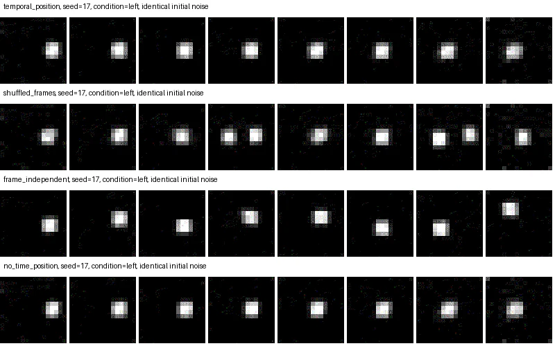
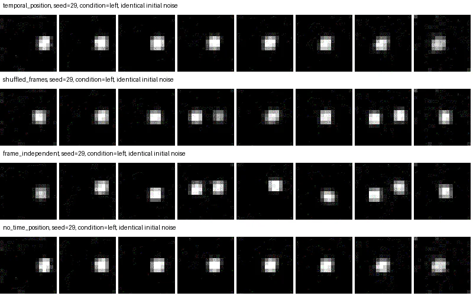
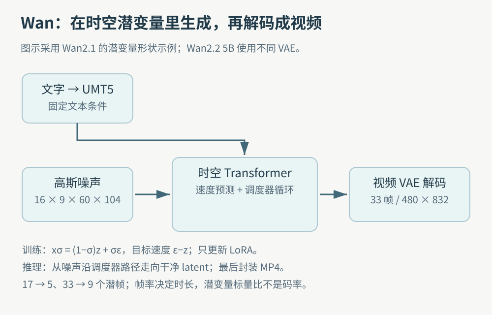
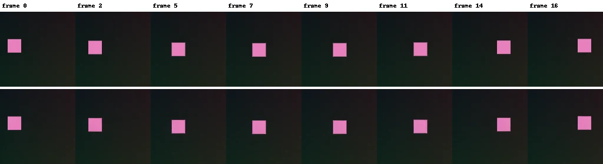
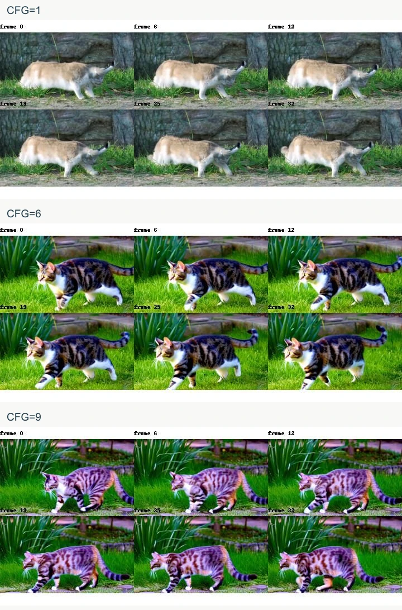
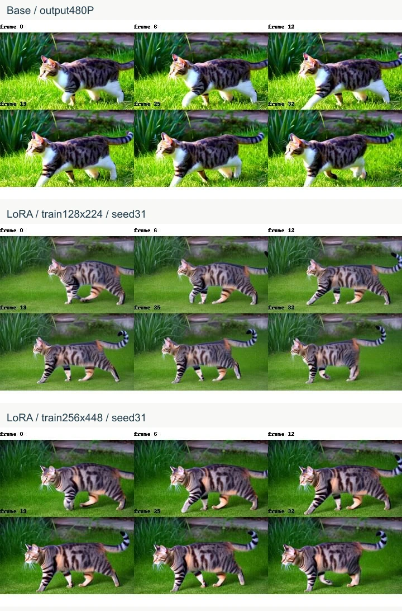
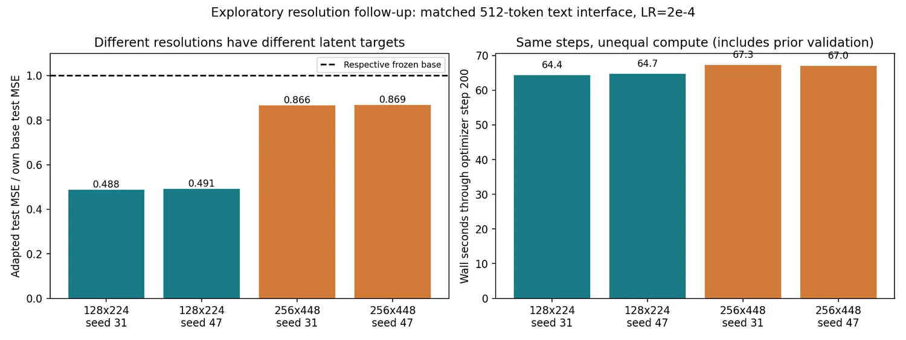
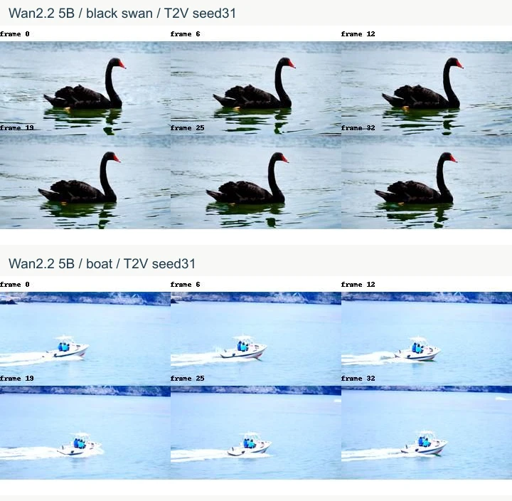
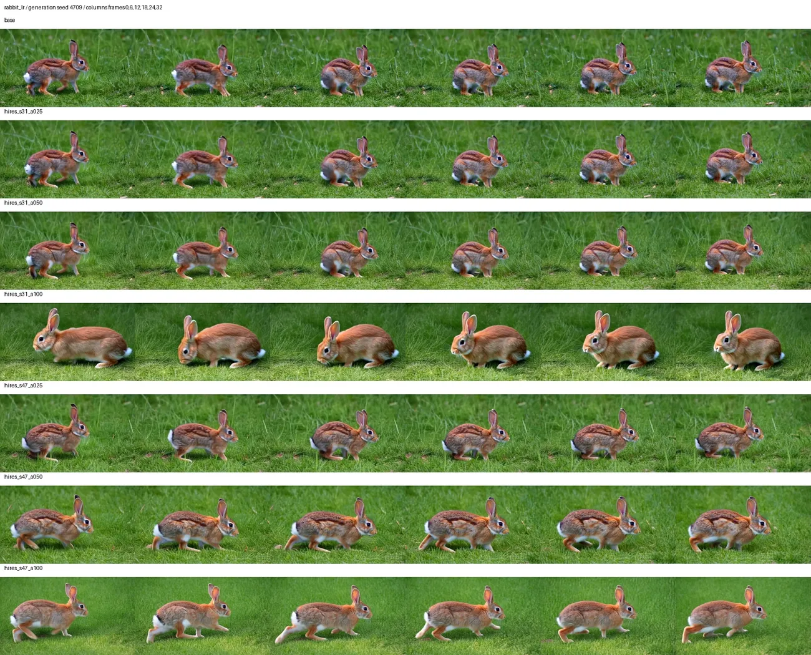
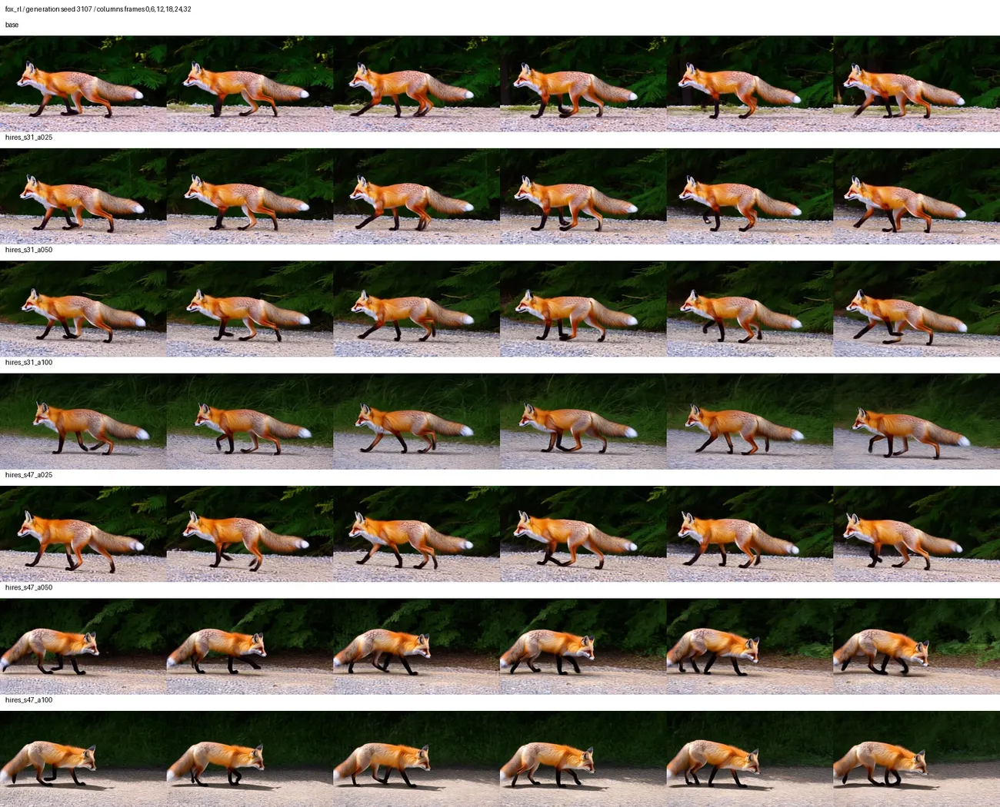

视频模型不仅要画对一个物体，还要让它在时间里保持身份、完成动作、遵守镜头约束。对课程动画、产品演示或分镜草图来说，“每帧都有一只猫”远远不足以证明“猫从左向右穿过固定画面”。这些是潜在用途；本项目实际做的是机制教学、公开模型生成与小样本适配，没有宣称完成业务部署。

我们的路线从有可计算位置真值的运动方块开始，再做公开视频 VAE 重建，之后运行完整 Wan 文生视频、Wan2.2 图生视频与 LoRA，最后用适配强度定位更新带来的外观变化。这篇将各轮的改动和失败案例放在同一条问题链上。原理前置是图像生成；完整系列见[总纲](/posts/projects/multimodal-lab/00-series-guide)。

## 每轮新增的能力，不能混算

| 阶段       | 实际完成                                                   | 能够证明什么                                |
| ---------- | ---------------------------------------------------------- | ------------------------------------------- |
| 初始教材   | 视频时间轴、帧反转反例、待运行配方                         | 明确时间建模问题，尚未完成大模型训练        |
| 第二轮     | 两帧预测六帧、八个 tiny Flow 训练、视听融合、冻结 R3D 探针 | 在合成数据上学习或使用时间关系              |
| 第二轮追加 | 官方 Wan2.1 VAE 六配置重建，零训练                         | 观察真实视频压缩与失真，不是生成未来        |
| 第三轮     | 两代完整 Wan 生成、八个 LoRA 训练，共 1,600 更新           | 实际生成自然样片与适配；51 MP4，SHA 去重 47 |
| 第四轮     | 两份真实适配器 × 三强度，连同基座共 42 配对视频            | 较弱更新扰动较小；未找到稳定质量最优强度    |

第二轮 14 个训练包含线性探针、预测、Flow 和融合，不等于训练 14 个 Wan。第三轮四个重复冻结基座控制也不算新模型。第五轮的视频相关扩展是 SAM2 时间记忆分割，属于另一任务，见系列分割篇。

## Case 1：平均图像看不出运动方向

设八帧小方块每帧向右 2 像素，将帧序列反转后，每帧集合和时间平均图都相同，方向却向左。它给评价方式一个直接反例：只看单帧或平均图像向量，会漏掉顺序。

第二轮未来预测输入前两帧。固定亮度质心先提取坐标，可训练 MLP `4→64→64→12` 学未来六帧位置，再用可微渲染器恢复图像。训练 4096、验证 512、测试 512 条独立合成视频，两种 seed 各 700 步。

| 预测方式           | 未来轨迹误差 / 像素 | 方向正确率 |
| ------------------ | ------------------: | ---------: |
| 学习动力学，seed17 |              0.1414 |       100% |
| 学习动力学，seed29 |              0.1428 |       100% |
| 复制第二帧         |              3.9911 |         0% |

方向要求有效位移超过 0.25 像素，静止不能算方向正确。最初纯 sign 指标被栅格与浮点误差误导，已从保存预测用容差复算，权重未重训。这是带强几何先验的动力学实验，不是模型从自然像素中学会全部物理规律。

## Case 2：用相同模型破坏训练时序

真正从噪声生成视频的教学实验采用 8 帧 16×16 方块和方向条件。噪声 `z` 与真实视频 `x` 按 `x_t=(1-t)z+t x` 混合，小 3D CNN 预测 `x-z`；700 步训练后固定 24 步 Euler，从同一批 128 个初始噪声生成。

四种设置各两个 seed：正常时间卷积加帧位置；相同结构但随机打乱真实训练帧；逐帧独立；删除显式帧位置。最后一种仍保留 Flow 的噪声时间 t，不能把“没有帧位置”误读成“去噪网络没有时间条件”。

_观察相邻列的移动是否连续，以及纵向位置是否跳变。两张对照图均按固定 sample0 展示，未按效果选优。正常配置仍有噪点和形状波动。_

| 配置              | seed17 方向合格率 | seed29 方向合格率 | 解释                                                |
| ----------------- | ----------------: | ----------------: | --------------------------------------------------- |
| 正常时序 + 帧位置 |            86.72% |            75.78% | 需要所有帧具备前景，且首尾朝指定方向位移 >0.75 像素 |
| 打乱训练帧        |            23.44% |            24.22% | 同结构、同步数的顺序破坏对照                        |
| 逐帧独立          |            44.53% |             7.03% | 同时把参数从约 22.25 万降到 7.43 万，混有容量差异   |
| 无显式帧位置      |            71.88% |            78.91% | 两个 seed 的位置编码收益方向不同                    |

_第二个 seed 很重要：显式帧位置不能被宣传成此设计中的稳定必要条件；随机打乱顺序的退步则在两次重复中一致。两个 seed 仍不足以估计普遍随机性。_

我们还做了音画配对任务：画面第 2/5 帧出现相反箭头，提示音决定选择哪个时刻，画面决定方向。两种 seed 对齐音画为 100%，缺一模态为 50%；同源音频互换后按旧标签为 0%，按反事实新标签却是 100%。此时答案翻转是正确使用新输入，而不是模型“崩溃”。自然音画问答和 Omni 模型并未复现。

## 从像素视频，转向时空 latent

Wan 的生成链包含文本编码器、视频 VAE 和时空 Transformer。训练先冻结 VAE 与文本编码器缓存表示，再给真实潜变量加噪，只更新选定参数；推理从高斯潜噪声开始，逐步预测速度、更新潜变量，最后 VAE 解码 RGB 帧。

_形状示例不含 batch 维。Wan2.1 首帧特殊处理，潜时间长度为 `1+(T−1)/4`；33 帧对应 9 个潜帧。Wan2.2 5B 的 VAE 配置不同，不能照搬这些维度。_

第二轮先只运行冻结 Wan2.1 VAE：输入 17 帧 128×128 RGB，latent 是 `16×5×16×16`。输入与 latent 的标量个数比为 40.8；这不是文件码率，也不是 H.264 压缩率。模型已经看到真实输入的全部帧，输出是重建，不是未来预测。[Wan 技术报告](https://arxiv.org/abs/2503.20314)

_上排输入、下排重建，观察轨迹与边缘。该合成样例全图 PSNR 为 44.17 dB。这里先验证表示瓶颈，避免把 VAE 已丢失的信息全部归罪于生成 Transformer。_

另一个公开实拍摆动个案中，整段时间压缩比逐帧独立编码少用 3.4 倍 latent 标量，全图 PSNR 低约 0.91 dB。它只展示具体失真取舍；不同 1/9/17 帧前缀不能当成长度单因素。博客展示采用我们的合成片段，原实拍来源与 CC BY-SA 4.0 修改说明保存在实验归档。

## 完整 Wan 生成：训练目标与采样旋钮

第三轮主线是 `Wan2.1-T2V-1.3B-Diffusers`，文本编码器采用另一官方 Wan2.2 仓库的 BF16 UMT5，以避免重复下载 FP32 副本。这是公开记录的组件组合，不冒充某个完整快照的逐字节复现。

采用噪声比例 σ 的实现约定：干净 latent 为 z，噪声为 ε，`xσ=(1−σ)z+σε`，目标为 `ε−z`。它与前面的教学 Flow 只是插值方向记号不同；必须同时核对调度器方向和目标符号，还要使用 Wan 自己逐通道 latent 归一化，不能套用其他 VAE 的缩放常数。[固定训练实现](https://github.com/huggingface/finetrainers/blob/684c0db37a97f3900b4dafdb5d21be9e84157c09/finetrainers/models/wan/base_specification.py)

主采样 832×480、33 帧、30 步、CFG6，固定猫、船、瀑布与 seed31/47；再改变步数和 CFG。CFG 控制条件与无条件预测的组合，增大它可能加强文字牵引，也可能改变颜色和细节；CFG=1 还减少无条件分支计算，不是只改一个外观旋钮。

### Case 3：CFG 更高，猫却更紫

_从上到下 CFG1、6、9。主体一直是猫，但背景、毛色和构图明显改变；CFG9 出现偏紫、过饱和。六帧检查不能排除中间帧瞬态错误，也不能仅凭头朝向计算画面位移方向。_

三个主体都可辨认，猫的左右方向却没有稳定遵守。15 步船样例还呈现插画感。33 帧基线采样约 25.43–26.70 秒；81 帧例子为 88.01 秒。改变帧数改变了噪声张量形状，相同 seed 不再意味着逐元素相同噪声，因此画面差异不能全归因于“视频更长”。

## LoRA：loss 下降约一半，质感却可能退步

自然适配来自 DAVIS 的 20 个序列，按完整序列分 12/4/4，截出 36/12/12 个 17 帧片段。同序列相邻片段可能重叠，所以必须一起分组。字幕由助手根据首帧联系图核对后撰写宽泛主体与动作，不能当成逐帧人工标注；这也不是 DAVIS 官方分割指标。[DAVIS 数据与论文](https://davischallenge.org/davis2017/code.html)

训练冻结 VAE 与 UMT5，更新 attention 的 `to_q/to_k/to_v/to_out.0`，rank8、alpha8，共 5,898,240 个参数。两学习率乘两 seed，每组 200 步；验证流损失选 checkpoint，包含 step0；测试不用来选学习率。

| 首批训练配置        | 固定协议测试速度 MSE |
| ------------------- | -------------------: |
| 基座                |             0.403240 |
| LR5e-5，seed31 / 47 |  0.203466 / 0.203349 |
| LR2e-4，seed31 / 47 |  0.197618 / 0.198034 |

按验证选出 2e-4，平均测试 MSE 比自身基座低约 50.94%。它描述速度预测目标拟合，不能改写成“视频质量提高 50.94%”。

### Case 4：同样 480P 输出，适配后的猫像塑料模型

_两种适配均能辨认猫，但纹理与造型发生明显变化。源实验观察到更塑料化、微缩模型般的外观；这是非盲法视觉诊断，不是量化人类偏好结论。固定 seed31 用于展示，两 seed 全结果均保留。_

首批训练文字上限 128、生成 256，默认原本 512，因此后续统一为 512，再比较 128×224 与 256×448 训练分辨率。两组沿用同数据、学习率、200 步；高分辨率拥有更多 latent token，计算并不相等。

_左图是适配 MSE 除以各自基座 MSE；低分辨率基座测试 MSE 0.403197，适配均值约 0.197508；高分辨率基座已经是 0.196068，适配约 0.170084。右图记录截至第 200 步、含此前验证的耗时。目标分布改变了，所以不能跨行用更低绝对 MSE 排名，也不能称为等计算量比较。_

CLIP 与 SigLIP2 也不总一致：同一猫样例高分辨率适配前后，CLIP 余弦 0.34751→0.37005，SigLIP2 0.15070→0.12795。只能分别比较各编码器自己的前后变化，不能跨模型比原始数值。两个评估器在全部 51 视频的五类主体识别都是 51/51，却没有发现我们看到的方向失败与材质退化。

## Wan2.2：首帧条件不是综合质量证明

我们实际运行的是 Wan2.2 TI2V 5B，支持 T2V 与 I2V，使用更高压缩 VAE；它与 Wan2.2 A14B 专家模型不同，不能把所有 Wan2.2 检查点叫成 MoE。短样例采用 1280×704、33 帧、24 fps、35 步、CFG5。[官方实现](https://github.com/Wan-Video/Wan2.2)

_这些是实际文生视频输出，不是论文示意图。T2V 没有看到参考照片；主体可辨认不能证明动作、物理与长程一致性正确。_

另有 T2V/I2V 配对与一个 121 帧 I2V，总九配置。121 帧是 5.04 秒视频，采样解码 178.85 秒，峰值 allocated 46.99 GB。一个 I2V 首帧 MSE 约 0.000151，支持模型使用了输入构图；T2V 没看到该图，不能用此 MSE 宣称 I2V 综合质量更高。

Wan2.2 曾因 tiled_decode 时间块维度问题失败，关闭 tiling 后运行成功；此显存口径也不能与 Wan2.1 的 tiling 设置简单比较。源码、日志、模型 revision 与官方 LFS 权重核验均保留。

## 第四轮：缩小同一更新，能保留什么

第三轮实际只保存 best 与 final，其中采用的两训练 seed 都选择第 200 步，两份文件各自逐字节相同。后续不补造 50/100/150 步 checkpoint，不把同一权重当两模型。

第四轮固定这两份高分辨率适配器，对基座和适配强度 0.25、0.5、1 比较。LoRA 更新是 `W+αBA`，实现只缩放 B；同时缩放 A/B 会变成 `α²BA`，是另一个实验。每次删除并从原文件重载适配器，防止累积缩放。

固定三个新提示：兔子左→右、狐狸右→左、鸭子材质近景；两个新生成 seed。七配置共 42 视频，全部 832×480、33 帧；新增训练为零。

### Case 5：兔子的朝向改变，不能算成方向修复

_从上到下：基座、训练seed31的0.25/0.5/1、训练seed47的0.25/0.5/1。seed31强度1让兔子朝左、更蹲伏；较小强度更接近基座。seed47强度1仍朝右、出现伸展步态。头朝向不等于固定画面中的位移，不能从这张图计算动作正确率。_

### Case 6：狐狸的变化依赖训练 seed

_基座与 seed31 各强度朝左；seed47 的 0.5/1 转向右。它说明更新影响了语义外观，并不能证明哪行完成了固定镜头下从右向左穿越。另一生成 seed4709 中主体居中、背景同时变化，镜头与主体运动仍混淆。_

在六个提示/生成 seed 配对上，相对同噪声基座的 RGB 改变量如下：

| 训练 seed | 强度0.25 | 强度0.5 |   强度1 |
| --------- | -------: | ------: | ------: |
| 31        |  0.06579 | 0.08816 | 0.11935 |
| 47        |  0.07382 | 0.10614 | 0.14818 |

12 个“训练 seed × 提示 × 生成 seed”配对的改变量都随强度变大，但共享六个基座输出，不能算 12 个独立基座样本。更接近基座不等于质量更高，因为基座也会失败。鸭子的头颈色纹、水面和构图同样变化，未发现两个生成 seed 都明确更自然的统一强度。

基座每段中位推理 25.34 秒，适配各强度约 27.90–27.92 秒；强度小仍执行同样低秩分支，不明显更快。强度插值也不等于训练步数缩短，因为训练路径与更新方向可能非线性。

## 把“质量”拆成能验证的几个问题

像素帧差同时混合真实运动、镜头、纹理与闪烁；静止视频可能最平滑。二阶差分、CLIP 主体匹配、训练 MSE 都是局部证据。本文没有运行 VBench，也没有人工 MOS 或盲法偏好结果。

对潜在分镜或教学动画应用，验收可以先分别冻结主体、动作方向、镜头约束、纹理、遮挡一致性和成本，再用新面板确认候选方案。需要追踪主体位置并估计镜头运动，不能仅靠头朝向判断动作；正式盲听/盲看必须有真实参与者与协议。VBench 将多个维度拆开评价，可作为后续方法来源，论文成绩不能当成本机复现。[VBench 论文](https://arxiv.org/abs/2311.17982)

完整证据包含所有 MP4、六帧联系图、训练历史、选权重记录、两代模型参数与失败日志。博客使用固定保存帧，不从原素材挑“最好的一帧”，也不把六帧联系图当成逐段完整播放。当前结果支持继续诊断时间和条件，尚不支持把某个 LoRA 或强度宣布为统一质量赢家。

复现代码位于 `labs/round2/video_experiments.py`、`video_vae.py`、`labs/round3/video/` 和 `labs/diagnostic_round/video/`。练习时先预测“帧打乱应该损害什么”，再看两 seed 结果；然后分别读训练 loss 和实际样片，写出它们为何可能相反。最后用兔子、狐狸案例说明：条件改变了输出，与条件被正确执行，需要两条不同证据。
