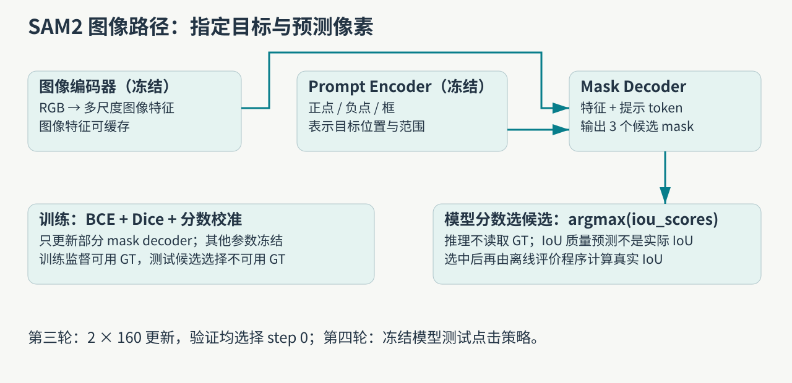
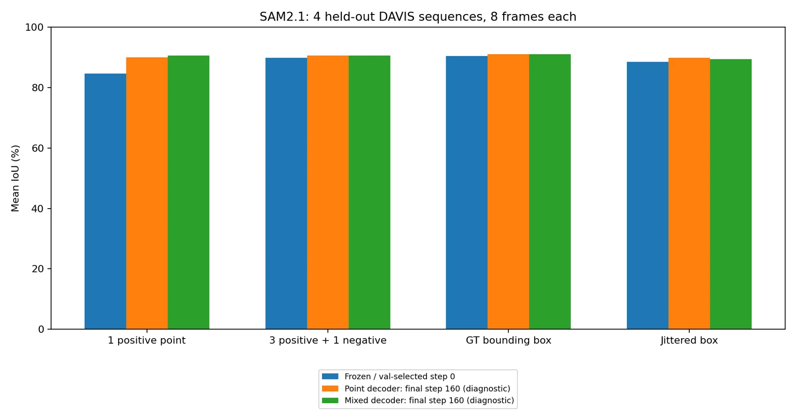
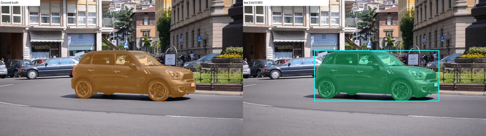
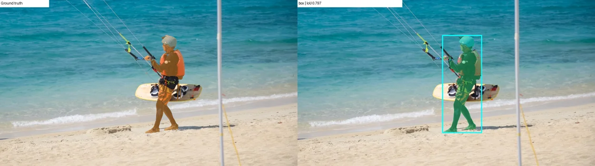
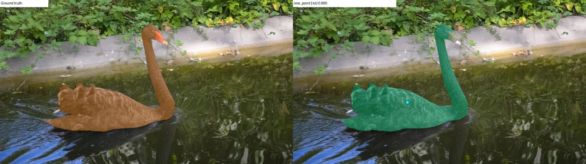
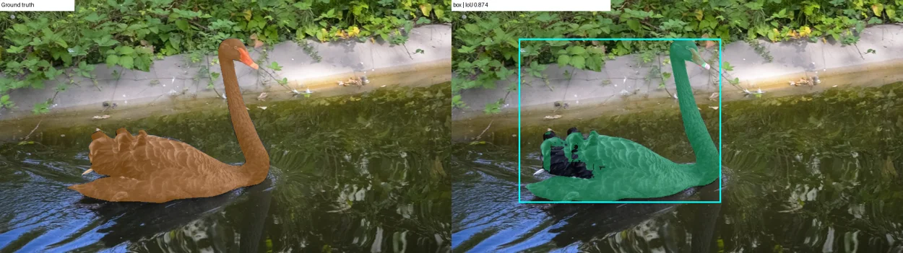
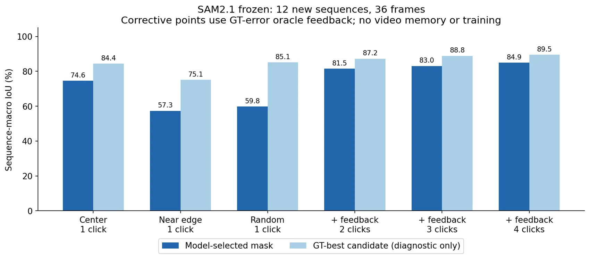
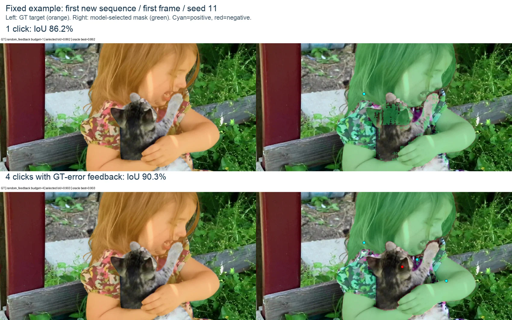

分割任务的困难常常先出现在“你到底指哪一个对象”。点击人物的衣服，可能是在指定一块衣服，也可能是在指定整个人。SAM2 输出像素区域，但一个点并没有天然携带完整的对象边界。这篇把第三轮的 decoder 微调与第四轮的提示诊断接起来：当训练没有带来可保留收益时，我们怎样用新的实验定位问题。

[系列总纲](/posts/projects/multimodal-lab/00-series-guide) · 后续：[SAM2 视频记忆](/posts/projects/multimodal-lab/12-sam-video-memory)

## 哪些业务问题需要像素而不只是文字

图片抠图、视频编辑、辅助数据标注，需要知道目标覆盖了哪些像素。分类回答“有车”，视觉语言模型回答“车在路口”，分割则回答“这一辆车的区域”。这是潜在使用场景；本项目测试了公开模型和 DAVIS 数据，并没有测量真实标注员的生产效率。

SAM 的任务形式是“图像＋提示→mask”。SAM2 在此基础上支持视频记忆，但第三、第四轮只运行独立图像路径，没有调用视频传播。第五轮的记忆实验单独成篇，避免把两种能力混在一起。[SAM2 官方源码](https://github.com/facebookresearch/sam2)。

## 图像、提示、候选是三件不同的事

图像编码器提取可缓存的特征；prompt encoder 把正点、负点或框表示为模型输入；mask decoder 结合两类信息输出多个候选与各自预测质量。正点表达希望目标包含该位置，负点表达希望排除该位置，框提供更明确的空间范围。候选不只是“几个随机版本”，也可以对应同一提示的不同合理范围。

我们的推理始终用模型自报 `iou_scores` 的最大值选择候选。之后评价程序才读取 GT，计算实际 IoU。预测质量是模型估计，实际 IoU 则是与人工标注的交并比；不能互相替代。

例如预测区域有 80 个像素，GT 有 100 个，交集 60 个，那么 IoU 为 `60/(80+100−60)=0.5`，Dice 为 `2×60/(80+100)=0.667`。这是手算示例，用于读懂指标。实际实验先将 logits 插值回原图尺寸，再以 0 为阈值二值化，最终在原图像素上评分。

## 第三轮：真的更新了 decoder，为什么交付基座

第三轮使用 SAM2.1-hiera-small，固定 12 个训练序列、4 个验证序列、4 个测试序列。按每序列 8 个均匀帧计划采样，训练两帧目标缺失被预定规则跳过，所以实际是 `94 train / 32 validation / 32 test`。对象 ID 在首帧按最大前景面积选定，后续保持一致。

我们缓存冻结图像特征，冻结 prompt encoder 和已经进入缓存计算的投影，只训练其余 mask decoder。两组分别用单点训练、混合提示训练，各 160 次 optimizer 更新，microbatch=1、梯度累积=2。训练损失包含 BCE、soft Dice，以及候选预测 IoU 的校准项。声明可训练参数 4,190,437，末步权重审计显示各组实际改变 4,058,596 个参数；未被当前路径使用的头不能凭空更新。

图 2 必须和选权重规则一起读。每 40 step 在验证集评估单点与精确框，取平均序列 IoU 最高的 checkpoint，并列保留更早者。

| step | 单点训练 Val IoU | 混合训练 Val IoU |
| ---- | ---------------: | ---------------: |
| 0    |          88.928% |          88.928% |
| 40   |          88.446% |          88.879% |
| 80   |          88.541% |          88.543% |
| 120  |          88.457% |          88.600% |
| 160  |          88.334% |          88.491% |

两组都选择 step 0，best 与基座逐张量相同。末步测试单点 IoU 确实从基座 84.57% 变为 89.95%/90.55%，但它没有通过验证选择，不能看到测试高分后改称最佳模型。这个负结果告诉我们，小验证集与场景异质性值得研究，而不是训练日志可以替代选权重规则。

## case：框通常更明确，但也不是每个样本都更好

第三轮四种提示的正式测试序列均值为：单点 84.57%，三正一点负 89.81%，精确框 90.33%，扰动框 88.53%。点和框均由 GT 模拟生成，模型没有自动发现目标；不同提示也不具有相同标注信息成本。

case 1 是路口车辆。整序列单点 IoU 86.28%，框 98.43%。图中青色提示说明模型获得了什么，橙色 GT 与绿色预测说明目标与输出是否一致。单帧图帮助查看边界与对象范围，不能把图标题的单帧得分误当整序列均值。

case 2 的单点整序列均值 64.82%，框 78.96%，改善后仍有误差。框给出范围，却不是完整像素真值；若细长结构、遮挡或候选排序仍有问题，分割不会自动变完美。具体内部原因尚未分别干预，这里只报告观察与指标。

case 3 保留反例：blackswan 单点整序列 94.58%，框 90.92%。平均上框更高，不要求每个场景都更高。候选范围歧义、质量分排序和边界特征都是可测试的解释，本文没有把任何一种写成已证实原因。

## 第四轮：先诊断点击与候选，不再盲目追加训练

新实验排除第三轮使用的全部 20 个序列，选 12 个新序列、每序列首/中/末 3 帧，共 36 帧。冻结基座，没有新增训练。设置中心点、近边界点、5 个随机种子的内部点；沿随机初始点继续到 2/3/4 次反馈。

反馈程序找到当前预测与 GT 的异或错误区域，点其内部最深位置，再由 GT 给正负标签。模型只得到点，不得到完整 GT mask。但程序知道真实错误在哪里，因此这是 **oracle 模拟标注**，不是自动纠错，也不是普通用户点击分布。

| 条件                | 模型选择 IoU | 使用 GT 选候选的诊断上限 |
| ------------------- | -----------: | -----------------------: |
| 中心 1 点           |       74.56% |                   84.35% |
| 近边界 1 点         |       57.29% |                   75.06% |
| 随机 1 点           |       59.83% |                   85.10% |
| 同一点＋反馈到 2 点 |       81.45% |                   87.23% |
| 反馈到 4 点         |       84.94% |                   89.47% |

前两行说明初始位置的分布会影响结果。随机一点的模型选中分与候选上限相差 25.27 个百分点，说明不少样本中已经存在更贴近标注的候选，但当前分数排序没有选它。一个点可能并未唯一指定对象范围，不能直接断言质量头坏了。

图 10 沿同一个起点观察反馈如何改变范围。第四轮保存了每个点、标签、三候选、模型分数和实际 IoU，共 792 次前向、2,376 个候选 mask，独立重算一致。读者可以先找选中候选与 GT-best 不同的时刻，再看下一次正点或负点究竟补了什么信息。

四点相对一点提升 25.11 个百分点，以 12 个独立序列配对 bootstrap 得到区间 `[14.28,36.90]`；四点相对两点只有 +3.48，区间 `[-0.31,6.82]` 跨过零。不能把 36 帧×5 提示种子当成 180 个独立自然场景来制造更窄区间。dogs-jump 在两点到四点间下降约 12.82 个百分点，多点也不保证单调改善。

## 迭代真正改变了什么

| 阶段   | 新做的事                             | 能支持的结论                                            |
| ------ | ------------------------------------ | ------------------------------------------------------- |
| 第三轮 | 独立帧提示对照，2 组 decoder 训练    | 验证规则没有保留适配收益；提示范围影响结果              |
| 第四轮 | 新序列、不同起点、反馈预算、候选审计 | 指定歧义和候选选择值得先诊断；oracle 反馈明显改善本样本 |
| 第五轮 | 原生视频 predictor 与因果记忆        | 留给下一篇验证跨帧传播，不能沿用单帧分数替代            |

第三轮正式测试只有 4 序列，第四轮只有 12 序列，都不是完整 DAVIS 官方 benchmark。模型预训练是否见过相关公开视频也没有被排除。训练计时和小显存来自冻结特征缓存与小 decoder，不能推算全量 SAM2 训练成本。

复现入口是 `labs/round3/segmentation/` 和 `labs/diagnostic_round/sam/`，原始记录位于对应 `runs/`。练习可手算一个 mask 的 IoU，再复核候选 argmax，最后解释为什么“额外真值能选择更好候选”不等于部署时自动选择更好候选。

方法和数据：[SAM2 论文](https://arxiv.org/abs/2408.00714)、[官方图像 predictor 示例](https://github.com/facebookresearch/sam2/blob/main/notebooks/image_predictor_example.ipynb)、[DAVIS 2017](https://davischallenge.org/davis2017/code.html)。案例底图来自 DAVIS trainval，遵循随数据保存的 CC BY-NC 4.0 条款，原始片段来源归其创作者；提示叠加与实验图由本项目生成。SAM2 代码/模型遵循其 Apache 2.0 许可。
