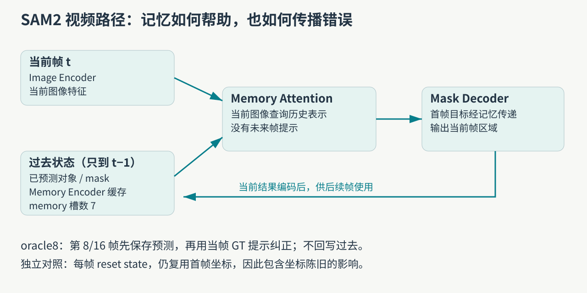
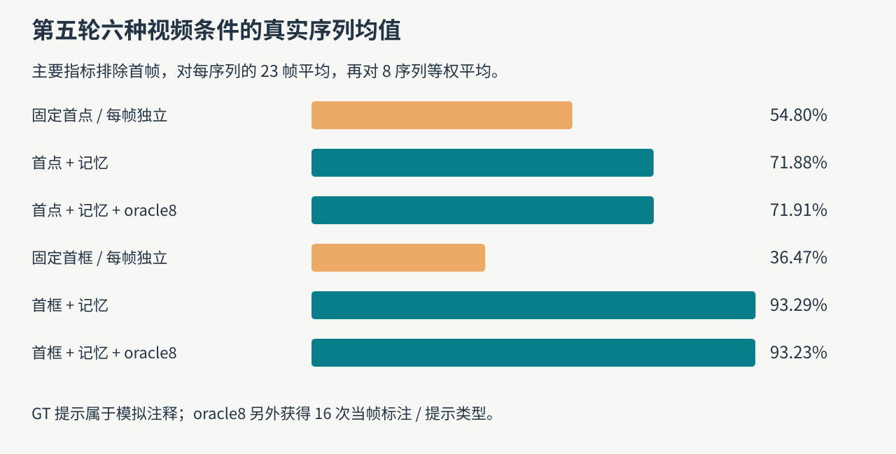
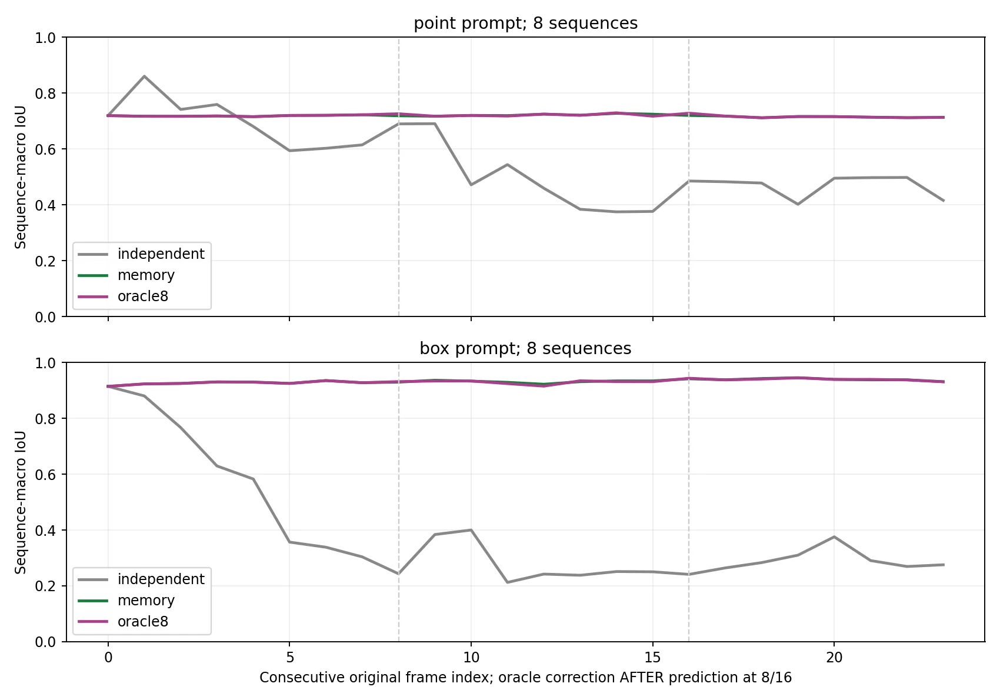
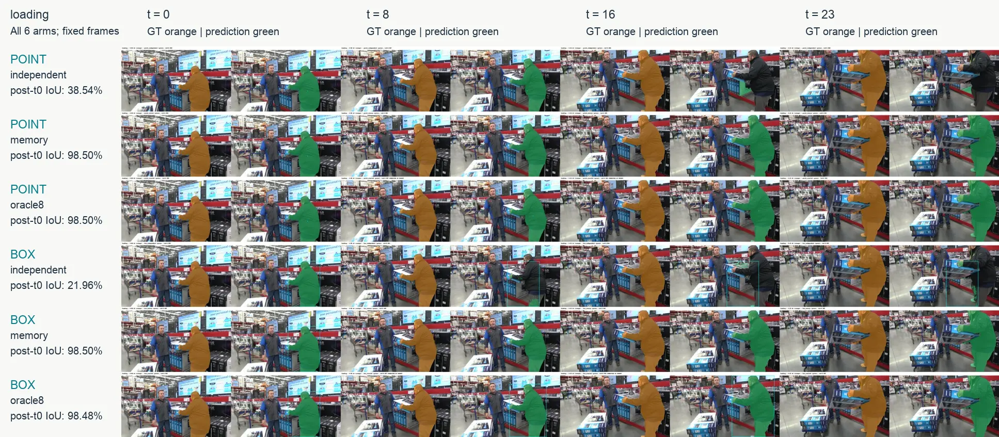
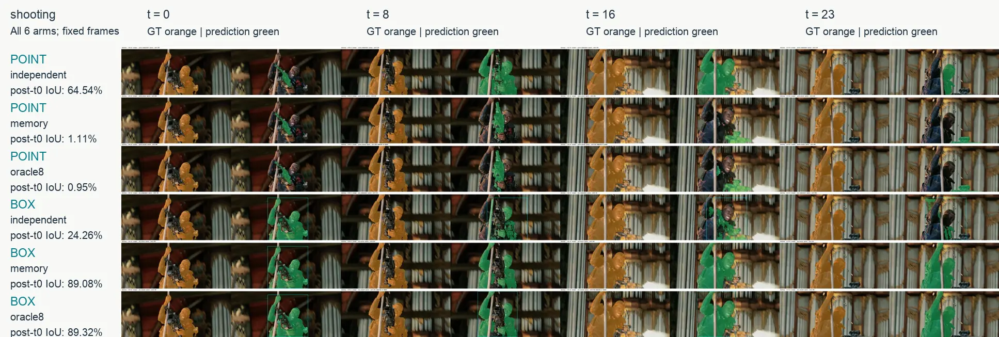
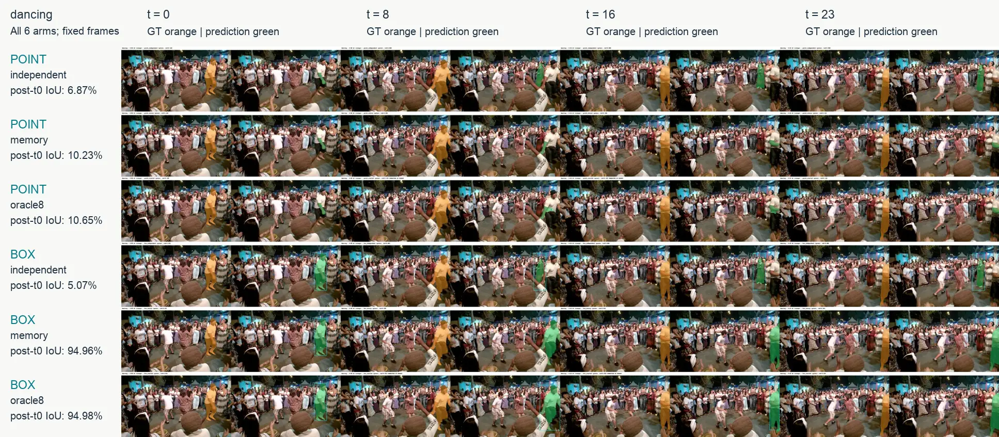
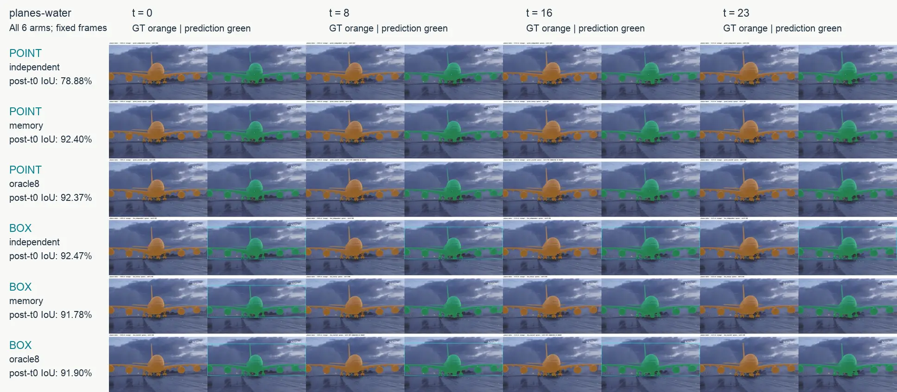

在视频里识别对象，不能只把每帧截图各做一遍分割：目标会移动、转身、遮挡，首帧的点击坐标很快失效。第五轮切换到官方原生 `SAM2VideoPredictor`，研究记忆是否帮助保持对象，以及错误的初始范围会不会一路传下去。

[系列总纲](/posts/projects/multimodal-lab/00-series-guide) · 前置：[SAM2 图像提示与候选](/posts/projects/multimodal-lab/11-promptable-segmentation)

## 从业务目标倒推时序机制

视频抠像、连续镜头编辑、辅助时序标注，都希望“首帧指定这个对象，后面继续处理同一个对象”。它们要求的不只是逐帧画出合理区域，还要求对象身份和范围持续一致。我们用 DAVIS 的同一标注 object ID 做受控验证，并没有评估剪辑人员的实际操作速度。

前两轮视频实验处理合成时序，第三轮引入自然视频和 SAM2 单帧分割，第四轮定位提示歧义，第五轮才真正启用 SAM2 的视频记忆。模型名称相同，不代表之前已经验证过这条路径。

## 记忆记录了什么，何时允许读取

当前帧先经图像编码器产生视觉特征，memory attention 将其与过去对象的记忆表示结合，再由 mask decoder 输出当前区域。memory encoder 结合当前图像特征与预测 mask，写成后续可读取的状态。本次官方配置包含 7 个 memory 槽；“7”不是视频只能有 7 帧，也不表示每帧的所有像素原样存进显存。

模型冻结，没有新增梯度训练。原生视频模型实际加载参数 46,060,354，不能与上一轮 Transformers 图像路径的 38,538,577 直接当成同一统计对象。权重与源码 revision 固定并核验，运行 BF16 autocast。可选 CUDA 后处理扩展没有编译，所有条件一致关闭后处理，这也是复现必须保存的配置。[官方 SAM2 实现](https://github.com/facebookresearch/sam2)。

这里的因果要求很具体：预测 t 帧时不加入未来提示，也不提前生成未来对象状态。初始化虽将 JPEG 解码为 CPU 像素，但只预计算首帧特征；程序断言每次前向只返回当前帧，历史对象状态的最大帧号不超过当前时刻。

## 六条实验路径怎样公平读

从尚未用于前几轮分割/适配的 DAVIS 序列中固定选 8 个，取前 24 个连续帧。目标在首帧按最大面积 object ID 固定，首点来自 GT 内部，首框是 GT 最小包围框。这是在模拟首帧标注，模型没有自动找到目标。

| 路径              | 初始提示   | 后续状态/纠正                    |
| ----------------- | ---------- | -------------------------------- |
| point independent | 首帧内部点 | 每帧重置状态，重复最初坐标       |
| point memory      | 同一首点   | 首帧提示后因果传播               |
| point oracle8     | 同一首点   | memory；8/16帧预测后加当帧真值点 |
| box independent   | 首帧精确框 | 每帧重置状态，重复最初框坐标     |
| box memory        | 同一首框   | 首帧提示后因果传播               |
| box oracle8       | 同一首框   | memory；8/16帧预测后加当帧真值框 |

独立对照刻意重复首帧坐标，因此对照同时包含“没有记忆”与“提示位置变陈旧”。它对应用户只标首帧后重复同坐标的简单基线，不是每帧获得新鲜标注的强图像分割器。不能把差异全归因于某一个 memory 模块。点与框携带的信息也不同。

主要评分排除首帧，以每序列后续 23 帧平均，再对 8 序列平均。每臂共有 192 个 mask，6 臂是 1,152 个；另保留 32 个纠正前 mask。帧数和 mask 数不等于独立视频样本数。

| 提示 | 每帧独立 | memory | memory＋oracle8 |
| ---- | -------: | -----: | --------------: |
| 首点 |   54.80% | 71.88% |          71.91% |
| 首框 |   36.47% | 93.29% |          93.23% |

点 memory 相对独立平均 +17.08 个百分点，按序列配对 bootstrap 的 95% 区间是 `[-12.83,43.81]`，跨过零；框 memory 为 +56.82，区间 `[35.27,74.20]`。小样本点路径中存在很大的场景差异，不该只引用平均提升而删掉区间。

图 3 先看首帧：如果初始化就错了，后续低分不能都叫漂移。再看目标运动以后独立坐标失效的时刻，最后比较记忆是否维持同一个标注对象。

## case：loading，目标离开旧坐标后记忆发挥作用

loading 首点初始 IoU 为 98.88%。每帧重复旧点的后续均值 38.54%，最后 8 帧接近 0；记忆点后续均值 98.50%，最后 8 帧 98.39%。图 4 中各行使用相同四个预定时刻，能看到空间坐标不再跟随目标，而记忆仍追踪对象。这个成功例支持“运动场景中首帧状态有价值”，不意味着所有对象都能稳定传播。

## case：shooting，一开始就分错了范围

shooting 的首点就在 GT 前景内部，点标签与坐标核验均正确，但初始 IoU 只有 0.52%。固定图中，点路径偏向人物持有物的局部，GT 则指定整个人。错误更像“模型解释的目标范围与标注范围不一致”，不能说程序点到了背景，也不能说先跟对后漂移。

点 memory 后续均值只有 1.11%，最后 8 帧 0.08%；同一固定点逐帧独立处理后续反而为 64.54%。后续图像内容变化可能使独立预测重新形成更合适的范围，而记忆延续原错误，这是与结果一致的解释，但尚未对内部表示作因果干预。框 memory 的完整范围指定显著改善了该序列。把这个反例保留下来，比只展示 loading 更能说明记忆的前提。

## case：dancing，增加时序没有解决提示歧义

dancing 首点初始 IoU 12.62%，点 memory 后续 10.23%；首框 memory 后续 94.96%。图 6 中点路径偏人物局部衣物，框路径覆盖更完整的人物。可以据此提出“目标范围表达不充分”的假设，却不能单凭样图断言 memory attention 或质量头具体哪部分故障。

## case：planes-water，平均变好仍保留局部负差

该序列固定框逐帧独立为 92.47%，框 memory 为 91.78%，有 −0.68 个百分点的差异。总平均不要求每条视频都受益。这个例子也提醒我们：运动幅度、首框覆盖和目标外观变化会改变基线难度，应看分序列数据，不能用一条均分代表每种场景。

## 为什么 oracle8 没有带来明显改善

两种 oracle8 各额外获得 16 次当帧标注，但点均值只多约 0.03 个百分点，框略降约 0.06。框 memory 原本已经很好，短片段的改善空间小；严重单点初始化错误也未必能被一个新的内部正点消除。后者是待继续干预的解释，不能把“有真值提示”叫“最优真值分割”。

纠正的时序也不能含糊：8/16 帧先存纠正前 mask，再用当前点或框生成纠正后 mask，编码后只供未来帧使用，没有回算过去。审计验证 oracle 与 memory 的前 8 帧、以及第 8 帧纠正前逐像素相同；independent 与 memory 的首帧也逐像素相同。

## 这轮完成了什么，以及下一步应验证什么

本轮保存全部 1,152 个预测、32 个纠正前预测、逐帧指标与 48 个展示视频，独立复算全部 IoU/Dice 与 SHA 一致。视频各 24 帧，12fps 只是播放展示速度，不是原视频采集帧率。推理主循环 69.54 秒，导出与核验另计；它是冻结小模型的教学测量，不是产品吞吐量评测。

下一步更有信息量的实验，是预先定义失败触发规则，在新的 dev/test 序列上比较追加负点、改框、重置对象状态能否解除范围错误。看到本轮 shooting 失败后再替换提示并改写分数，会污染当前测试。也需要加入“每帧新鲜提示”的图像基线，把陈旧坐标和记忆作用进一步分开。

可追溯入口：`labs/round5/temporal/run_temporal.py` 的因果前向，`analyze_export.py` 的指标导出，以及 `runs/round5/temporal/results/predictions.json`、`summary.json`、`verification.json`。固定案例按全部条件和既定时刻展示，读者可用原预测重建，不依赖我们的视觉判断。

参考：[SAM2 论文](https://arxiv.org/abs/2408.00714)、[固定版本原生 predictor](https://github.com/facebookresearch/sam2/blob/2b90b9f5ceec907a1c18123530e92e794ad901a4/sam2/sam2_video_predictor.py)、[DAVIS 官方评价](https://davischallenge.org/davis2017/code.html)。DAVIS 案例底图遵循数据包 CC BY-NC 4.0 条款，原始来源归相应创作者，预测叠加与统计图由本实验生成；本文不是完整 DAVIS 官方挑战结果。
